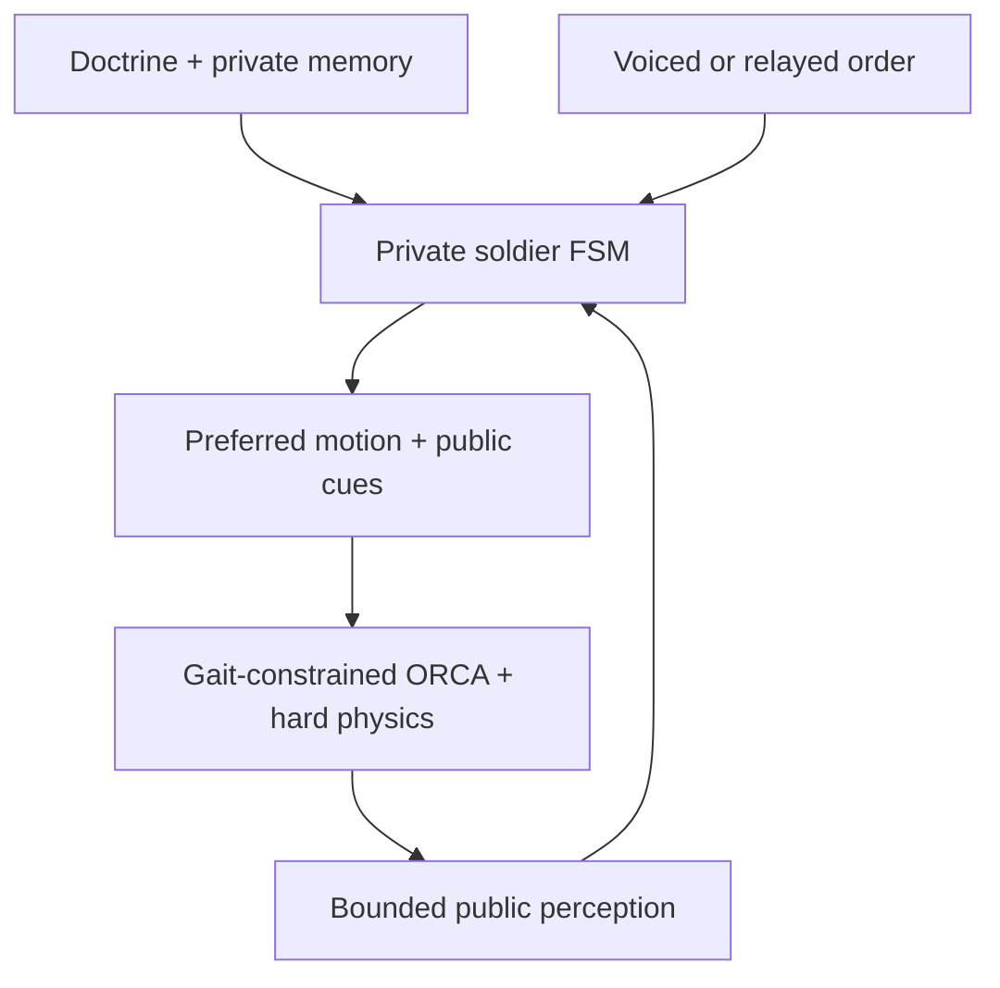
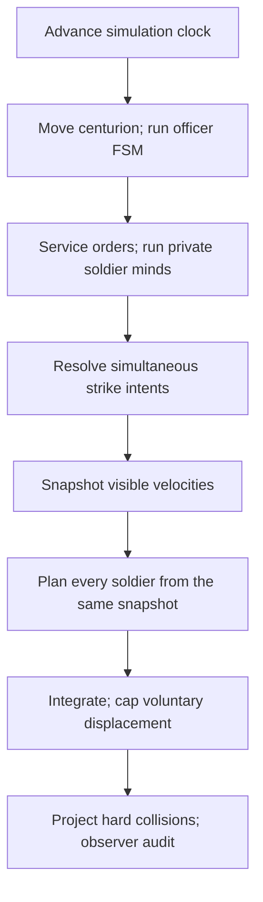
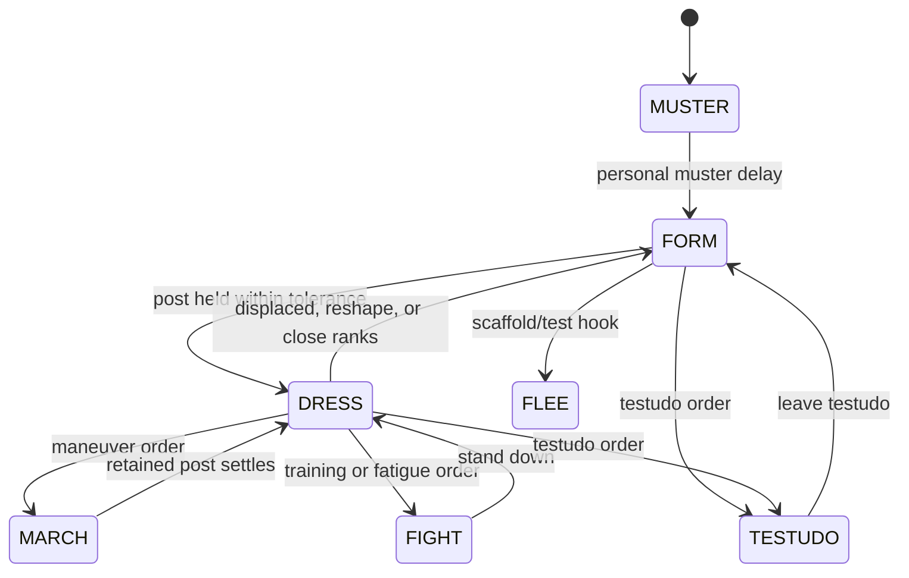
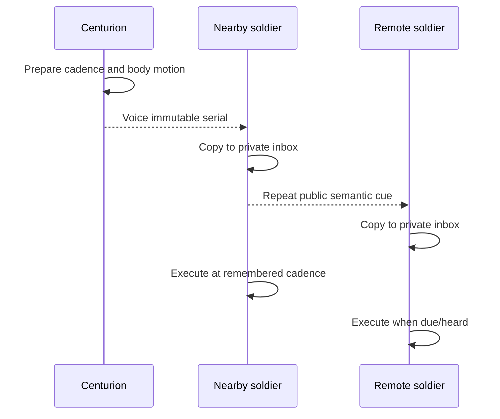

# soldier_ABM_v26 architecture and logic reference

This document describes `soldier_ABM_v26(1).html` as inspected on 2026-07-14.

- Source size: 415,001 bytes; 9,719 text lines.
- Source SHA-256: `c06b8a8ba706c6f8b02fc4f03d32ba8cb543ad81e60aace6d39927d442cf44e7`.
- Runtime form: one self-contained HTML file containing the HUD, CSS, simulation, renderer, controls, and a small public test API.
- External runtime dependencies: none. It uses modern browser JavaScript and the Canvas 2D API.
- Active controller: the later `v12`–`v26` path (`updateMinds12`, `planSoldier12`, `resolveCollisions12`, and related functions). The unsuffixed `updateMinds`, `planSoldier`, `resolveCollisions`, and `diagnostics` functions are retained legacy code and are not called by the active `step()` loop.

## 1. Executive model

This is an agent-based formation, drill, and close-contact simulation built around a strict information rule:

> A participant may act from doctrine it has learned, its own private memory and FSM, and things it can physically perceive or receive through a modeled signal. It may not read another participant's private intention or a global answer about what the unit is doing.

The file models three distinct kinds of agency:

1. **Each soldier** owns a private doctrine copy, remembered centurion guide, mental formation lattice, post claim, target, timers, nested activity state, and locomotion plan.
2. **The centurion** is a physical agent and command source. He owns a private command board, limited perception, contact memory, course plan, and officer FSM. He issues semantic orders rather than per-soldier assignments.
3. **The scenario/observer layer** creates casualties and training props, collects diagnostics, renders labels, and exposes test hooks. Its omniscience is explicitly out-of-simulation and must not feed an agent decision.

The formation emerges because drilled men independently reconstruct the same doctrine, observe nearby public evidence, negotiate collisions, and resolve duplicate post claims locally. The centurion never assigns a roster to slots. Soldiers never receive a target list, a completion percentage, or another soldier's private goal.



## 2. The no-telepathy contract

### 2.1 State ownership

| Layer | Legitimate state | Who may read it for decisions |
| --- | --- | --- |
| Soldier-private | `doctrine`, `mentalLattice`, `claimSi12`, `targetX/Z`, route and waypoint state, timers, fatigue, training target ID, maneuver/reform/testudo/relief state, centurion inbox and remembered guide | That soldier only |
| Soldier-public | Physical position and visible velocity; close-range `publicState`; deliberate claim, gap, relief, compression, contact, readiness, and order-echo cues | A perceiver that is within the applicable range |
| Centurion-private | `brain26`, target tracks, course objective, route choice, command confidence, current order plan | The centurion/controller only |
| Centurion-public | Physical pose, public officer state, and the currently repeated order within voice range | Soldiers that can see/hear him |
| Physical world | Soldier bodies, centurion body, active/fallen training targets, fallen bodies | Physics globally; cognition only through a sensor function |
| Observer-only | HUD totals, labels A/B/C, event logs, diagnostics, strict completion audit, target home metadata | Rendering, testing, and scenario control only |

`cfg`, `soldiers`, the target arrays, and other JavaScript variables are technically closure-wide because this is a single-file prototype. The architectural restriction is enforced by *which functions may consume them*. Global indexing is allowed for physics, rendering, scenario setup, and observer diagnostics. Agent cognition is routed through copied percepts or order packets.

### 2.2 Explicit public channels

The active soldier sensor is `visible12(s, radius)`. It constructs a new percept object rather than returning a soldier reference. The percept can contain:

- identity, physical position, and the last published visible velocity;
- exact public FSM state only inside the 5.5 m social radius;
- public mobility, planted posture, testudo readiness, and reform readiness where allowed;
- deliberate post-claim and vacancy-pointing gestures;
- local relief and compression activity;
- a boolean contact cue with hop count and remaining life;
- a copied centurion-order echo inside the social radius.

It does **not** contain another soldier's mental lattice, claim index, private target, route, waypoint, fatigue, timers, maneuver object, training target ID, inbox, or officer track.

Public signals are double-buffered. A mind tick writes `next...` fields; only after every soldier has decided are those values published into `public...` fields. This prevents a later array element from seeing a decision made earlier in the same cognitive pass.

### 2.3 Legitimate global passes

The following whole-world operations are not cognition:

- spatial-hash construction and neighbor broad phase;
- hard body collision projection;
- physical strike validation after all strike intentions have been queued;
- rendering and HUD counts;
- observer diagnostics and completion auditing;
- test-fixture deployment, reset, and casualty injection;
- line-of-sight occlusion tests that expose only the filtered sensor result.

### 2.4 Current abstractions and realism gaps

The architecture respects the information boundary, but several sensors remain simplified:

- Soldier-to-soldier perception is radial. It does not yet model soldier FOV, terrain/building occlusion, darkness, smoke, weather, or measurement error.
- Positions and visible velocities in a soldier percept are exact within range.
- Direct officer voice is a distance gate, without wind, masking noise, language errors, or line-of-sight effects.
- Order and contact relays use local hops and cognition cadence, but do not model individual vocal strength, message corruption, or explicit facing toward the speaker.
- Centurion observation of his own century is a 28 m radial sample without FOV or occlusion. His *target* perception is substantially richer: FOV, range, occlusion, quantization, confidence decay, and stale tracks are modeled.
- Stable numeric IDs are used for deterministic visible tie-breaking. They stand in for recognizable persons/seniority rather than literal floating labels.
- The mass-casualty test immediately initiates an explicit `CLOSE RANKS` strength report. The report itself is not independently discovered by a chain of human observers.
- `globalThis.soldierABM` exposes mutable arrays and `cfg` for testing. Freezing the wrapper does not make its contents immutable, so external scripts can bypass the intended information rules.

These are extension points, not hidden claims that perception is already fully human-realistic.

## 3. File layout and active execution path

| Source area | Purpose |
| --- | --- |
| Lines 1–109 | HTML, CSS, HUD controls, labels, and canvas |
| 110–570 | IIFE, camera, global configuration, state enums, tuning constants, deterministic RNG, spatial hash |
| 571–2042 | Formation doctrine, private lattices, agent construction, post remapping, command protocol, FACE handling |
| 2043–3092 | Retained legacy mind and motion controller; parsed but inactive |
| 3093–3553 | Canvas renderer, HUD, and legacy diagnostics |
| 3554–3897 | Embedded ORCA/RVO2 solver |
| 3898–3974 | Active-controller, gait, clock, casualty, and training state |
| 3975–6347 | Yard props, centurion perception and assault-course FSM, training combat |
| 6348–8575 | Active soldier initialization, perception, claims, orders, formation FSM, testudo, reflow, fatigue, casualties, mind barrier |
| 8576–9349 | Active locomotion, gait constraints, ORCA planning, integration, collision physics, diagnostics, completion audit |
| 9350–9718 | Simulation loop, UI bindings, camera input, boot, and public API |

The active simulation tick is:



More exactly, `step(dt)` calls:

1. `updateCenturion12(dt)`
2. `updateAssaultCourse21(dt)`
3. `reflectCourseState21()`
4. `serviceStrengthOrder12()`
5. `updateMinds12(dt)`
6. `resolveTrainingStrikes20()`
7. snapshot each soldier's visible velocity and starting pose
8. `planSoldier12(s, dt)` for all soldiers
9. `integrateSoldier12(s, dt)` for all soldiers
10. cap voluntary displacement to 4.85 m/s for this step
11. `resolveCollisions12()`
12. `trackCompletion12(dt)`

The animation loop clamps real-frame time to 0.05 s, integrates in substeps no larger than 1/30 s, and limits substeps to 8 below 200 soldiers, 6 above 200, and 4 above 500. Any unprocessed budget after that cap is discarded, so a badly overloaded or high-tempo simulation slows rather than performing an unbounded catch-up burst.

## 4. Coordinate and formation doctrine

### 4.1 Axes

- World ground coordinates are `(x, z)`; `y` is height only for projection.
- Heading `0` faces world `+z`.
- Forward is `(sin heading, cos heading)`.
- The field named `right` in `facingVectors()` is the positive *formation-latitude* axis. At heading 0 it points `+x`. In the code's y-up convention, anatomical right is negative latitude, so positive lateral command values mean **LEFT** and negative values mean **RIGHT**.
- Formation depth is positive toward the fighting front.

For row `r`, column `c`, spacing `sp`, `rows`, and `cols`:

```text
lat = (c - (cols - 1) / 2) * sp
dep = ((rows - 1) / 2 - r) * sp
world = anchor + latitudeAxis * lat + forwardAxis * dep
```

Therefore row 0 is the front rank. The centurion's declared guide post is one metre beyond the front-right corner: negative latitude and maximum front depth.

### 4.2 Canonical shapes

| Shape | Canonical plan |
| --- | --- |
| `triple` | 3 rows; `ceil(strength / 3)` columns |
| `rect` | Approximately 2.4:1 width-to-depth using `ceil(sqrt(n * 2.4))` columns |
| `square` | `ceil(sqrt(n))` by the same |
| `testudo` helper | Approximately 1.6:1, minimum 3 columns; the live testudo command normally preserves the current rows/columns and compresses spacing instead |

A lattice is a full rectangle and may contain more cells than ordered strength. `activeDoctrineSeats12()` defines the active posts as complete front ranks followed by a centered partial rear rank. Empty doctrinal cells are valid; the formation is not a global array of assigned men.

### 4.3 Private mental lattices

Every soldier owns a cached `mentalLattice`. `getMentalLattice(s)` builds it from:

- that soldier's private doctrine copy;
- that soldier's remembered centurion guide position;
- drilled plan dimensions and spacing.

The lattice contains slot metadata and cached world coordinates, but it belongs to the soldier. Two men usually derive congruent lattices because they heard the same doctrine and remember the same guide; they do not share a live slot table.

World/formation conversion is constant-time. `worldToSlotIndex()` rounds to the nearest grid cell, `nearestSeat()` refines a 3×3 neighborhood, and `collectCandidates()` expands grid rings without scanning arbitrary world points.

### 4.4 Self-sorting and post ownership

On initial muster, equal-probability bins map a man's own approach bearing and starting radius into a preferred file and rank. This gives doctrine-based self-sorting without a roster assignment.

The active claim process then uses:

- a deliberate public claim gesture with bounded maturity;
- physically planted bodies;
- locally relayed vacancy gestures;
- distance from the candidate and distance from the man's preferred sector;
- a deterministic per-man/per-seat salt to break symmetry;
- a permanent per-order taboo after a witnessed loss;
- local scouting along one-way rear-apron lanes after repeated failed claims.

`claimWinner12()` is stable: mature visible commitment wins first, then a body already settled on the post, then deterministic post-specific priority. A private timer or hidden claim is never inspected.

### 4.5 Deterministic post remapping

Shape changes and FACE orders must preserve topology without assigning people centrally:

- `buildPersonalReformMap12()` maps old doctrinal posts to new posts by a deterministic nearest-unused geometry rule.
- `buildPersonalFaceMap25()` performs stable proposals from old posts to active new posts.
- A 180° FACE uses `buildAboutFaceMap25()`: it starts with the exact mirrored inverse and moves holders through shortest four-neighbor ripples to resolve partial-rank mismatch.

Every recipient can recompute the same *post permutation* from drill diagrams. The mapping is post-to-post, not person-to-post.

## 5. Soldier FSM and nested activities

### 5.1 Primary states



| State | Meaning and active behavior |
| --- | --- |
| `muster` | Move toward the soldier's own doctrinal preference; after a short personal delay, enter FORM and claim the home post. |
| `form` | Acquire, approach, defend, lose, or scout for a post. Reshaping and redressing are truthfully public as FORM. |
| `dress` | Brace on the claimed post, face the ordered front, advertise nearby gaps, and recover locally if displaced. |
| `march` | Preserve a retained post against a moving private lattice during a collective maneuver. |
| `fight` | Hold the fighting front while either training-combat, modeled relief, or casualty compression runs. |
| `testudo` | Pack front-to-rear into compact spacing, remain braced when settled, or retain the compact post during a maneuver. |
| `flee` | Latent routing scaffold: move toward the rear of the soldier's own understood formation. Normal scenarios do not currently transition into it. |

The active cognitive cadence is nominally 0.08 s with deterministic per-agent jitter. Each agent accumulates elapsed time until its own tick, so thought is asynchronous even though public publication is barriered.

### 5.2 Nested formation reshape FSM

`reform12` runs within public FORM:

- `reserve`: the old post has no canonical mapped destination; wait briefly, then rejoin ordinary local claim search.
- `leg1` / `leg2`: retained compatibility stages; current v25 orders normally begin at a unique loose pre-post in `leg2`.
- `wait`: rear ranks wait for the immediately preceding file member or a local zipper substitute.
- `pack`: move to the final post and hold long enough to publish readiness.

Waypoints are gates, not exact nails. Crossing a capture circle or demonstrably passing the closest point advances the stage. A bounded no-progress timeout returns control to normal local FORM rather than freezing forever.

### 5.3 Nested testudo FSM

- `reserve`: locally claim a compact vacancy; no replacement post is assigned.
- `yield`: follow the preceding man at a loose distance while the front packs; an adjacent-file zipper can substitute after a missing-predecessor timeout.
- `pack`: close onto the compact post.
- `settled`: publish testudo readiness and brace.
- `maneuver`: retain the compact post against a moving lattice.

The live command keeps the same file/rank topology, holds the physical guide corner fixed, and reduces spacing to `max(0.92, 2 * bodyR + 0.08)`.

### 5.4 Nested training-combat FSM

Front-rank men run:

```text
seek -> approach -> guard -> commit -> strike -> recover -> guard
```

Rear-rank men enter `support` and hold unless they locally see a viable adjacent lane. Each front-ranker privately searches its own file first, then one neighboring file. Target identity never becomes public; only an outward CONTACT posture is relayed.

Strike intentions are queued during cognition and resolved after all minds have run. The resolver rechecks range, facing, target activity, and physical friendly-lane clearance, sorts deterministically, applies simultaneous hits, and topples finite-integrity straw targets.

### 5.5 Nested relief and casualty reflow

Modeled fatigue relief is explicitly marked experimental. A fatigued front-ranker follows:

```text
egress to personal right -> rear apron -> insert into a visible rear vacancy -> settle
```

No global rotation schedule exists. Neighboring relief gestures suppress simultaneous adjacent departures.

Casualty compression is also local:

- the immediately rear man fills a known vacancy in his file;
- only the rear boundary diffuses sideways to balance unequal depths;
- an empty outside file is not trusted unless another occupied file is visible beyond it;
- a one-rank basin is passed only toward a visibly deeper donor file;
- peeling an empty outer file inward requires at least two locally observed falls.

Each micro-move is a normal claim, can lose a local conflict, and can fall back to its previous post or FORM search.

## 6. Centurion, orders, and communication

### 6.1 The centurion is physical

The centurion has a world pose, velocity, heading, collision body, public phase, command timer, currently repeated order, target guide pose, active/pending motion, private course state, and `brain26`. He stands outside the front-right file rather than occupying a legionary post.

His public phases are `posted`, `command`, `maneuver`, `assess`, `refront`, `dress`, `engage`, `verify`, and `complete`.

### 6.2 Immutable order packet

`publishCenturionOrder12()` deep-copies and recursively freezes:

| Field | Meaning |
| --- | --- |
| `originId` | Centurion identity |
| `seq` | Monotonically increasing order serial |
| `kind` | Human-readable command kind |
| `preempt` | Whether the recipient should clear older private activity when executing |
| `urgent` | Enables the longer emergency front-facing lock |
| `payload` | Semantic doctrine/order data, copied by value |
| `issuedAt` | Simulation time of issue |
| `executeAt` | Cadence at which a recipient should execute |
| `repeatUntil` | End of the centurion/relay repetition window |

Formation packets carry shape, strength, spacing, and plan dimensions—not a world anchor or roster. Maneuver packets carry relative formation-axis distances, angles, pivot coordinates, and duration—not individual world paths. Soldiers reconstruct geometry from their own remembered guide.

### 6.3 Issue, propagation, and execution



1. `beginOrderIssue21()` determines the drilled warning interval, handles an interrupted active maneuver, or prepares a compatible pipelined successor.
2. The controller updates only its own command-board endpoint.
3. `scheduleCenturionMotion12()` gives the officer a physical line, arc, or perimeter polyline.
4. `publishCenturionOrder12()` exposes one immutable serial.
5. A soldier within 18 m can hear the officer directly. Other soldiers can copy an order echo from a neighbor inside the 5.5 m social radius.
6. Each recipient owns an inbox, suppresses older work only when the newer signal reaches it, and executes once at or after `executeAt`.
7. Execution uses that recipient's private guide and doctrine.

The command-board lock (`cfg.collectiveOrderUntil12`) prevents the officer/controller from issuing incompatible collective geometry too quickly. It is not a read of formation completion. Physical readiness for the automated course is assessed through the centurion's own sensor products.

### 6.4 Command preparation and pipelining

The preparation delay is the 0.48 s issue hold plus estimated travel beyond the 18 m voice radius at 22 m/s and an additional relay-cognition margin. Wide formations therefore receive a warning interval before the lattice starts moving.

Compatible march legs can pipeline when the current motion will finish within the next preparation window, the visible body remains cohesive, and no pending motion/FACE conflict exists. The successor is planned from the command-board endpoint already owned by the centurion, never from a predicted soldier completion flag.

### 6.5 FACE is a coordinate rebase

A FACE order is not merely “look left.” It:

- changes the operational formation front;
- recomputes rows/files and the front-right guide corner;
- has each soldier independently remap its own post and memories;
- briefly locks every body into the ordered pivot before post correction;
- sends the centurion physically around a clear perimeter path to the new guide post.

A quarter FACE normally transposes rows and columns. `reformFrontage24` preserves fighting frontage for urgent/course changes. ABOUT FACE uses the special mirrored/ripple map. An urgent tactical FACE keeps men presenting the new front for six seconds while local correction continues.

### 6.6 Maneuver semantics

| Command | Packet geometry |
| --- | --- |
| `advance` / `retire` | Signed forward distance |
| `oblique` / `incline` | Forward and lateral displacement in formation coordinates |
| `turn` | Rotation about formation center |
| `wheel` | Rotation about the named front corner so the opposite flank advances |
| `refuse` | Rotation about the opposite hinge so the named flank retires |
| `curve` | Arc length/angle represented by an outside pivot |
| `company-halt` | Preempt at the physically reached partial pose and redress there |

Common duration is derived from the slowest required body-frame forward, lateral, or backward gait. During execution, each man moves its own retained lattice post; the packet does not tow bodies directly.

## 7. Perception and centurion doctrine

### 7.1 Soldier perception radii

| Channel | Range/default | Information |
| --- | --- | --- |
| Post claims and deliberate gap gestures | 27 m (`V12.claimR`) | Claim point, maturity, gap point, hop/life |
| Close social/body-language channel | 5.5 m (`V12.socialR`) | Exact public FSM, motion/planting, relief, compression, contact, order echo |
| Training target acquisition | 4.8 m and ±72° | Active target pose sufficient for local selection |
| Training strike cone | 1.38 m and ±48° | Physical strike eligibility |
| Direct view/voice of centurion | 28 m sight, 18 m voice | Officer pose/state; current order only inside voice range |

### 7.2 Centurion target perception

The course officer does not read target IDs, station labels, integrity, intended target headings, or course metadata. `senseCenturion26()` produces the only target input used by his decisions:

1. Choose a gaze bearing. During assessment it sweeps; during commitment it looks at the current contact.
2. Filter straw figures by 96 m range and a ±68° field of view.
3. Reject lines blocked by soldier or upright-target silhouettes.
4. Quantize perceived range and bearing with distance-dependent resolution.
5. Associate detections with private tracks by proximity, creating officer-local IDs.
6. Retain stale tracks for bounded memory, increasing uncertainty and exponentially reducing confidence.
7. Cluster current/stale perceived points into inferred rows and estimate each row axis by PCA.

The officer's century-readiness sensor separately copies only soldiers within 28 m and only their physical pose, speed, public state, public mobility, and public CONTACT cue.

### 7.3 Contact relay

An engaged soldier emits a boolean CONTACT cue. Neighbors relay only the boolean, hop count, and remaining life, to a maximum of 48 hops. They do not relay target identity, bearing, lane, or assignment. The centurion can therefore learn that a remote file remains engaged without learning what that file privately selected.

Clearance can be accepted from a completely visible collapsed row, or from a locally sufficient front-file sample that has ceased reporting contact while no fresh upright target is seen. A live CONTACT relay vetoes clearance; it can delay success but cannot create it.

## 8. Assault-course officer FSM

The course deploys three randomly transformed straw rows, but A/B/C labels are rendering/observer metadata. The officer receives only physical observations, knows that the exercise contains three stations, and chooses by perceived geometry.

| State | Responsibility |
| --- | --- |
| `dress` | Wait for the initial halt and a locally observed ready body. |
| `assess` | Sweep the horizon, reconstruct contact rows, exclude cleared zones, and choose an objective. |
| `orient` | Decide whether to refront, turn, incline, deploy frontage, or begin/continue the route. |
| `refront` | Issue the queued discrete FACE after readiness and cadence gates. |
| `wait-refront` | Wait for a physically observable step-off condition. |
| `approach` | Issue bounded advance, curve, oblique, retire, or committed attack-run legs. |
| `wait-orient` / `wait-approach` | Wait for cadence/readiness; optionally start compatible pipeline planning. |
| `halt` / `wait-halt` | Halt and dress before ATTACK. |
| `engage` | Observe target collapse and contact cues; renew once or plan corrective reopening. |
| `wait-contact-recover` | Halt, move back/sideways to reopen lanes, then recommit. |
| `wait-cease` | Halt after a verified collapse and record the cleared perceived line zone. |
| `verify` | Reassess rather than assuming the next station. |
| `complete` / `failed` / `idle` | Terminal or inactive states. |

Objective scoring combines:

- route length;
- direction-change cost scaled by unit width;
- penalty for crossing another observed active row;
- target-track uncertainty/confidence;
- one-objective look-ahead weighted by current command confidence;
- immediate priority for an observed threat inside the body's turn envelope.

Final contact doctrine is deliberately staged: maneuver to a safe outer apron, establish the combat front, make at most a bounded incline, then commit straight ahead. The officer does not make a last-second reverse or sideways “parking” correction in front of the enemy.

On a visible contact stall, the officer may:

1. repeat ATTACK once so soldiers privately reassess their own openings;
2. halt, withdraw about 2.1 m, shift no more than 0.95 m toward a visible surviving file, and recommit;
3. after two failed corrections, report a doctrinal failure rather than silently timing out.

The whole-course and station timeouts scale up above 40 men. The interactive button blocks strength above 100.

## 9. Locomotion and physics

### 9.1 Intent before avoidance

`preferredVelocity12()` derives velocity only from the soldier's private target, retained post, doctrine, current activity, and local waypoint. It distinguishes free travel, formation motion, stationkeeping, testudo packing, relief, reform, training approach, and flight.

Long FORM routes may use a rear-apron path. `setPortalWaypoint12()` adds a short local detour around a visibly planted blocker in the destination file. It does not plan a global path.

### 9.2 Body-frame gait doctrine

`chooseLocomotionMode23()` selects one of:

- `travel`: turn toward a distant destination, then move chiefly forward;
- `formation`: preserve a moving lattice under common cadence;
- `station`: shuffle while maintaining the ordered front.

`gaitLines23()` converts forward, backward, left, and right caps into fixed ORCA half-planes. Collision avoidance may change direction only inside this feasible body-frame envelope; it cannot manufacture a full-speed sideways or backward slide.

### 9.3 ORCA/RVO2

For each mobile soldier, the active planner:

- perceives neighbors within 5.5 m;
- sorts by distance and keeps at most 24;
- uses only copied position, visible velocity, and public state;
- builds reciprocal collision-avoidance half-planes;
- gives a mobile agent most correction responsibility when the other publicly appears planted;
- solves for the feasible velocity closest to the private preference;
- accelerates toward it rather than teleporting velocity.

The embedded solver implements the standard LP1/LP2/LP3 structure. Agent collision horizons are 0.92 s for moving bodies and 0.78 s for publicly static bodies, plus a 0.01 m safety pad.

### 9.4 Hard collision projection

ORCA is anticipatory, not authoritative. After integration, `resolveCollisions12()` performs 10 position-based iterations (6 above 400 soldiers):

- mobile body core: 0.32 m;
- planted/braced ordinary core: 0.38 m;
- moving testudo core: 0.22 m;
- braced testudo core: 0.36 m;
- pair skin: 0.018 m.

Braced bodies have low displacement weight; mobile bodies yield. Closing normal velocity is removed. The centurion and active targets are also physical obstacles, but only soldiers are displaced by contact with them. The last projection pass is soldier-versus-soldier so a late prop correction cannot reinsert overlap.

## 10. Rendering, UI, and scenario controls

The renderer is a small custom 3D-to-2D projection over Canvas 2D. The orbit camera stores eye, forward, right, and up vectors; `project()` rejects non-finite and behind-camera points. Ground extent expands to include deployed targets and the centurion.

Soldier color is observer-only:

| State | Color family |
| --- | --- |
| Muster | purple |
| Form | blue |
| Dress | green |
| March | gold |
| Fight | red |
| Testudo | blue-gray |
| Flee/other | yellow |

The renderer draws physical bodies, facing strokes, training weapons, targets, fallen markers, the centurion's crest, and optional believed target points. It depth-sorts below 220 soldiers; larger formations use cheaper unsorted discs.

### UI controls

| Control | Effect |
| --- | --- |
| TRIPLE / RECT / SQUARE | Issue a formation doctrine order |
| FACE LEFT / RIGHT / ABOUT FACE | Issue a coordinate-rebase FACE |
| ADVANCE / RETIRE / TURN | Issue collective movement |
| CURVE / INCLINE / WHEEL / REFUSE | Issue compound relative maneuvers |
| COMPANY HALT | Preempt at the partial physical pose and redress |
| TESTUDO | Enter or leave compact formation |
| fighting fatigue | Enable/disable modeled relief fighting |
| FRONT CASUALTY / 25% CASUALTIES | Inject observer-side casualty tests |
| PĀLUS / STRAW / HALT DRILL | Deploy/command training combat |
| RESET YARD | Clear props and drill scratch state after issuing cease as appropriate |
| ASSAULT COURSE / END COURSE | Start or stop the automated three-contact exercise |
| Scatter | New deterministic seed stream, respawn, and reset all minds |
| Pause | Stop simulation time while continuing render/HUD |
| N | Respawn at the new strength (12–300 in UI) |
| spacing | Leave testudo if necessary, change spacing, and reset minds |
| tempo | Scale simulation budget from 0.25× to 8× |
| believed spots | Show observer visualization of soldier targets and centurion gaze |

Keyboard aliases are `1/2/3`, `Q/E/F`, `A/B/H`, `R`, Space, and `+/-`.

## 11. Diagnostics and determinism

The main RNG is Mulberry32 seeded from `cfg.seed`. `hash01()` supplies deterministic local salts without consuming the shared stream. Course layout has a separate seeded stream so generating a yard cannot alter soldier preferences.

`diagnostics12()` is explicitly observer-only. It reports:

- phase counts, near-post and strict-dressed counts;
- RMS/max post error, duplicate posts, overlaps, non-finite agents;
- claim losses, scouts, relief cycles, compression moves;
- gait modes, planned lateral/backward maxima, and constraint violations;
- testudo/reform travel;
- orphan/overdue maneuvers;
- training state, strikes, hits, blocks, acquisitions, and target integrity state;
- centurion guide error, order reach/execution counts, officer brain state, and course metrics.

`trackCompletion12()` is a separate strict observer audit. It requires every soldier to be publicly and privately DRESS, planted, on a unique post, nearly stopped, facing within 3°, within 0.10 m of its post, and non-overlapping for 0.25 s. Nothing in soldier or centurion cognition reads this result.

## 12. Public test API

The file exports `globalThis.soldierABM`.

### Readable references

- `cfg`
- `soldiers`
- `centurion`
- `trainingTargets`, `trainingEvents`
- `courseStations`, `courseEvents`, `commandEvents`
- `centurionStates`, `states`

These are live references intended for debugging, not safe immutable views.

### Methods

| Method | Purpose |
| --- | --- |
| `step(dt)` | Advance one simulation step without rendering |
| `diagnostics()` | Return the observer-only active diagnostics object |
| `runSeconds(seconds, dt=1/30)` | Headless deterministic stepping plus diagnostics |
| `reset(seed)` | Reset field, controller, and minds with a seed |
| `setAgentState(id, state)` | Test hook to force one primary FSM state |
| `issueCommand(command, value)` | String command dispatcher described below |
| `setShape(shape)` | Issue triple/rect/square doctrine |
| `enterTestudo()` / `exitTestudo()` | Explicit compact-formation controls |
| `setFatigueSimulation(enabled)` | Issue engage/stand-down fatigue doctrine |
| `triggerFatigue(id)` | Test hook that exhausts one soldier |
| `removeAgent(id)` | Remove a chosen agent or one front-ranker |
| `inflictCasualties(fraction)` | Deterministic distributed casualty injection |
| `deployTrainingTargets(kind)` | Deploy a pālus or straw line without issuing ATTACK |
| `placeTrainingTarget(spec)` | Add one physical training prop |
| `clearTrainingTargets()` / `resetTrainingTargets()` | Clear or restore target fixture state |
| `deployAssaultCourse(seed)` | Deploy the course fixture only |
| `startAssaultCourse(seed)` / `stopAssaultCourse()` | Run or end the officer course |
| `resetYard()` | Clear active yard/course fixture state |
| `classifyThreatBearing(heading)` | Return the discrete FACE decision, if any |
| `reactToThreatBearing(heading)` | Issue urgent FACE, bounded wheel, or halt from an observed bearing |

`issueCommand()` accepts the aliases `face_left`, `face_right`, `about_face`, `halt`, `company_halt`, `stand_fast`, `advance`, `retire`, `retreat`, `oblique`, `incline_left`, `incline_right`, `shift_left`, `shift_right`, `turn_left`, `turn_right`, `curve`, `march_turn`, `curve_left`, `march_curve_left`, `curve_right`, `march_curve_right`, `wheel_left`, `wheel_left_forward`, `wheel_right`, `wheel_right_forward`, `refuse_left`, `wheel_left_backward`, `refuse_right`, `wheel_right_backward`, `triple`, `formation_triple`, `rect`, `rectangle`, `formation_rect`, `square`, `formation_square`, `testudo`, `engage`, `fight`, `stand_down`, `stop_fighting`, `palus_drill`, `engage_drill`, `straw_drill`, `halt_drill`, `cease_drill`, `assault_course`, `start_course`, `end_course`, and `stop_course`.

## 13. Configuration and tuning reference

### 13.1 `cfg` defaults

| Key | Default | Role |
| --- | ---: | --- |
| `shape` | `triple` | Current controller-side formation doctrine |
| `count` | 36 | Spawn strength |
| `orderedStrength12` | 36 | Last strength explicitly ordered; doctrine, not observed roster |
| `accountedStrength12` | 36 | Observer/centurion-side casualty accounting used to request close ranks |
| `pendingStrength12` | `null` | Deferred strength order |
| `spacing` | 1.55 m | Ordinary post spacing |
| `bodyR` | 0.42 m | Render/nominal body radius; hard cores use state-specific values |
| `formFacing`, `unitFacing` | 0 | Command-board and observer facing |
| `planCols`, `planRows` | `null` | Explicit current plan dimensions when established |
| `orderAnchorX/Z` | 0, 0 | Centurion's private command-board formation anchor |
| `collectiveOrderUntil12` | 0 | Officer issue-cadence lock, not a completion signal |
| `testudoActive` | `false` | Controller-side compact doctrine flag |
| `preTestudoCommand` | `null` | Saved plan dimensions |
| `fatigueFight` | `false` | Controller-side fatigue doctrine flag |
| `trainingMode20` | `none` | Observer/command-board yard mode |
| `courseActive21` | `false` | Course controller active flag |
| `courseLayoutSeed22` | 0 | Independent yard-layout seed |
| `senseR` | 16 m | Legacy controller sensor radius; active path uses V12/CENT constants |
| `press`, `sep` | 6.5, 2.8 | Legacy steering gains |
| `paused` | `false` | Animation-loop pause |
| `showTargets` | `false` | Observer visualization toggle |
| `timeScale` | 1 | Simulation tempo |
| `seed` | `0x00004004` | Main deterministic seed |

### 13.2 Officer and course constants

| Group | Defaults and meaning |
| --- | --- |
| `CENT12` | `guideGap=1.00`, `bodyR=0.45`, `voiceR=18`, `sightR=28`, `relaySpeed=22`, `issueHold=0.48`, `repositionSpeed=2.35` |
| `HALT21` | `prep=0.34`, `dressTimeout=4.5`, `maneuverSettleTimeout=2.8` |
| `CENT26` sensing | `targetSightR=96`, `targetFovHalf=68°`, `targetScanRate=1.05 rad/s`, `targetTrackTTL=600`, `perceptualLineJoinR=5.20`, `surveySeconds=4.15` |
| `CENT26` readiness | `localBodyFraction=0.44`, `localReadyFraction=0.88`, `pipelineSlack=0.34` |
| `CENT26` planning | `compactLeg=18`, `wideLeg=25`, `lookaheadWeight=0.34`, `commitmentMin=4.0`, `attackStall=9.0`, `maxAttackRenewals=1`, `maxContactCorrections=2` |

`COURSE21` declares: `sightR=96`, `stationJoinR=3.35`, `attackStandOff=1.20`, `maxObliqueLeg=13.5`, `obliqueTurnLimit=18°`, `routeTurnThreshold=57°`, `flankFaceMin=58°`, `flankFaceMax=122°`, `rearFaceMin=135°`, `wheelMinAngle=12°`, `wheelMaxAngle=34°`, `attackCorridorLong=1.15`, `attackCorridorLat=1.35`, `curveMinAngle=6°`, `curveMaxAngle=54°`, `stagingBuffer25=4.0`, `curveMinLeg=3.0`, `readyHeading=8°`, `readyRms=0.22`, `readyMax=0.48`, `readyHold=0.45`, `assessDelay=0.40`, and base `stationTimeout=78`, `wholeTimeout=245`. `sightR`, `maxObliqueLeg`, `flankFaceMax`, and the base timeout fields are retained declarations not directly read by v26; target sight comes from `CENT26`, and each course instance installs strength-specific timeouts.

### 13.3 Active soldier and gait constants

| Group | Defaults and meaning |
| --- | --- |
| `V12` cognition | `thinkEvery=0.08`, `musterTime=0.15`, `claimR=27`, `socialR=5.5`, `searchStart=10`, `conflictHold=0.04`, `dressTol=0.065`, `dressHold=0.14` |
| `V12` motion | `neighborR=5.5`, `timeHorizon=0.92`, `staticHorizon=0.78`, `safePad=0.01`, `accel=4.0` |
| `GAIT23` mode switching | `turnRate=5.5`, `travelEnter=1.05`, `travelExit=0.68`, `travelLock=0.42`, `alignFull=18°`, `alignStop=74°` |
| `GAIT23` free | forward 3.95, lateral 1.05, backward 1.28 m/s |
| `GAIT23` march | forward 1.72, lateral 0.58, backward 0.72; retire backward 0.78 m/s |
| `GAIT23` station | forward 0.92, lateral 0.55, backward 0.48 m/s |
| `GAIT23` turn | forward 1.02, lateral 0.72, backward 0.82 m/s |
| `GAIT23` testudo | forward 0.58, lateral 0.24, backward 0.30 m/s |
| `GAIT23` curve | `curveInnerRadius=4.0` m |

### 13.4 Training constants

`TRAIN20` defines `senseR=4.8`, acquisition half-angle 72°, strike half-angle 48°, `weaponReach=1.38`, `standOff=1.16`, `approachSpeed=1.28`, `readyTime=0.24`, `strikeTime=0.10`, fatigue per strike `0.045`, active recovery `0.012/s`, and idle recovery `0.032/s`. Pālus targets are indestructible, radius 0.24 m, height 1.82 m. Straw targets default to integrity 7, radius 0.30 m, height 1.62 m; course straw has integrity 3.

### 13.5 Retained legacy tuning

`MIND` and `LOCO` tune the inactive unsuffixed controller. They remain relevant only if that controller is deliberately revived.

| `MIND` key | Default | Legacy role |
| --- | ---: | --- |
| `arrive` | 0.32× spacing | On-post radius |
| `lock` / `unlock` | 0.42× / 1.35× | Claim lock and hard unlock radii |
| `seated` / `occupy` | 0.48× / 0.58× | Perceived body-on-seat and seat-in-use radii |
| `claimTimeout` / `minCommit` | 3.4 s / 1.25 s | No-progress repick and minimum belief tenure |
| `stuckFormTime` / `wingEscape` | 6.5 s / `true` | Delayed endgame escape enablement |
| `switchMargin` / `rescoreEvery` / `stickBonus` | 2.4× / 0.55 s / 3.2× | Anti-musical-chair hysteresis |
| `approachReserve` / `progressFrac` | 1.35 / 0.12 | Approach precedence and progress threshold; the former is declared legacy tuning but not consumed by the current source path |
| `nearRankMax` / `seekerCap` | 18 / 32 | Candidate cascade and visible contender budgets |
| `gestureR` / `socialR` | 5 m / 7 m | Legacy deliberate-gesture and public-FSM ranges |
| `searchStart` / `searchGrowth` / `noSlotGrowth` | 11 m / 3.2 m/s / 4.0 m/s | Expanding candidate search |
| `sectorPull` / `crossPenalty` | 0.62 / 8× spacing | Stay near entry wing and penalize crossing the body |
| `stationTenure` / `disputeHold` | 2.2 s / 0.65 s | Early duplicate and persistent-dispute windows |
| `musterRadius` / `musterInner` | 9 m / 6.5 m | Outer and inner muster regions |
| `musterFriends` / `musterFriendR` | 5 / 6.5 m | Local muster-density requirement |
| `musterHold` | 1.15 s | Base muster dwell |
| `formToDressHold` / `dressBreak` | 0.65 s / 2.8× spacing | FORM-to-DRESS stability and displacement break |
| `formBreakPad` | 10 m | Padding before falling back to muster |
| `thinkEvery` | 0.16 s | Legacy cognitive cadence |

| `LOCO` key | Default | Legacy role |
| --- | ---: | --- |
| `walk` / `run` / `shuffle` | 1.4 / 3.2 / 0.55 m/s | Nominal speed modes |
| `turn` | 4.2 rad/s | Turn rate |
| `moveCommit` / `faceAlign` / `stopSpeed` | 0.35 / 0.22 / 0.06 | Motion, facing, and stop thresholds; `faceAlign` is retained but not consumed by the present code |
| `travelSoft` / `jamSlide` | 1.22 / 1.15 | Relocation bubble and jam peel |
| `faceOrderHold` | 0.55 s | FACE pivot hold |
| `passT0` / `sideCommitT0` | 0.55 s / 0.7 s | Pass window and sticky side choice |
| `vLatDamp` / `vLatPassDamp` | 8.0 / 1.4 | Normal and passing lateral damping |
| `staticJamBoost` / `passStrafe` / `tangSlip` | 1.35 / 0.55 / 0.55 | Static jam, deliberate strafe, and contact slip gains |
| `maxPassLat` | 1.35 m/s | Lateral speed cap |
| `avoidHorizon` / `avoidClear` / `avoidGain` | 1.25 s / 1.02 m / 1.9 | Predictive legacy avoidance |
| `stationBrake` | 0.9 | Maximum threat braking factor |

The active path still reuses a few neutral `MIND` values for HUD thresholds and some shared construction fields, but it does not call the legacy mind/steering functions.

## 14. State-field dictionary

This section is organized by ownership rather than source order. A field described as public is still visible only through a sensor that enforces its range.

### 14.1 Soldier core and primary FSM

| Fields | Meaning |
| --- | --- |
| `id` | Stable deterministic identity used for lookup and visible tie-breaking |
| `x`, `z`, `vx`, `vz`, `speed`, `heading`, `gait` | Physical pose, velocity, speed, facing, and render animation phase |
| `seenVx`, `seenVz`, `seenSpeed` | Previous sense/plan barrier's visible velocity snapshot |
| `physicsStartX12`, `physicsStartZ12` | Start of the current physics step for voluntary-displacement capping |
| `drill`, `publicState`, `nextPublicState` | Private primary FSM, last published cue, staged next cue |
| `phaseTime12`, `drillTime`, `orderAge12` | Private time in state/order; `drillTime` is retained compatibility state |
| `neighborStates`, `dominantNeighborState` | Private count/summary of perceived close public FSM cues |
| `needMove`, `holding`, `braced` | Private/current physical intention flags from which public posture is derived |
| `publicMobile12`, `publicPlanted12`, `nextMobile12`, `nextPlanted12` | Double-buffered overt motion/planting cues |
| `faceOrderT`, `urgentFaceUntil26`, `orderedFacing12` | FACE pivot lock, urgent front lock, and private remembered ordered front |

### 14.2 Doctrine, lattice, and claims

| Fields | Meaning |
| --- | --- |
| `doctrine` | Soldier-private copy of shape, strength, spacing, front, plan dimensions, anchor mirror, remembered guide, source, and order serial |
| `mentalLattice` | Cached private lattice derived from doctrine and remembered guide |
| `entrySideNorm`, `entryDepthNorm` | Private normalized approach bearing/range used for initial self-sorting |
| `homeFile12`, `homeRow12`, `prefLat12`, `prefDep12` | Private doctrinal home sector/post preference |
| `claimSi12`, `beliefSi` | Active private post index and compatibility mirror |
| `targetX`, `targetZ`, `slotDist` | Current private navigation target and distance |
| `claimAge12`, `claimLosses12`, `claimSwitches12`, `claimRebaseGraceUntil12` | Claim maturity, witnessed losses, diagnostic count, and short FACE/rebase conflict grace |
| `tabuUntil12` | Per-post rejection memory for the current doctrine; witnessed losses become `Infinity` until reset |
| `seatEverSeen12` | Private evidence that a post was previously occupied, used to distinguish casualty holes from doctrinal spares |
| `conflictT12`, `arriveT12` | Private dwell timers for claim loss and stable arrival |
| `publicClaimX12/Z12`, `publicClaimActive12`, `publicClaimMaturity12` | Last published deliberate claim posture |
| corresponding `nextClaim...` fields | Staged claim posture for barrier publication |
| `publicGapX12/Z12`, `publicGapActive12`, `publicGapHops12`, `publicGapLife12` | Published vacancy gesture/relay |
| corresponding `nextGap...` fields | Staged vacancy relay |
| `relayGapSi12`, `relayGapUntil12` | Private remembered direction toward a remotely relayed gap; not ownership |

### 14.3 Search, local routing, and locomotion

| Fields | Meaning |
| --- | --- |
| `scouting12`, `scoutDir12` | Whether the man is physically scouting the rear apron and in which one-way direction |
| `routeStage12`, `routeGateLat12`, `routeApronDep12` | Active long FORM-route stages and private formation-coordinate gates |
| `wpT12`, `wpX12`, `wpZ12` | Short-lived local portal waypoint |
| `portalActive12`, `portalX12`, `portalZ12` | Persistent local blocker-detour gate |
| `plannedVx12`, `plannedVz12` | ORCA-selected next voluntary velocity |
| `locoMode23`, `locoModeUntil23`, `intentHeading23` | Current travel/formation/station mode, hysteresis lock, and private desired bearing |
| `gaitForwardCap23`, `gaitLateralCap23`, `gaitBackwardCap23`, `gaitHeading23` | Body-frame limits supplied to ORCA and recorded for diagnostics |
| `voluntaryForward23`, `voluntaryLateral23` | Planned body-frame motion diagnostics |
| `wp...`, `routeStage`, `routeX/Z`, `faceMode`, `travelHeading`, `passT`, `passSide`, `sideCommitT`, `blockedT`, `wiggle...` | Mostly retained fields for the inactive legacy locomotion path; `blockedT` and some compatibility values may still be initialized but are not central to active ORCA motion |

### 14.4 Commands and private officer memory

| Fields | Meaning |
| --- | --- |
| `centurionTrack12` | Private remembered officer pose/guide, state, confidence, last seen/heard times, last serial/kind, and relay source |
| `centurionInbox12` | Private immutable packet copies ordered by cadence and serial |
| `pendingCenturionOrder12` | Convenience reference to the inbox head |
| `lastHeardCenturionSeq12`, `lastExecutedCenturionSeq12`, `lastRejectedCenturionSeq12` | Per-soldier serial history |
| `centurionCommandApplyCount12` | Observer diagnostic counter |
| `publicOrderCue12`, `nextOrderCue12`, `orderCueUntil12` | Last published/staged local order echo and its repetition window |
| `preemptedActivity21` | Private record of what an urgent/replacement command interrupted |
| `lastHaltSeq21`, `lastHaltAt21` | Private record of executed halt |

### 14.5 Maneuver, reform, testudo, compression, and relief

| Fields | Meaning |
| --- | --- |
| `maneuver12`, `maneuverElapsed12`, `maneuverArrive12` | Private retained-post maneuver geometry and settle timers |
| `reform12`, `reformReadyUntil12`, `reformTravel12`, `reformStartedAt12`, `reformSettledAt12` | Private staged reshape and observer travel measurements |
| `publicReformReady12`, `nextReformReady12` | Local front-to-rear packing readiness cue |
| `redressing12`, `redressCount12` | Whether a planted soldier is actively recovering its post; count is retained diagnostic state |
| `microMove12`, `microFromSi12`, `microMoveKind12`, `microGapSi12`, `microGapKind12`, `microGapT12`, `microMoveStarted12` | Private local casualty-compression move and candidate evidence |
| `compressionMoves12`, `compressionWaveT12` | Diagnostic count and private locally propagated reflow window |
| `publicCompressionActive12`, `nextCompressionActive12` | Overt local compression activity |
| `relief12`, `reliefCount12` | Private relief-cycle FSM and completed personal count |
| `publicReliefActive12`, `publicReliefX12/Z12` and `next...` | Overt relief activity and the vacated front point |
| `preTestudoDoctrine12` | Private ordinary doctrine saved while compact |
| `testudoStage12`, `testudoRank12`, `testudoWaitX12/Z12`, `testudoYieldGap12` | Private packing stage, retained rank, follower waypoint, and loose separation |
| `testudoReadyT12`, `testudoMissingAheadT12`, `testudoZipAhead12` | Private predecessor/zipper evidence |
| `testudoSettled12`, `testudoPackingActive12`, `testudoReserveClaim12` | Private compact readiness and activity |
| `testudoEntryX12/Z12`, `testudoTravel12`, `testudoDirect12`, `testudoStartedAt12`, `testudoSettledAt12` | Observer measurements of path length and timing |
| `publicTestudoReady12`, `nextTestudoReady12` | Overt local compact readiness |

### 14.6 Training and fatigue

| Fields | Meaning |
| --- | --- |
| `trainingMode20` | Private currently obeyed training doctrine |
| `trainingState20`, `trainingStateAge20` | Private nested combat state and age |
| `trainingTargetId20` | Private target choice; never placed in a public percept |
| `trainingAimX20/Z20` | Private current aim point used for rendering the soldier's overt weapon pose |
| `trainingMobile20` | Whether the current training behavior requires approach motion |
| `trainingFatigue20`, `trainingStrikes20`, `trainingHits20` | Private fatigue and personal counters |
| `trainingOrderSeq20` | Serial that started the private drill |
| `ownContactCue20` | Whether this soldier currently has local contact |
| `publicContactCue20`, `publicContactHops20`, `publicContactLife20` and `next...` | Double-buffered boolean CONTACT relay; no target data |
| `fatigue12`, `fatigueEnabled12` | Private relief countdown and obeyed fatigue doctrine |

### 14.7 Retained legacy mind fields

`musterReady`, `nearPostTime`, `claimTimer`, `commitTimer`, `stuckFormT`, `lastSlotDist`, `rescoreT`, `thinkT`, `mindElapsed`, `disputeT`, `conflictT`, `escapeEpoch`, `slotSwitches`, `formSearchT`, `noSlotT`, `searchRadius`, `sectorLat`, `prefEdge`, `prefSide`, `fileBias`, `prefFront`, `signal...`, `nextSignal...`, `distSite`, `distMuster`, and `nFriends` belong chiefly to the retained unsuffixed controller. They are initialized for compatibility, but the active ABM uses the `...12` claim/search system.

### 14.8 Centurion and target fields

The physical centurion object holds `id`, pose/velocity, `targetX/Z/Heading`, `state/publicState`, `commandT12`, `orderSeq12`, `lastOrderKind12`, `publicOrder12`, `publicOrderUntil12`, `motion12`, optional `pendingMotion21`, `issueContext21`, private `course21`, and private `brain26`.

`brain26` contains mission/posture/phase/intent, commitment time, objective and command confidence, local sample size, cohesion debt, private target tracks and next local track ID, gaze, fresh-contact count, plan revision/action/pipeline/recovery counters, and last sense/decision times.

A training target holds physical `id`, `kind`, pose, heading, radius, height, current/maximum integrity, active/upright flag, hit count, hit/impact/destruction times, plus optional observer-only course annotations (`courseStation21`, `homeX22/Z22`, `createdAt22`). The centurion sensor never copies the annotations, integrity, or engine ID.

## 15. Complete function reference

Line numbers refer to the inspected HTML and are included to make maintenance searches unambiguous. Inline arrow callbacks are described with their owning function or in the UI table.

### 15.1 Canvas, math, RNG, and spatial indexing

| Line | Function | Role |
| ---: | --- | --- |
| 119 | `resize()` | Resize the backing canvas for capped device-pixel ratio while drawing in CSS-pixel coordinates. |
| 141 | `vsub(a,b)` | Subtract two 3D vectors. |
| 142 | `vdot(a,b)` | Return a 3D dot product. |
| 143 | `vcross(a,b)` | Return a 3D cross product. |
| 146 | `vnorm(v)` | Normalize a 3D vector with a nonzero fallback divisor. |
| 150 | `updateCamera()` | Recompute orbit-camera eye and orthonormal basis from target, distance, yaw, and pitch. |
| 162 | `project(x,y,z)` | Perspective-project one world point, rejecting non-finite or behind-camera values. |
| 178 | `projectedSegmentSafe22(a,b,maxPx)` | Reject missing/non-finite or implausibly long projected line segments. |
| 476 | `clamp(v,a,b)` | Bound a scalar. |
| 478 | `reseed(seed)` | Initialize the main deterministic RNG, substituting a nonzero fallback. |
| 479 | `random()` | Generate one Mulberry32 sample. |
| 487 | `rand(a,b)` | Scale the next RNG sample to a range. |
| 488 | `hash01(a,b,c)` | Produce a deterministic stateless hash in `[0,1)` for local tie-breaking. |
| 493 | `dist2sq(...)` | Squared x/z distance without a square root. |
| 496 | `rebuildSpatial(cellSize)` | Rebuild the integer-key spatial hash over current soldier bodies. |
| 515 | `queryNear(x,z,radius,self)` | Fill the reusable neighbor buffer with bodies inside a radius. |
| 546 | `angleDiff(a,b)` | Return wrapped signed angle difference in `[-π,π]`. |
| 559 | `facingVectors(face)` | Return forward and positive-latitude axes for a heading. |
| 565 | `wrapAngle(a)` | Normalize an angle to `[-π,π]`. |

### 15.2 Formation doctrine and private geometry

| Line | Function | Role |
| ---: | --- | --- |
| 572 | `formationPlan(n,shape)` | Derive canonical rows/columns for triple, rectangle, square, or testudo. |
| 597 | `buildMentalLattice(doctrine)` | Materialize one private full grid, axes, anchor, slot metadata, and cached world positions. |
| 643 | `receiveDoctrine(s)` | Bootstrap/reset a soldier's standing doctrine and remembered guide; it assigns no post. |
| 669 | `frontRightGuideFromAnchor12(...)` | Convert a formation anchor into the declared external front-right guide pose. |
| 680 | `anchorFromFrontRightGuide12(...)` | Invert guide pose back to the formation anchor. |
| 689 | `formationCoords(x,z,L)` | Convert world position to private latitude/depth. |
| 696 | `formationWorld(lat,dep,L)` | Convert private latitude/depth to world position. |
| 703 | `getMentalLattice(s)` | Lazily build/cache the soldier's lattice from its remembered guide. |
| 719 | `privateCenturionGuide12(s,fallbackL)` | Read the soldier's own guide memory, then doctrine, then derived fallback. |
| 733 | `setPrivateCenturionGuide12(s,x,z,heading)` | Update one soldier's guide memory and invalidate only that lattice if changed. |
| 749 | `worldToSlotIndex(x,z,L)` | Round a world point to a valid lattice cell or return `-1`. |
| 760 | `nearestSeat(x,z,L,seatedR)` | Refine the rounded cell through a 3×3 search; local `check()` evaluates each candidate. |
| 794 | `collectCandidates(...)` | Enumerate nearby grid cells in expanding rings; local `push()` applies bounds/radius. |
| 1044 | `remapSeat12(si,oldL,newL)` | Legacy world-position remap from an old post index to a new lattice. |
| 1049 | `remapSeatMemory12(...)` | Legacy remap of a per-seat typed array. |
| 1059 | `centerOutColumns12(...)` | Return a column range sorted from center outward. |
| 1070 | `activeDoctrineSeats12(L,strength)` | Enumerate complete front ranks plus a centered partial rear rank. |
| 1086 | `buildPersonalReformMap12(...)` | Deterministically pair old active posts to nearest unused new posts. |
| 1115 | `buildAboutFaceMap25(...)` | Build a 180° mirror plus local shortest-path ripple for partial-rank mismatches; local `cellDistance()` is Manhattan distance. |
| 1184 | `buildPersonalFaceMap25(...)` | Build a stable proposal-based one-to-one FACE post map; local `cost()` is squared world displacement. |
| 1231 | `remapSeatByPostMap25(...)` | Apply a post permutation to one index. |
| 1235 | `remapSeatMemoryByPostMap25(...)` | Apply a post permutation to a typed per-seat memory. |

### 15.3 Construction, reset, and command protocol

| Line | Function | Role |
| ---: | --- | --- |
| 292 | `createCenturionBrain26()` | Return a fresh private officer doctrine/perception/planning state. |
| 366 | `assaultCourseBlockReason21()` | Explain why a course cannot start: no soldiers, testudo, or strength above 100. |
| 375 | `setYardStatus22(message)` | Set observer-facing yard status text. |
| 833 | `rollPrefs(s)` | Draw legacy/private formation taste salts. |
| 842 | `makeSoldier(id,x,z)` | Construct core fields, bootstrap doctrine, derive entry sector, and initialize the active controller. |
| 926 | `resetCenturion12()` | Place and reset the physical officer at the canonical guide. |
| 950 | `spawnField()` | Reseed, reset strength/officer, and scatter all soldiers on an 8–28 m annulus. |
| 965 | `resetMinds()` | Clear clocks, yards, logs, casualties, officer, and all private/public soldier activity without respawning bodies. |
| 1245 | `interruptAutonomousMotion12(s)` | Clear one soldier's private micro/reform/relief/testudo/maneuver/training activity before a new command. |
| 1275 | `freezePacket12(value)` | Recursively freeze a copied packet/object graph. |
| 1281 | `copyPacket12(packet)` | Deep-copy a JSON-safe packet and freeze it. |
| 1285 | `commandPrepDelay12(plan,sp)` | Estimate warning time from unit span, voice radius, relay speed, and cognition margin. |
| 1298 | `sampleMotionPose21(m,at)` | Sample line, arc, or polyline officer motion at a time. |
| 1336 | `truncateCenturionMotion21(stopAt)` | Replace an active officer motion with a segment ending at the command-preemption cadence. |
| 1363 | `currentCommandPlan21()` | Return explicit current plan dimensions or a canonical plan. |
| 1372 | `beginOrderIssue21(options)` | Establish preparation context, interrupted partial pose, FACE redirection, or pipeline base endpoint. |
| 1439 | `scheduleCenturionMotion12(...)` | Create/queue the officer's physical line, arc, or polyline movement to the new guide. |
| 1489 | `publishCenturionOrder12(...)` | Freeze, serial-number, expose, log, and cadence-lock a semantic order. |
| 1557 | `issueCompanyHalt21(options)` | Cancel incompatible drill/fatigue state and publish a preemptive company halt at the physical partial pose. |
| 1579 | `updateCenturion12(dt)` | Integrate the officer motion, promote pending motion, publish officer state, and expire repeated orders. |
| 1629 | `observeCenturion12(s)` | Return a bounded immutable officer percept, including order only inside voice range. |
| 1640 | `rememberCenturionOrder12(...)` | Copy one newer serial into a soldier's inbox and update its private officer track. |
| 1672 | `preemptPrivateActivity21(s)` | Materialize interrupted private motion, clear it, and record the activity types. |
| 1689 | `applyCompanyHalt21(s,packet,prior)` | Stop one soldier's current work and return it to compact packing, FORM, or MUSTER. |
| 1720 | `executeCenturionOrder12(s,packet)` | Dispatch one due semantic payload to its private handler exactly once. |
| 1744 | `executeDueCenturionOrders12(s)` | Drain all due packets from one private inbox. |
| 1752 | `updateCenturionAwareness12(s,vis,mdt)` | Decay officer memory, perceive direct officer/order, copy the newest local echo, and execute due work. |
| 1784 | `rebaseAgentFront12(...)` | Rotate one soldier's private doctrine/lattice and remap its own post/memories. |
| 1863 | `applyFaceOrderToSoldier12(...)` | Interrupt local work, apply the private FACE rebase, set pivot locks, and resume FORM if needed. |
| 1891 | `faceRepositionPath12(...)` | Build the officer's clear front/right/rear perimeter polyline for a FACE. |
| 1937 | `issueFaceOrder(delta,options)` | Update command-board front/dimensions, plan the guide path, and publish the FACE payload. |

### 15.4 Retained legacy agent controller

These functions remain in the file but have no caller from `step()`.

| Line | Function | Role |
| ---: | --- | --- |
| 1982 | `setDrill(s,phase)` | Legacy phase-transition initializer. |
| 2032 | `stageSignal(s,x,z,settled)` | Stage a legacy deliberate seat gesture. |
| 2043 | `updateMinds(dt)` | Legacy 572-line muster/FORM/DRESS claim auction and double-buffered mind pass. Its local helpers are `isFreeForMe`, `sectorCost`, `scoreAt`, `pickBest`/`claimCost`, `pickEndgameFree`, and `commit`. |
| 2618 | `rightOfHeading(h)` | Return anatomical-right x/z direction for legacy passing. |
| 2626 | `choosePassSide(s,preferred)` | Maintain sticky legacy passing side. |
| 2638 | `planSoldier(s,dt)` | Legacy force/heading/pass-window velocity planner. |
| 2978 | `integrateSoldier(s,dt)` | Legacy Euler integration. |
| 2984 | `resolveCollisions()` | Legacy soft passing plus hard-disc position solver. |
| 3488 | `diagnostics()` | Legacy controller observer metrics. |

### 15.5 Rendering and HUD

| Line | Function | Role |
| ---: | --- | --- |
| 3094 | `drawGround()` | Draw origin and an extent-aware 5 m field grid. |
| 3137 | `drawSoldier(s,simple)` | Draw phase-colored body, facing mark, and visible weapon animation. |
| 3187 | `drawTrainingTargets20()` | Draw upright/fallen pālus/straw props and hit wobble/pulse. |
| 3246 | `drawCourseStations21()` | Draw observer-only station tails and labels. |
| 3264 | `drawCenturion12()` | Draw physical officer body, crest, heading, command pulse, and optional gaze. |
| 3316 | `drawFallenBodies12()` | Draw fading casualty crosses for up to 45 s. |
| 3335 | `drawTargets(simple)` | Draw optional observer-only private soldier target points/lines. |
| 3360 | `render()` | Update camera, paint sky/field/props, depth-sort as needed, and draw all agents. |
| 3397 | `updateHud()` | Aggregate observer counters and update controls/status text. |

### 15.6 Embedded ORCA/RVO2 solver

The solver is attached at lines 3554–3897 and exposes a frozen `ORCA2D` API.

| Line | Function | Role |
| ---: | --- | --- |
| 3578–3590 | `vec`, `add`, `sub`, `scale`, `dot`, `det`, `lengthSq`, `length`, `normalize`, local `clamp` | Immutable-style 2D vector primitives. |
| 3612 | `mobilityForState(...)` | Convert a public state to avoidance authority. |
| 3622 | `responsibilityForStates(...)` | Divide one reciprocal correction by the two public mobility weights. |
| 3629 | `isStaticPublicState(...)` | Treat DRESS and FIGHT as publicly static by default. |
| 3634 | `visibleVelocity(agent)` | Copy finite published velocity into solver vector form. |
| 3641 | `position(agent)` | Copy finite x/z pose into solver vector form. |
| 3653 | `makeAgentLine(self,other,options)` | Construct the standard RVO2 half-plane for a non-overlap or overlap case. |
| 3731 | `buildAgentLines(...)` | Build one line per supplied local neighbor. |
| 3742 | `linearProgram1(...)` | Solve on one constraint line while satisfying earlier half-planes. |
| 3777 | `linearProgram2(...)` | Find the closest feasible velocity inside the speed circle. |
| 3804 | `linearProgram3(...)` | Repair the residual when all half-planes and the circle have no direct common solution. |
| 3841 | `solvePreferredVelocity(...)` | Prepend fixed gait lines, build agent lines, run LP2/LP3, and return velocity plus diagnostics. |

### 15.7 Yard props and course deployment

| Line | Function | Role |
| ---: | --- | --- |
| 3975 | `trainingTargetProfile20(kind)` | Return default radius, integrity, and height for pālus or straw. |
| 3981 | `placeTrainingTarget20(spec)` | Validate and create one physical target with a unique engine ID. |
| 4005 | `clearTrainingTargets20()` | Remove all props and reset the next target ID. |
| 4010 | `resetTrainingTargets20()` | Restore current props and clear all training counters/events. |
| 4024 | `clearYardProps24()` | Remove targets/stations and clear yard combat state, returning removed target count. |
| 4034 | `deployTrainingLine20(kind)` | Put one target in front of every doctrinal file. |
| 4055 | `courseEvent21(type,detail)` | Append a bounded observer-only course event. |
| 4060 | `mixCourseSeed22(value)` | Avalanche an input into a 32-bit layout seed. |
| 4067 | `courseRng22(seed)` | Return the course-private Mulberry32 closure. |
| 4078 | `segmentPointDistance22(p,a,b)` | Compute point-to-segment distance for route/row clearance. |
| 4086 | `courseRowsClear22(...)` | Validate generated station separation, field bounds, initial-body clearance, and bearing diversity. |
| 4132 | `fitAssaultCourseCamera22()` | Expand/center the orbit camera until deployed bodies and props fit on screen. |
| 4171 | `deployAssaultCourseTargets21(seed)` | Generate three seeded, separated, differently oriented straw rows and observer annotations. |

### 15.8 Centurion sensing and perceived contact geometry

| Line | Function | Role |
| ---: | --- | --- |
| 4308 | `centurionGazeHeading26(course)` | Sweep during assessment or look at the committed contact. |
| 4321 | `courseTargetOccluded26(observer,target,distance)` | Test line-of-sight against physical soldier/target silhouettes; local `blocks()` evaluates one occluder. |
| 4349 | `observeCourseTargets21(observer,gazeHeading)` | Apply target kind, range, FOV, occlusion, and distance-dependent quantization to retinal detections. |
| 4379 | `inferCourseLine21(members,anchor)` | Estimate row centroid/axis by PCA and orient a normal relative to the observer. |
| 4397 | `clusterVisibleCourseTargets21(observations,anchor)` | Join perceived points into row-like connected components and summarize span/activity/confidence. |
| 4435 | `observeCenturyForCenturion21(course)` | Copy physical/public soldier evidence inside the officer's 28 m sight radius. |
| 4452 | `frontContactConsensus26(course,seen)` | Sample distinct perceived front files and count boolean CONTACT reports. |
| 4484 | `senseCenturion26(course)` | Run target/century sensors, associate private target tracks, decay memory, and return an immutable officer sensor product. |
| 4539 | `assessFormationFromCenturion21(course,sensed)` | Compare the local visible body with the officer's command board and infer readiness/cohesion. |
| 4576 | `setCourseState21(state,reason)` | Transition officer course state, reset readiness/survey clocks, update brain intent, and log. |
| 4593 | `coursePipelineWindow26(course)` | Decide whether visible cohesion and remaining cadence permit successor planning. |
| 4617 | `courseCanIssue21(options)` | Enforce pending motion, command timer, cadence lock, FACE redirect, or pipeline issue gates. |
| 4626 | `isFaceRepositionActive25()` | Detect officer motion created by FACE/ABOUT FACE. |
| 4639 | `courseNavigationPose25(course)` | Return the physically observed anchor or the officer's remembered command-board endpoint during FACE/pipeline planning. |
| 4665 | `clearCoursePipeline26(course,issued)` | End pipeline planning and count it only when an order was actually issued. |
| 4677 | `courseStepOffReady25(course)` | Infer whether enough visible bodies face the new front and occupy a coherent loose envelope. |
| 4716 | `courseMovementReady25(course)` | Accept strict ready dwell or the looser visible step-off test. |
| 4720 | `courseFrontEstablished24(course)` | Require the strong local ready sample used before final frontage actions. |
| 4734 | `rememberCourseOrder21(course)` | Remember the issued serial and earliest post-cadence re-evaluation time. |
| 4740 | `sameClearedContactLine26(cluster,zone)` | Test parallelism and interval overlap against a previously cleared perceived row. |
| 4758 | `contactPointInClearedZone26(point,zone)` | Test whether one remembered contact lies inside a cleared row corridor. |
| 4770 | `refreshCurrentContactMembers26(course,observations)` | Add compatible nearby private tracks to the current perceived row without exceeding plausible span. |
| 4808 | `freshUprightOnCurrentLine26(course)` | Check fresh visible upright targets against the remembered current-row corridor. |
| 4829 | `courseCurrentObservation21(course,observations)` | Reconstruct current row pose/activity conservatively; stale or unseen members cannot prove collapse. |

### 15.9 Course route and tactical planning

| Line | Function | Role |
| ---: | --- | --- |
| 4880 | `courseAttackPose21(target,course)` | Compute the formation anchor for target stand-off using intended combat depth. |
| 4894 | `courseTurnSweepRadius21(course)` | Compute the body's drilled circumradius plus clearance. |
| 4900 | `courseStagingPose21(target,course)` | Compute a safe outer staging point, compensating for guide-anchored frontage changes. |
| 4933 | `courseRoutePose21(target,course,anchor)` | Choose an enemy-normal apron withdrawal before lateral staging when necessary. |
| 4951 | `courseTurnClear21(course,observations,anchor)` | Reject a change of front when an observed upright target lies inside the sweep. |
| 4963 | `courseRoutePenalty21(...)` | Penalize a proposed segment that passes near another perceived active row. |
| 4976 | `chooseCourseApproach21(...)` | Compare the two legitimate row normals and score route, refront, and obstacle cost. |
| 5025 | `courseLookaheadCost26(...)` | Estimate the cheapest next perceived objective after the chosen row is cleared. |
| 5043 | `courseFaceDecision24(desired,present)` | Classify a desired bearing as ABOUT FACE, quarter FACE, or continuous maneuver. |
| 5059 | `centurionReactToThreat24(desiredHeading)` | Update private tactical intent and issue urgent FACE, bounded wheel, or brace/halt. |
| 5087 | `queueCourseRefront24(...)` | Bound repeated route/final changes and stage a discrete FACE decision. |
| 5112 | `courseFaceSafetyDelay26(course)` | Compute additional remote-file margin after a FACE command. |
| 5122 | `issueCourseRefront24(course)` | Issue the queued FACE, update course plan/counters, and wait for physical step-off. |
| 5183 | `courseAttackError24(target,course,anchor)` | Express attack-pose error in perceived target forward/lateral coordinates. |
| 5194 | `planContactRecovery26(course,observations)` | Derive a two-pace withdrawal and bounded nearest-file lateral correction from visible survivors. |
| 5229 | `courseAttackLateralTolerance25(target,course)` | Compute useful frontage-overlap tolerance instead of requiring centroid equality. |
| 5243 | `startAssaultCourse21(seed)` | Halt, deploy, initialize officer brain/course state, and begin in DRESS. |
| 5295 | `stopAssaultCourse21(reason,issueHalt)` | Mark complete/inactive, update officer intent/status, and optionally issue halt. |
| 5316 | `endAssaultCourse24(reason)` | User-facing end operation that halts as needed and clears all yard props/state. |
| 5337 | `updateAssaultCourse21(dt)` | The 665-line private officer FSM: sense, select, route, refront, pipeline, engage, recover, verify, complete, or fail. |
| 6003 | `reflectCourseState21()` | Map private course state to the officer's public phase when he is not moving/commanding. |

### 15.10 Training combat

| Line | Function | Role |
| ---: | --- | --- |
| 6016 | `trainingTargetById20(id)` | Engine-side target lookup for physics/resolution, not a percept. |
| 6020 | `visibleTrainingTargets20(s,kind)` | Return active targets inside one soldier's range and acquisition cone. |
| 6042 | `trainingLaneClear20(s,target,vis)` | Check the soldier's copied local percepts for a friendly in the strike segment. |
| 6059 | `recordTrainingEvent20(...)` | Append a bounded observer event with soldier/target IDs and optional details. |
| 6069 | `queueTrainingStrike20(s,targetView,vis)` | Validate private strike intent and queue it if range/facing/local lane allow. |
| 6094 | `physicalTrainingLaneClear20(s,target)` | Recheck the actual physical world during simultaneous strike resolution. |
| 6111 | `resolveTrainingStrikes20()` | Sort queued strikes, revalidate, apply simultaneous hits/integrity, and topple targets. |
| 6156 | `clearTrainingSoldier20(s)` | Clear one soldier's private training FSM and public CONTACT cue. |
| 6170 | `applyTrainingOrder20(s,mode,packet)` | Enter/leave private training, preempt formation correction, and move claimed men into FIGHT. |
| 6197 | `setTrainingButtons20()` | Reflect observer command-board mode in HUD button classes. |
| 6204 | `issueTrainingDrill20(mode,options)` | Optionally deploy props and publish semantic ATTACK/HALT-DRILL. |
| 6228 | `chooseTrainingTarget20(s,L,views,vis)` | Select own-file target first, then a locally clear adjacent file; local `pick()` scores candidates. |
| 6257 | `advanceTraining20(s,L,vis,mdt)` | Advance support/seek/approach/guard/commit/strike/recover behavior and emit CONTACT. |
| 6348 | `nearbyFallenBodies12(s,radius,maxAge)` | Return only casualty markers physically inside one soldier's local radius and age window. |

### 15.11 Active soldier initialization, perception, and claims

| Line | Function | Role |
| ---: | --- | --- |
| 6359 | `initV12(s,force)` | Initialize every active-controller private/public field, approach-derived home post, and officer memory. |
| 6517 | `setPhase12(s,phase)` | Apply a primary active FSM transition and minimal phase-specific flags. |
| 6535 | `claimWinner12(a,b,tx,tz,si)` | Resolve a visible duplicate by public claim maturity, settlement, then stable post-specific priority. |
| 6560 | `visible12(s,radius)` | Build detached range-gated public percept copies and exclude private fields. |
| 6609 | `bodiesNear12(s,radius)` | Return actual body references strictly for contact physics. |
| 6614 | `observedClaimSeat12(o,L)` | Convert a perceived public claim point into a private lattice index. |
| 6619 | `takeClaim12(s,L,si)` | Privately adopt one post and stage its outward claim gesture. |
| 6635 | `chooseClaim12(s,L,vis)` | Build local occupancy/cue evidence, score eligible posts, and choose or retain one without a global auction. |
| 6755 | `updateScoutTarget12(s,L,vis)` | Move a postless man into one-way rear-apron search, optionally toward a relayed gap direction. |
| 6799 | `findGapCue12(s,L,vis)` | Pick one nearby apparently empty post for a deliberate outward vacancy gesture. |
| 6827 | `claimConflict12(s,L,vis)` | Decide whether public physical/claim evidence proves the current post lost. |
| 6842 | `resetClaimMemory12(s,L)` | Reinitialize per-doctrine claim evidence and home preference. |

### 15.12 Maneuver and formation-order execution

| Line | Function | Role |
| ---: | --- | --- |
| 6856 | `hearManeuverOrder12(s,order,packet)` | Construct one private moving-lattice maneuver from semantic relative geometry. |
| 6923 | `advanceManeuver12(s,mdt)` | Advance private anchor/front by remembered cadence, pursue the retained post, settle, or time out to FORM. |
| 7003 | `pivotDuration23(...)` | Find the common cadence required by the slowest post's body-frame arc. |
| 7019 | `issueManeuverOrder12(kind,value,options)` | Translate a command into relative geometry/duration, update officer command board/motion, and publish it. |
| 7172 | `hearFormationOrder12(s,doctrine,packet)` | Reconstruct new doctrine from the soldier's guide, map its old post, and enter staged local reform or reserve. |
| 7292 | `reformAheadReady12(s,L,vis,mdt)` | Use immediate predecessor/zipper public cues or bounded missing-person wait to permit packing. |
| 7328 | `advanceFormationOrder12(s,L,vis,mdt)` | Run reserve/stage/wait/pack reshape behavior and recover from conflicts/stalls. |
| 7439 | `setShapeButtons12(shape)` | Reflect selected shape in observer controls. |
| 7445 | `issueFormationDoctrine12(...)` | Compute guide-preserving plan/strength doctrine and publish a long-repeated formation call. |
| 7501 | `issueFormationOrder12(shape)` | Reassert via halt during active movement or issue a genuine shape change. |
| 7509 | `requestStrengthOrder12(strength)` | Issue close ranks immediately when legal or store a pending effective strength. |
| 7521 | `serviceStrengthOrder12()` | Retry a pending strength order after cadence/testudo constraints clear. |

### 15.13 Testudo, reflow, relief, fatigue, and casualties

| Line | Function | Role |
| ---: | --- | --- |
| 7530 | `enterTestudo12(s,packet)` | Save private doctrine, compact spacing around the same guide, retain post topology, and enter yield/pack/reserve. |
| 7608 | `leaveTestudo12(s,packet)` | Restore private ordinary spacing/doctrine around the current guide and resume FORM. |
| 7642 | `toggleTestudo12()` | Update command-board compact geometry and publish enter/leave TESTUDO. |
| 7677 | `testudoAheadReady12(s,L,vis,mdt)` | Detect a settled predecessor or adjacent zipper cue with dwell. |
| 7704 | `advanceTestudoPacking12(s,L,vis,mdt)` | Run local reserve/yield/pack behavior until compact readiness. |
| 7815 | `localSeatOccupancy12(s,L,vis)` | Build one soldier's occupancy evidence from local bodies and public claims. |
| 7845 | `observedFileDepth12(c,L,occupied)` | Return the deepest observed occupied row in a file. |
| 7853 | `compressionCandidate12(s,L,vis,mdt)` | Infer forward fill, rear-boundary balance, or decimated-edge move from local evidence and dwell. |
| 7973 | `startMicroMove12(s,L,si)` | Adopt a locally inferred gap as a normal claim and publish compression activity. |
| 7990 | `advanceMicroMove12(s,L,vis,mdt)` | Pursue a compression post, handle conflict fallback, and settle. |
| 8032 | `startReliefCycle12(s,L)` | Release a fatigued front post and start the personal-right egress route. |
| 8062 | `advanceReliefCycle12(s,L,vis,mdt)` | Run egress/rear/insert/settle, locally search alternatives, and record completed relief. |
| 8141 | `applyFatigueOrderToSoldier12(s,enabled)` | Enter/leave fatigue FIGHT and initialize personal fatigue. |
| 8155 | `issueFatigueFight12(enabled,options)` | Publish semantic engage/stand-down fatigue doctrine. |
| 8176 | `removeFrontCasualty12(id)` | Observer-side removal of a chosen/front-rank body and creation of a fallen marker. |
| 8209 | `inflictCasualties12(fraction)` | Deterministically remove a distributed fraction, create markers, and request revised strength doctrine. |
| 8234 | `updateMinds12(dt)` | Active private cognition pass, signal relay, FSM/activity dispatch, and final public publication barrier. |

### 15.14 Active locomotion, physics, diagnostics, and loop

| Line | Function | Role |
| ---: | --- | --- |
| 8576 | `collisionRadius12(s)` | Return the state/mobility-specific hard anatomical radius. |
| 8590 | `steeringRadius25(a)` | Return the smaller public predictive radius supplied to ORCA. |
| 8600 | `localTravelDistance23(s)` | Measure current waypoint or final-target distance. |
| 8608 | `travelEligible23(s)` | Decide whether the current activity may turn and travel freely. |
| 8617 | `setLocomotionMode23(s,mode)` | Change mode and start its hysteresis lock. |
| 8625 | `chooseLocomotionMode23(s,rawPref)` | Compare travel-turn time with body-front shuffle time and choose travel/formation/station. |
| 8658 | `gaitProfile23(s,mode)` | Select body-frame caps for free travel, stationkeeping, testudo, turn, curve, wheel, or retirement. |
| 8694 | `gaitLine23(nx,nz,cap)` | Convert one scalar velocity cap to an ORCA half-plane. |
| 8702 | `gaitLines23(s,profile)` | Build forward/back/left/right fixed gait constraints. |
| 8713 | `travelAlignment23(s,intentHeading)` | Smoothly suppress translation until the body turns from 74° error toward 18°. |
| 8722 | `preferredVelocity12(s,dt)` | Generate private target pursuit/feed-forward velocity for every active state/activity. |
| 8840 | `setPortalWaypoint12(s,neighbors)` | Add a short local side portal around a visible planted blocker in the destination file. |
| 8881 | `planSoldier12(s,dt)` | Select gait, solve ORCA, accelerate, record body-frame motion, and turn toward safe intent or ordered front. |
| 8997 | `integrateSoldier12(s,dt)` | Euler-integrate pose and activity travel measurements. |
| 9007 | `resolveCollisions12()` | Iteratively enforce hard soldier, officer, and target nonpenetration. |
| 9093 | `diagnostics12()` | Produce the complete observer-only active diagnostic tree. |
| 9316 | `trackCompletion12(dt)` | Record strict formation completion after a fully global observer audit. |
| 9350 | `step(dt)` | Execute the active sense/decide/act/physics pipeline. |
| 9390 | `loop(now)` | Convert animation time to bounded substeps, then render and update HUD. |
| 9415 | `setShape(shape)` | Thin UI wrapper around `issueFormationOrder12`. |
| 9419 | `resetYard24()` | User/test-fixture reset that ceases drills as needed and clears props/scratch state. |

### 15.15 Public API methods and inline handlers

The export methods at lines 9580–9713 are thin test-facing wrappers:

| Line | Method | Role |
| ---: | --- | --- |
| 9580 | `setAgentState(id,state)` | Force a valid primary state, creating a post first if DRESS needs one. |
| 9592 | `issueCommand(command,value)` | Dispatch documented string aliases to semantic issue functions. |
| 9635–9639 | `startAssaultCourse`, `stopAssaultCourse`, `resetYard`, `reactToThreatBearing`, `classifyThreatBearing` | Course/tactical wrappers. |
| 9642–9659 | `deployAssaultCourse`, `deployTrainingTargets`, `placeTrainingTarget`, `clearTrainingTargets`, `resetTrainingTargets` | Fixture wrappers. |
| 9660–9684 | exported `setShape`, `enterTestudo`, `exitTestudo`, `setFatigueSimulation`, `triggerFatigue` | Doctrine/test wrappers. |
| 9686–9690 | `removeAgent`, exported `inflictCasualties` | Casualty wrappers. |
| 9692 | `runSeconds(seconds,dt)` | Validated deterministic headless stepping. |
| 9702 | `reset(seed)` | Full seeded field/mind reset plus diagnostics. |

Lines 9446–9564 bind every button, slider, key, and pointer event. Their anonymous functions perform only the effects listed in the UI section: issue semantic commands, manipulate observer/test-fixture state, respawn/reset for N or Scatter, change tempo/visibility, and orbit/zoom the camera. `spawnField()` runs once at boot, the frozen API wrapper is attached, and `requestAnimationFrame(loop)` starts rendering.

## 16. Version-suffix guide

Numeric suffixes in this monolith record the feature generation in which a function or field was introduced; they do not denote separate runtime modules.

| Suffix/comment | Main contribution still visible in v26 |
| --- | --- |
| unsuffixed / v02–v06 | Original mental lattice, claim scoring, force-like motion, rendering, and compatibility fields |
| `12` | Distributed claims, private order execution, ordered maneuvers, local reflow, diagnostics |
| v15 comment | Active distributed-controller block and embedded ORCA integration point |
| `20` | Training props/combat, public CONTACT posture, external front-right centurion guide |
| `21` | Company halt/preemption, assault-course controller, command/course event logs |
| `22` | Independent course seeding, geometry validation, camera/render safety helpers |
| `23` | Body-frame gait doctrine and maneuver duration derived from gait limits |
| `24` | Threat-bearing classification, tactical refronting, frontage/course corrections |
| `25` | Stable FACE maps, form-on-the-march behavior, staging/steering/body-core refinements |
| `26` | Officer gaze/occlusion/tracks, confidence and one-step look-ahead, cadence pipelines, contact consensus and recovery |

Because the old code was retained, “higher suffix” does not always mean “replacement.” The only reliable way to identify live behavior is the call path from `step()`.

## 17. Information-boundary audit

The inspected active path is consistent with the intended no-telepathy rule, with the sensor simplifications already listed.

### 17.1 Soldier cognition

- `updateMinds12()` iterates the global collection as a scheduler, but a soldier's decisions about other men consume `visible12()` copies.
- `claimWinner12()` receives the self object and a copied public percept; it does not dereference the other soldier's private state.
- `chooseClaim12()`, `claimConflict12()`, `reformAheadReady12()`, `testudoAheadReady12()`, `compressionCandidate12()`, and relief insertion use only the soldier's lattice plus public/physical local evidence.
- `advanceTraining20()` sees targets only through `visibleTrainingTargets20()` and chooses privately. It never checks another man's selected target.
- `planSoldier12()` supplies ORCA with copied local neighbors and fixed public fields. The temporary `orcaSelf` override changes only how this man's overt ordered mobility is represented to the solver.

### 17.2 Officer cognition

- All course target choices originate from `senseCenturion26()`.
- Engine target IDs are replaced with officer-local track IDs; target integrity and station labels do not cross the sensor boundary.
- Formation readiness originates from `observeCenturyForCenturion21()` and `assessFormationFromCenturion21()`, not `diagnostics12()`.
- The command board contains the officer's own prior orders and intended endpoints. Using it is memory of issued doctrine, not a read of whether soldiers secretly complied.
- Course completion requires three verified perceived clearances because “three stations” is mission doctrine; it does not read `courseStations21` to pick the next row.

### 17.3 Non-cognitive engine authority

- Hard collisions may inspect true body state because they enforce material nonpenetration.
- Strike resolution may look up true bodies/targets after intentions are committed because it arbitrates physical simultaneity.
- Target generation may use hidden fixture metadata because it is scenario construction.
- HUD, labels, logs, diagnostics, and strict completion may inspect everything because no decision function reads their results.

### 17.4 Deliberate exceptions at reset/test boundaries

`Scatter`, count/spacing changes, `reset()`, `resetMinds()`, `setAgentState()`, casualty buttons, and yard-reset operations can rewrite state directly. They are scenario/test controls, not events that pretend to occur through battlefield cognition. Any production game layer should keep this authority outside the simulation's in-world action interface.

## 18. Maintenance risks and known limitations

### 18.1 Architecture and code organization

1. **The active and legacy controllers coexist.** The inactive 1,000+ lines add ambiguity and initialize compatibility fields that look live. Extracting or deleting the old path after regression coverage would materially reduce maintenance risk.
2. **The file is monolithic.** Simulation domain state, perception, cognition, command, physics, rendering, UI, fixtures, and tests share one closure. The information boundary is conventional rather than enforced by module types or access control.
3. **Version suffixes are historical rather than structural.** A maintainer must follow the active call graph, not infer replacement from a suffix.
4. **The exported wrapper is only shallowly frozen.** External code can mutate `cfg`, agent objects, and arrays directly and violate invariants.
5. **There is no source-level automated test suite in the file.** The headless API and rich diagnostics are strong test seams, but assertions/scenarios live outside this artifact.

### 18.2 Sensor/model limitations

1. Soldier vision/hearing needs FOV, occlusion, uncertainty, attention selection, sound falloff/masking, and terrain/weather effects for the stated hyper-realistic goal.
2. Officer body/readiness perception should eventually use the same gaze/LOS/noise discipline as target perception.
3. Local relay propagation is produced by cognitive hops; `CENT12.relaySpeed` estimates preparation time but is not itself an explicit moving acoustic wavefront.
4. Identity recognition is perfect within a percept. Real recognition confidence, uniform similarity, dust, helmets, and misidentification are not modeled.
5. The enemy is currently an inert training prop. There is no opposing ABM, morale, threat intent inference, weapon reach contest, missile combat, terrain, or command degradation under injury.
6. FLEE exists only as a scaffold; morale, shock, rally, surrender, pursuit, and route contagion do not drive it.

### 18.3 Numerical/performance assumptions

1. The spatial-hash integer key uses a stride of 4096 and an offset of 512. The present bounded field is safe, but extremely large/negative cell coordinates could alias keys; a two-integer nested map or collision-free pairing would remove that domain assumption.
2. Observer diagnostics contain pairwise `O(N²)` overlap checks. They are not called every frame by the HUD, but frequent external polling at large N will be costly.
3. Target occlusion is `O(targets × (soldiers + targets))`; the course limit makes it manageable, but battlefield-scale LOS needs a spatial/visibility structure.
4. Physical strike-lane rechecks scan all soldiers. Large simultaneous melees will need broad-phase segment queries.
5. ORCA sees only the nearest 24 bodies inside 5.5 m. This is an intentional attention/performance cap, but dense shock behavior depends on it.
6. Real-time overload discards excess simulation budget. This protects stability but makes wall-clock and simulation-clock rates diverge.
7. Direct `step(dt)` is public and does not validate `dt`; `runSeconds()` does. Production callers should validate or make `step` private.

### 18.4 Behavioral assumptions worth preserving explicitly

- `cfg.accountedStrength12` and `orderedStrength12` are different: the former is casualty accounting, the latter is doctrine last heard/ordered.
- One front casualty triggers local compression without automatically changing effective strength. Distributed attrition explicitly requests close ranks.
- Active seats fill from the front with a centered partial rear rank.
- Positive formation lateral is left, despite the historical field name `right`.
- Stale target memory can guide route planning but cannot prove a kill.
- A contact relay may veto clearance but cannot manufacture it.
- Observer completion must never become an officer/soldier readiness input.

## 19. Recommended extraction boundaries

The safest modularization preserves information ownership in APIs:

| Proposed module | Owns | May expose |
| --- | --- | --- |
| `geometry/doctrine` | Formation plans, coordinate conversion, post permutations | Pure values/functions only |
| `world/physics` | Bodies, props, spatial index, integration, collisions | Physical sensor queries and resolved contacts |
| `agents/soldier` | Private soldier state and FSM | Public cue snapshot; semantic order input; desired motion |
| `agents/centurion` | Private officer brain, tracks, course FSM, command board | Public pose/state/order; semantic command output |
| `perception` | FOV, LOS, hearing, uncertainty, recognition | Detached percept DTOs only |
| `communication` | Voice events, relays, decay/corruption, cadence | Copied semantic packets, never actor references |
| `locomotion` | Gait selection and ORCA | Velocity from self intent + public neighbor DTOs |
| `scenario` | Spawn, casualties, training/course fixtures | Explicit out-of-world operations |
| `observer` | Renderer, HUD, logs, diagnostics, replay | Read-only snapshots; no dependency back into cognition |

The critical dependency direction is:

```text
observer <- snapshots <- world/agents
scenario -> world/agents
perception <- physical world
soldier/centurion <- perception + doctrine + communication
physics <- agent motion intents
```

There should be no dependency from agent cognition to observer diagnostics or from one agent's private state to another agent.

## 20. Rules for extending the simulation

When adding a behavior, answer these questions in code and tests:

1. **Who owns the fact?** Put beliefs, timers, targets, and intent on that agent.
2. **How was it learned?** Add an explicit sensor or communication event with range, FOV/LOS, uncertainty, delay, and decay.
3. **What is outwardly observable?** Publish the smallest physical cue needed; do not publish the private cause or target ID.
4. **Does doctrine suffice?** Prefer a pure shared rule that each recipient can derive over a central per-agent assignment.
5. **Is the data physical, cognitive, or observer-only?** Keep the three APIs separate.
6. **Is the update synchronous?** Stage outward cues and publish after all private decisions.
7. **Is randomness reproducible and private?** Use a separate stream for independent systems or a stateless per-agent hash.
8. **Can stale evidence prove success?** Usually no; stale memory should guide search, not certify absence/death/completion.
9. **Can an observer metric leak back?** Search the call graph and prohibit diagnostics/HUD/event-log dependencies from agent code.
10. **Can array order alter the outcome?** Queue simultaneous intents, snapshot visible state, and test with reordered storage.

High-value next realism work would be a unified perception layer for soldiers and officers, explicit acoustic signal events, terrain/cover visibility, an opposing force using the same private-agent contract, morale/routing FSMs, and replayable scenario tests that assert information provenance as well as outcomes.

## 21. Verification performed for this README

The source HTML was not modified.

1. The script block was parsed as modern ECMAScript without syntax errors. The structural inventory found 387 function nodes: 279 named functions and 108 anonymous callbacks/factories; 245 named functions are in the outer simulation scope.
2. The active call graph was traced from `step()`, confirming that the unsuffixed mind/physics path is unreachable from the live loop.
3. A Node VM smoke harness with DOM/canvas stubs executed the real script, exposed `soldierABM`, and stepped the active model headlessly.
4. With 36 soldiers and the supplied default seed:
   - after 20 simulated seconds, all 36 were DRESS, on 36 unique posts, with zero hard overlaps and zero non-finite agents;
   - an 8 m ADVANCE was heard/executed by all 36 and returned to DRESS;
   - FACE LEFT was heard/executed by all 36 and returned to DRESS;
   - all 36 entered TESTUDO without duplicates/overlap/non-finite state, then all 36 left and returned to DRESS;
   - a course seeded with `0x26` physically selected and cleared three perceived rows, reached `complete` within the 300-second course sampling window, and showed no duplicate posts, overlaps, or non-finite agents at the recorded checkpoints.

These are smoke checks, not a proof of all seeds, strengths, frame rates, or visual rendering. The source already exposes enough deterministic hooks to build a proper regression matrix across strength, spacing, shape, order interruption, casualties, target layouts, array order, and communications partitions.

## 22. One-sentence mental model

The centurion issues doctrine and relative commands through a physical signal chain; every soldier privately reconstructs what that means from its own remembered guide, observes only outward local evidence, moves under a personal FSM and body-frame gait, and contributes to formation behavior through local claims, relays, and collision physics rather than shared hidden intent.
