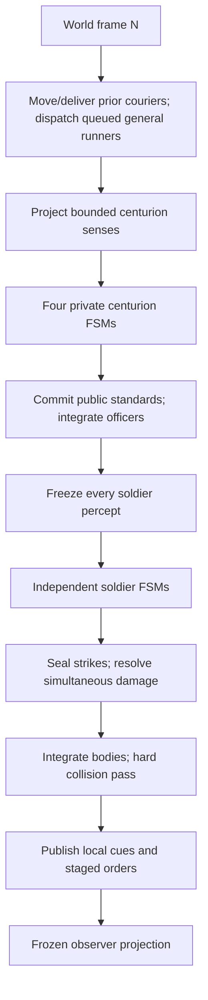

# soldier_ABM_v28 — two-century battle laboratory

`soldier_ABM_v28` is a deterministic, headless-first agent-based battlefield simulation with two centuries per team. It is a tactical systems prototype, not a conventional unit-controller RTS: a general supplies broad intent, centurions interpret that intent through doctrine and private beliefs, and soldiers act through local finite-state machines.

The cardinal rule is:

> No telepathy. Shared doctrine is allowed. Shared live knowledge or intention is not.

Every causal decision must therefore originate in one of two places:

- **Doctrine:** immutable knowledge assigned before contact—formation geometry, century mark, relay duty, team axis, role conventions, and fallback behavior.
- **Perception or communication:** something the individual physically sees, hears, remembers, infers, or receives through a modeled channel.

External or shared world truth still exists inside the material simulation, but only four boundaries may inspect it directly: sensor projection, communication propagation, collision/combat resolution, and observer projection. A mind may inspect its own embodied/private state, but a centurion or soldier mind never receives the live world collections or another mind's mutable record.

## What v28 adds

- A shared battlefield with **Blue B1/B2 versus Red R1/R2**.
- Four distinct centurion brains, four inboxes, four plan records, and four private enemy-track maps.
- Default **fix-and-flank doctrine** for an aggressive pair.
- Coordinated **hold-wing sectors** for a stationary pair.
- Perception-triggered **bait-and-cover doctrine** for defensive feints.
- Physically delayed general orders from fixed Blue and Red command posts.
- Centurion proposal/ACK/commit plan epochs.
- Voice, raised-standard, physical runner, officer-order, and local soldier-relay channels.
- Anonymous geometry-based enemy detections and uncertain private tracks.
- Physical melee with simultaneous damage, shield/front/flank effects, casualties, local morale, routing, and rallying.
- A perspective battlefield renderer, selectable centuries, team-level posture controls, hold-zone placement, cognition overlays, couriers, standards, and detailed diagnostics.
- A self-contained browser release plus a modular source project and headless Node tests.

The default scale is 36 soldiers per century: 144 soldiers, four centurions, and any runners currently in flight. This is a computational representation of century behavior, not a claim that a historical century always fielded 36 men. The UI supports 12–64 soldiers per century; the engine accepts up to 100.

## Run it

The easiest build is the self-contained file:

```text
soldier_ABM_v28.html
```

Open it in a modern browser. It contains all JavaScript and CSS and requires no server.

For source development:

```bash
npm install
npm test
npm run build
```

`npm run build` writes:

- `dist/soldier-abm-v28.bundle.js`
- `dist/soldier_ABM_v28.html`
- a release copy at `../soldier_ABM_v28.html`

The engine itself has no DOM dependency:

```js
import { createBattlefieldSimulation } from './src/engine.js';

const sim = createBattlefieldSimulation({ seed: 28, perCentury: 24 });
sim.issuePosture('blue', 'aggressive'); // dispatches physical general couriers
sim.runSeconds(30);
console.log(sim.diagnostics());
```

## Player controls

The player is a battlefield general, not a puppeteer for 144 individual bodies.

1. Select B1, B2, R1, or R2.
2. Leave **Issue posture to both team centuries** enabled for normal general-level play. Disable it only for controlled experiments.
3. Choose one of three intentions:
   - **Aggressive / advance**
   - **Stationary / hold**
   - **Defensive / feint**
4. Optionally place a hold-ground zone. With team scope enabled, each centurion derives a distinct left/right sector rather than collapsing both centuries onto the clicked center.

Commands do not change the selected centuries immediately. A runner leaves the physical team command post, searches for the addressed standard from its last perceived or doctrinal position, delivers the order, and returns. A team posture then requires centurion proposal/ACK/commit traffic before both officers adopt the new epoch.

Other controls:

- Drag to orbit.
- Shift-drag or right-drag to pan.
- Mouse wheel to zoom.
- Space pauses/resumes.
- `Q`, `W`, `O`, and `P` select B1, B2, R1, and R2.
- `1`, `2`, and `3` issue the three postures to the current command scope.
- `Escape` cancels hold-zone placement.
- **Assault v Hold**, **Meeting Fight**, **Feint Trap**, and **Mutual Feint** are posture-only presets. They dispatch ordinary general couriers; they do not reposition bodies or pre-share a plan.
- **Pause**, **Restart**, **New Seed**, and **Reset Camera** control presentation/match lifecycle. The UI tempo slider spans 0.25–8×. The strength slider spans 12–64 soldiers per century in steps of two. Strength and the typed seed take effect on restart; New Seed deterministically derives and immediately starts another seed.
- The UI hold-zone radius is 5–30 m; the headless API accepts 4–32 m.
- **Private enemy tracks** shows observer-only projections of each century’s beliefs: dashed areas for formation tracks, diamonds for courier contacts, and crosses for other isolated bodies. It does not enable those beliefs or feed data back into the engine.
- **Runners and signals** controls only their rendering.

## Causal architecture



The barriers matter:

- A message dispatched during tick N cannot be received during tick N. Queued general runners are created only after the prior in-flight courier set has moved or delivered.
- All four centurion percepts are deeply frozen before any centurion FSM runs; an early officer cannot change a public state or create a runner for a later officer to sense in the same commander frame.
- A standard raised by the first-updated centurion is staged; the second centurion cannot see it until the next commander frame.
- Every soldier percept for a tick is frozen before any soldier mind publishes its next cue.
- Strike intentions are complete before any damage is applied.
- Renderer, diagnostics, and match adjudication cannot write into cognition.

### Ownership and authority

| Owner | Mutable knowledge | May directly change |
|---|---|---|
| Material world | Bodies, collision map, couriers, damage | Physical positions, delivery success, wounds |
| General command post | Per-team command serial and queued addressed packets | Starts a finite runner mission |
| One centurion | Own tracks, ally track, plan epoch, inboxes, FSM, perceived strength/cohesion | Own movement, standard act, semantic century order |
| One soldier | Own doctrine copy, guide/order belief, local target memory, morale, fatigue, combat FSM | Own preferred motion and strike intention |
| Observer | Frozen snapshots, diagnostics, terminal result | Nothing in cognition |

There is no faction brain, global nearest enemy, shared target, shared morale, shared unit anchor, or live team plan object.

## Communication model

| Channel | Physical rule | Content and limitation |
|---|---|---|
| General runner | Starts at `(0,-54)` for Blue or `(0,54)` for Red; 2.6 m/s; visually reacquires within 18 m; targetable; returns | One independently addressed order per century. One active general runner per recipient; later commands queue. |
| Centurion voice | Sender chooses voice only from a private estimate at perceived range ≤25 m; material delivery revalidates audibility at ≤25.8 m | Finite delay `0.22 s + perceivedRange / 65`; short utterance cooldown; no synchronous delivery knowledge. |
| Raised standard | Public code recognizable within 75 m after a 0.45 s visual-recognition delay in the current unobstructed field model | `READY`, `GO`, `FIXED`, `DRAW`, or `ABORT`; staged to prevent same-tick reads. |
| Century runner | 2.6 m/s; one active outbound/return runner per century; 18 m reacquisition; 45 s packet life; targetable | Detailed reports or plan packets when the peer is not believed to be in voice range. The sender learns outcome only if the runner returns. Routine reports pause briefly after return rather than creating a permanent courier loop. |
| Officer order | Projected into each soldier's frozen acoustic percept within 25 m; repeated on state change or roughly every 1.6 s | Semantic movement, heading, cadence, formation dimensions, reason, sequence, and expiry—never per-soldier destinations or a live officer reference. |
| Soldier relay | 6.2 m; designated relay-duty soldiers; at most eight hops | Repeated order wording is projected acoustically regardless of receiver facing. A quantized deliberate guide call is consumed only from a speaker also present in the receiver's bounded visual percept. Public cues are staged and expire. |

The general can aim a courier at a currently visible friendly standard within 92 m. Otherwise the courier starts with the doctrinal assembly location and must search. Each recipient has one active general runner, and surviving queued orders leave in issue order. Posture and zone orders maintain separate receipt watermarks; a newer posture cannot erase a delayed zone order. Before dispatch, a newer command supersedes an older queued command in the same family: posture replaces posture, while set-zone and clear-zone replace one another. An already dispatched courier is never recalled or silently rewritten. The UI may show the whole battle to the human observer, but the command network does not use that omniscient view.

## Plan epochs

A team-scoped posture is not a shared Boolean.

1. A separate general runner carries the same per-team command serial to each centurion.
2. The doctrinal coordinator—century 1—creates a private mission proposal for that epoch.
3. The partner copies the proposal into its own plan record and sends an ACK.
4. The coordinator successfully places the exact COMMIT into a finite voice/runner channel, then commits locally and raises `GO`.
5. The partner commits only after receiving that exact mission packet and only if it previously dispatched an ACK carrying the matching full mission fingerprint.

Each mission record carries an explicit `team` or `single` scope, an epoch-derived mission ID, and a 36 s coordination deadline. Team negotiation does not change active posture or tactical roles while it is pending. Packets can be delayed, lost with a runner, heard by one officer and not the other, or superseded by a later epoch. Repeated proposals and commits are idempotent. The ACK includes a canonical fingerprint of the complete proposed mission; a commit is rejected unless it comes from the doctrinal coordinator and exactly matches the recipient's pending, fingerprinted proposal. The coordinator itself commits only after the COMMIT act has actually entered a finite voice/runner channel.

If agreement cannot be completed before the deadline, that officer raises `ABORT`, retains its previously active posture/role, and clears the live pending mission. Only a non-coordinator follower whose matching ACK successfully entered a finite channel keeps a bounded 30 s fingerprinted reconciliation record; a coordinator or unacknowledged follower keeps none. A coordinator that already committed can react only if it physically sees or receives the matching `ABORT`; it re-sends the exact original COMMIT. The follower may accept that late packet only against its own previously ACKed reconciliation record. If the abort signal or reply cannot travel, the split remains—a deliberate causal failure rather than an invisible team-state repair.

Individual-century posture commands are supported for experiments. They still travel by general runner, but the addressed officer can adopt them locally because no team agreement was requested. A single-scoped mission is never offered or rebroadcast through the team protocol, so this can intentionally create divergent plans without silently changing the partner.

## Posture doctrine

All posture branches are subordinate to emergency priorities: perceived collapse/withdrawal, a credible exposed outer flank or seam penetration, and a finite ally support request can override the nominal mission.

The FSM uses asymmetric entry/exit thresholds and short commitment windows for contact, counterpressure, flank guard, and withdrawal. This prevents noisy range estimates from producing implausible order chatter while preserving prompt emergency entry.

### Aggressive / advance

The pair assigns complementary roles:

- **Century 1 — FIX:** advances on its best private track. Below 9.5 m it reduces forward pressure and enters `fix-enemy`; the exit threshold is 11 m. It raises `FIXED` only after repeated direct observations with sufficient confidence.
- **Century 2 — FLANK:** advances more slowly while a fresh private ally estimate regulates a scale-dependent staging gap—formation width plus the doctrinal century gap and 5 m of maneuver room. With no fresh ally estimate it adds no lateral drift. It enters `maneuver-flank` only after receiving or seeing `FIXED` for the current epoch and holding a fresh, directly observed enemy track. A report-only track cannot authorize the maneuver.

Once flank commitment has valid provenance, it remains part of that plan epoch even if the `FIXED` display later drops. The flanker still needs fresh direct contact to continue its attack and limits separation from its privately estimated ally position. The fixing century does not chase the flanker sideways; ordinary seam correction is intentionally asymmetric during the maneuver.

### Stationary / hold

Both centuries become `hold-wing` roles.

- Without an explicit zone, the centurion treats the location at mission commitment as its fallback anchor.
- With a team zone, each officer derives a separate sector by offsetting the clicked team center along the team lateral axis by its doctrinal wing sign.
- A century repositions toward its own anchor and may apply bounded counterpressure when a credible contact enters 13.5 m; it does not leave counterpressure until the contact reaches 16 m.
- A soft zone edge begins at 72% of the radius; inward pressure grows toward and beyond the hard radius.
- Private ally tracks drive seam and depth correction. If the ally estimate is stale, the centurion stops correcting rather than reading the partner’s true pose. A perceived hostile formation entering the inter-century seam or the doctrinal outer wing triggers a local guard response and a finite warning to the partner.

### Defensive / feint

The pair assigns:

- **Century 1 — BAIT:** `bait-wait` does nothing aggressive without a fresh direct enemy track. With a perceived enemy beyond 13 m and at or within 32 m it probes. At 13 m or less it commits to a retirement toward its anchor, capped at roughly 8 m, and raises `DRAW`. The retirement is latched and the bait then holds the new line; range noise cannot restart the probe/retire loop inside the same plan epoch.
- **Century 2 — COVER:** holds its anchor. It enters `ambush-strike` only when it has both recent `DRAW` provenance and its own fresh direct contact inside 24 m.

There is no timer-driven feint loop. With the enemy outside perception and hostile communications suppressed, the bait remains `bait-wait` and the cover remains `cover-feint` indefinitely.

## Perception and enemy awareness

### Centurion sensing

- Sight: 82 m.
- Enemy-search field of view: 150°.
- Close awareness: 16 m.
- Friendly raised standards: up to 75 m in the current open-field model.
- Perceived points include deterministic range-dependent error and quantization.
- Own cohesion is estimated from overt spacing and heading alignment. The sensor never reads a soldier’s private intended post.

Visible enemy soldiers and centurions are clustered with geometry-based connected components using a 2.8 m link distance. The sensor never groups bodies by engine `centuryId`. A standard signature is attached only if an enemy centurion/standard is physically in the observed component. A cluster needs at least three visible bodies before it becomes a formation observation. Smaller fragments and couriers enter a separate, short-lived individual-contact memory; they cannot create a formation track, authorize `FIXED`/flank or feint triggers, or masquerade as a century. Fragmented ranks may still create multiple tentative clusters, and intermingled formations may be confused.

### Private tracks

Each centurion owns its own `Map` of formation tracks plus a separate bounded list of individual contacts.

- A new visual track begins at 0.35 confidence.
- Repeated direct observations increase confidence by 0.22.
- Confidence decays with a 5.8 s half-life.
- Tracks below 0.10 or older than 18 s are removed.
- Planning ignores weak or sufficiently stale tracks.
- Threat assessment examines every usable private formation track, not just the currently preferred frontal target; outer-flank and seam-penetration contacts are ranked separately.
- Every track remembers whether and when it was directly observed.
- Ally reports can create a lower-confidence `ally-report` track, but do not manufacture direct-observation provenance.
- Isolated bodies and runners decay on a shorter 2.5 s half-life and are retained for awareness only, never selected by formation tactics.

Contact reports are deliberately coarse: positions to 3 m, velocity to 0.5 m/s, heading to 15°, strength as `few/body/many`, and age as `fresh/recent/stale`. On receipt, physical transit time is added to that reported age, position is dead-reckoned from the coarse velocity, and confidence decays from the total information age. An older courier cannot overwrite newer visual/voice evidence or refresh an expired tactical request.

Report cadence is event-sensitive: plan acts always take priority; new FSM states, standards, materially displaced contacts, strength bands, and flank classifications prompt a report. After a successful send, the base interval is 1.4 s for a flank threat; 4 s with contact in a tactically active state; 12 s with contact in `hold`, `bait-wait`, or `cover-feint`; 5.5 s without contact when cohesion is low or the officer is supporting its ally; and otherwise 11 s. Deterministic jitter in `[0, 1.2)` s is added. A runner send has a 12 s floor, and routine non-emergency reports rest for roughly 3 s after its return.

### Soldier sensing

- Sight: 9.5 m.
- Field of view: 190°.
- Close awareness: 2.4 m.
- Perfect team-color recognition is an explicit current abstraction.
- Soldier percept DTOs contain no engine body ID or century membership key.
- Audible order calls are projected independently of visual facing.
- Officer death affects a soldier only through a locally witnessed fallen officer, missing/expired orders, and subsequent local behavior—not a raw global `centurion.alive` read.

## Formation and orders

Every soldier receives a unique, deeply frozen doctrine object containing rank, file, lateral/depth offset, spacing, century mark, wing, and relay duty.

The centurion publishes semantic orders only:

- posture and movement word;
- heading and cadence;
- number of ranks/columns and spacing;
- issue, execution, and expiry times;
- a human-readable tactical reason.

The order contains no enemy target, world destination, unit pointer, or per-soldier coordinate. A soldier combines the copied order with its own doctrine and private guide estimate to reconstruct its target post.

Each soldier starts with a doctrine-time guide estimate for its deployment station. After contact begins, guide estimates come from direct sight of the officer or a limited, quantized, deliberate local guide call. Only designated relay-duty soldiers repeat calls, calls have cooldowns, no cue can travel more than eight local hops, and next-tick publication prevents instantaneous floods.

Friendly local collision avoidance receives copied public kinematics only. Enemies are deliberately excluded from cooperative ORCA: opposing soldiers do not politely negotiate future velocities. Material collision resolution handles enemy contact.

## Combat and morale

Each soldier combat FSM moves through:

```text
ready → approach → guard → commit → strike → recover
```

A soldier remembers a locally perceived position briefly, never an engine target handle. A strike intention contains the attacker’s own internal identity plus an aim heading and perceived range. At the material boundary, the resolver selects a physically present enemy in that arc, verifies weapon reach and friendly obstruction, then computes front/shield/flank effects.

Important defaults:

- Weapon reach: 1.42 m.
- Base hit chance: 0.46 before geometry, shield, target type, and attacker-fatigue effects.
- Flank bonus: 0.26.
- Commit: 0.18 s.
- Strike: 0.09 s.
- Recovery: 0.62 s, lengthened by fatigue.

All sealed strikes for a tick are evaluated before accumulated damage is committed, allowing reciprocal same-tick hits. Fallen bodies become local morale evidence and physical observer artifacts.

Morale is individual and local. It responds to nearby numerical balance, newly witnessed friendly/enemy losses, stale orders, and a witnessed fallen centurion. Each local casualty event is consumed once by that soldier. A witnessed courier loss has only 15% of the immediate morale weight of a soldier loss. A soldier routes below 0.16; while routing it neither strikes nor deliberately relays orders, and it may rally only above 0.34 with no locally perceived enemy within 8 m.

## Determinism

The simulation uses no consuming global gameplay RNG.

- Soldier variation is keyed by seed, soldier number, team/index salt, and purpose.
- Sensor noise is keyed by observer/source/time epoch.
- Strike rolls are keyed by attacker, physical target, strike serial, and quantized commit time.
- Each centurion owns its own enemy-track serial counter.
- Each team owns its own general-command serial counter.
- Runner search variation is keyed to that runner mission, never the length/order of a global message collection.

Two worlds with the same seed and inputs produce identical snapshots even if one is observed, diagnosed, or privately audited much more often.

## Public API

`createBattlefieldSimulation(options)` returns a frozen facade.

| Member | Behavior |
|---|---|
| `version` | `28` |
| `step(dt)` | Advances one material tick; requires `0 < dt <= 0.25`. This low-level method ignores UI pause/time scale. |
| `runSeconds(seconds, dt?)` | Deterministic headless stepping; requires a finite non-negative duration and `0 < dt <= 0.25`, then returns a frozen snapshot. |
| `reset({ seed, perCentury })` | Rebuilds all agents, private memory, couriers, logs, and adjudication state. A finite seed is converted to unsigned 32-bit; `perCentury` is rounded and clamped to the engine range 12–100. Passing a finite number alone is shorthand for `{ seed }`. |
| `observe()` | Returns a deeply frozen observer projection. |
| `diagnostics()` | Returns frozen current gauges plus cumulative communication, combat, and casualty totals. The exact schema is below. |
| `issuePosture(scope, posture)` | Queues finite general couriers. `scope` is a century ID, `blue`, `red`, or `all`. |
| `setHoldZone(scope, zone)` | Queues `{x,z,radius?}` as a physical general order. Radius defaults to 14 m and clamps to 4–32 m; x/z clamp to battlefield bounds ±68/±72 m. Team scope derives distinct sectors on receipt. |
| `clearHoldZone(scope)` | Queues a physical clear-zone order. |
| `setPaused(bool)` | UI-facing pause flag. |
| `setTimeScale(scale)` | Clamps UI tempo to 0.1–8×. |
| `setPresentation(options)` | Observer-only `showCognition` and `showMessages` flags. |
| `observerEventsSince(index)` | Returns frozen `{ nextIndex, dropped, events }`. Every returned event has a monotonic `index`; `dropped` counts requested indices older than the oldest event still retained after buffer trimming or reset. The cursor remains monotonic across reset. |
| `simTime`, `tick`, `paused`, `timeScale`, `result` | Read-only getters. |

### Diagnostics schema

The cumulative communication, combat, and casualty totals below are monotonic within one match and reset with it; trimming bounded detail logs cannot reduce them. Health, queue, plan, courier, collision, and team/century fields are current gauges and may rise or fall.

| Scope | Fields and semantics |
|---|---|
| Top-level health | `version`, `simTime`, `tick`, `activeBodies`, `fallenBodies`, `couriers`, `physicalRunners`, `generalCommandsQueued`, `overlaps`, `nonFinite`, `minGap`, `matchResult`. `activeBodies` counts living soldiers, centurions, and physical runners—not voice packets. `fallenBodies` retains fallen physical bodies of all three kinds. `couriers` includes finite voice signals; `physicalRunners` counts only physical runner bodies. `generalCommandsQueued` excludes already dispatched general runners. `minGap` is the minimum center-to-center distance between living bodies, not edge clearance. |
| Communication | `messagesDispatched`, `messagesDelivered`, `runnerDeliveries`, `voiceDeliveries`. These count centurion-to-centurion traffic; general-order events retain their separate event names. |
| Combat | `strikes` counts resolved hit-or-miss attempts, `hits` counts hits, and `casualties` aliases `soldierCasualties`. `soldierCasualties`, `centurionCasualties`, and `runnerLosses` are separate. |
| `team.blue` / `team.red` | `initial`, `alive`, `fallen`, `routing`, `centurionsAlive`. |
| `century[centuryId]` | `posture`, `state`, `alive`, `initial`, `centurionAlive`, `perceivedOwn`, `tracks`, `contactConfidence`, `messagesSent`, `messagesReceived`, `tacticalRole`, `planStatus`, `planEpoch`, `standardCode`, `ordersIssued`, `lineDepthError`, `lineGapError`, `holdZone`. |

### Debug facade

`simulation.debug` is frozen and exists for tests/scenarios. It is deliberately quarantined from production cognition.

| Member | Purpose |
|---|---|
| `setCommunicationEnabled(centuryId, enabled)` | Disabling immediately clears that officer's peer and general-command inboxes, then blocks new centurion sends and packet/general receipt. It does not erase an already public standard, retract an outbound courier, or silence soldier-order acoustics. |
| `teleportCentury(centuryId, x, z, options?)` | Moves one physical formation, its soldiers’ private guide estimates, and normally its fallback anchor for counterfactual tests. It does not update any other century’s belief. |
| `knowledge(centuryId)` | Returns a detached/frozen copy of one private brain’s tracks, plan, inboxes, signal memory, and support/threat beliefs. |
| `percept(agentId)` | Projects one current sensor DTO without returning live state. |
| `dispatch(senderId, kind, payload)` | Attempts one act through the normal perceived-range, voice cooldown, and runner-capacity rules. |
| `architectureAudit()` | Computes identity/freeze/percept-boundary metrics from the live instance. |

No live `soldiers`, `centuries`, body map, private brain, or mutable configuration object is exported.

## Observer snapshot

The main snapshot contains:

- public configuration, time, tick, and match result;
- four century summaries, including public posture/state, observer copies of plan/role metrics, and cognition-gated formation/individual belief projections;
- soldier and centurion render DTOs;
- optional courier render DTOs and raised-standard rendering, controlled by the observer-only runners/signals flag;
- fallen-body records;
- bounded recent communication/combat events;
- private enemy-track copies only when the observer cognition overlay is enabled.

Snapshot body IDs are observer/render identifiers. Agent percepts do not contain them.

## Match adjudication

Adjudication is observer-only. It cannot influence morale or tactical decisions.

- A team loses if its surviving soldiers fall to a small remnant, or if both centurions are gone and most survivors are routing.
- At 360 s, remaining soldier strength breaks a tie; exact equality is a draw.
- The first result is frozen and emitted once. Further headless stepping cannot change it.

## Source map

| File | Responsibility |
|---|---|
| `src/constants.js` | Public enum values, ranges, speeds, combat timings, battlefield limits, and deployment doctrine. |
| `src/math.js` | Vector/scalar helpers, coordinate transforms, quantization, and recursive freezing. |
| `src/rng.js` | Stateless keyed hashes plus optional isolated seeded RNG helper. |
| `src/orca.js` | Capability-limited friendly-only local avoidance. It cannot import the world kernel. |
| `src/engine.js` | World ownership, sensors, private cognition, communications, tactics, combat, physics, API, and observer projection. |
| `src/renderer.js` | Snapshot-only perspective canvas renderer and screen/ground projection. |
| `src/ui.js` | General-intent controls and observer dashboard through the injected frozen facade. |
| `src/main.js` | Fixed-step browser loop; pause/tempo handling; composition root. |
| `tools/build-standalone.mjs` | Bundles modules and inlines CSS/JS into one HTML release. |
| `tools/audit-architecture.mjs` | Static and runtime no-telepathy boundary checks. |
| `tools/audit-ui.mjs` | Control/DOM and standalone self-containment checks. |
| `test/engine.test.mjs` | Determinism, protocol, noninterference, tactics, combat, terminal, and stability tests. |
| `RELEASE_NOTES.md` | Exact release-gate hashes, soak outcomes, tactical timings, and known tuning frontier. |

## Engine function catalog

This section maps every function declaration plus the five named arrow helpers in `src/engine.js` to its role so future changes can be reviewed at the causal boundary rather than treated as a monolith.

### Construction, world indexing, and sensors

| Functions | Responsibility |
|---|---|
| `createBattlefieldSimulation` | Owns every mutable world collection and returns the frozen facade. |
| `emitObserver`, `logCommunication`, `logCombat` | Append bounded observer-only event histories while maintaining separate monotonic aggregate counters/cursors. |
| `otherTeam`, `centuryById`, `partnerOf`, `aliveSoldiers`, `currentCenturyCenter` | Team inversion and kernel-only material lookups; never exported to minds. |
| `formationPlan`, `formationHalfWidth`, `guideFromCenter`, `centerFromGuide`, `slotPosition` | Derive immutable rank/file geometry and translate between formation center, guide, and individual doctrine posts. |
| `postureIsValid` | Validate the three public general-intent values at the facade boundary. |
| `roleForPosture` | Converts shared role doctrine plus century index into fix/flank, hold-wing, or bait/cover. |
| `createCentury`, `initializeBattlefield` | Allocate four private brains, unique soldier doctrines, bodies, deployment anchors, and initial orders. |
| `spatialKey`, `rebuildSpatial`, `queryPhysicalBodies` | Material spatial hash and bounded physical queries. |
| `withinSensorArc`, `noisyPoint` | Sensor geometry and deterministic range error. |
| `senseCenturion` | Produces anonymous clustered detections, overt own-formation estimates, and public ally-standard observations. |
| `senseSoldier` | Produces identifier-free nearby-body, audible-order, and local-loss DTOs. |

### Memory, plans, and communication

| Functions | Responsibility |
|---|---|
| `copyPacket` | Deep-copy and freeze a finite packet at a causal boundary. |
| `decayTrackConfidence`, `associateEnemyTrack`, `updateEnemyTracks` | Private formation-track prediction, association, confirmation, decay, and deletion. |
| `updateIndividualContacts` | Maintains bounded short-lived memories for couriers and sub-formation fragments without promoting them into tactical formation tracks. |
| `updateAllyTrackFromObservation`, `incorporateReportedContact` | Maintain one private ally estimate and transit-aged, lower-trust reported enemy contacts without letting old evidence overtake new. |
| `raiseStandard`, `expireStandard`, `commitCenturionSignals` | Stage deliberate public standard codes without same-tick cross-brain reads. |
| `missionFingerprint`, `validTeamMission`, `missionFor`, `activateMission`, `sectorZoneForCentury` | Canonically bind proposal contents, validate copied team missions, commit one officer’s epoch, and derive distinct left/right team sectors. |
| `generalCommandFamily`, `processGeneralCommandInbox` | Keep posture/zone causality separate and apply only physically delivered, non-obsolete general packets. |
| `processCenturionInbox` | Deduplicate delivered peer packets, preserve information age/epoch provenance, expire old tactical semantics, and update only the recipient brain. |
| `servicePlanCoordination` | Retry proposal/ACK/commit acts, apply epoch/fingerprint guards, and perform bounded physically prompted reconciliation. |
| `deliverCenturionPacket`, `deliverGeneralCommand` | Material delivery boundary; no success is written synchronously at dispatch. |
| `composeSenderPose`, `composeContactPayload` | Quantize semantic reports. |
| `createPhysicalRunner`, `dispatchCenturionMessage`, `serviceGeneralCommandQueue`, `removeCourier`, `updateCouriers` | Select acts from belief, enforce capacity/cooldowns, move targetable runners, reacquire visually, deliver, return, search, or expire. |

### Centurion tactics

| Functions | Responsibility |
|---|---|
| `usableEnemyTracks`, `bestEnemyTrack`, `assessFlankThreat` | Filter all usable private formation beliefs, select a tactical focus, and independently rank perceived outer-flank or seam-penetration threats. |
| `sendPeriodicCenturionReport` | Coalesce line/contact/flank/withdraw/feint information into finite acts. |
| `setCenturionState` | Change one FSM and preserve its current reason. |
| `publishCenturyOrder`, `movementForState`, `commitCenturyOrders` | Create semantic staged soldier orders and publish only after the decision barrier. |
| `constrainToZone`, `applyLineCoordination`, `boundaryCorrection` | Apply private zone, ally-estimate seam/support, and battlefield-edge corrections. |
| `updateCenturionBrain` | Execute emergency priorities plus aggressive, hold, or defensive-feint role doctrine from its pre-frozen percept and private memory. |
| `integrateCenturions` | Materially integrate only the already chosen officer motion. |

### Soldier cognition, combat, and material resolution

| Functions | Responsibility |
|---|---|
| `updateSoldierOrderAndGuide` | Consume frozen officer/soldier acoustic DTOs, copy heard orders, and gate deliberate local relays. |
| `updateSoldierMorale`, local `casualtyWeight` | Apply only local numerical, once-consumed casualty, order, and witnessed-officer evidence; weight a witnessed runner loss at 15% of an ordinary casualty. |
| `formationTargetForSoldier` | Reconstruct one post from private doctrine plus a private guide/order belief. |
| `chooseVisibleEnemy` | Select only from the frozen local percept. |
| `advanceCombatState` | Advance the private melee FSM and seal aim-only strike intentions. |
| `planSoldierVelocity` | Blend route, combat, or post-seeking motion and friendly-only ORCA. |
| `updateSoldierMind`, `publishSoldierCues`, `integrateSoldiers` | Think from frozen frames, stage public local calls/states, and integrate planned motion. |
| `segmentClearOfFriendlies` | Materially validate the strike corridor. |
| `killBody`, `resolveStrikes` | Accumulate simultaneous damage, create casualties, and stop fallen bodies. |
| `bodyMobility`, `clampBodyToBattlefield`, `resolveBodyCollisions` | Resolve non-negotiated hard overlap with state-weighted displacement while projecting battlefield-edge constraints inside the iterative solve. |

### Loop, observers, controls, and tests

| Functions | Responsibility |
|---|---|
| `projectMatchResult` | Observer-only terminal adjudication. |
| `step` | Enforce the full tick barrier order. |
| `centuryObserverSnapshot`, `observe`, `diagnostics` | Build deeply frozen, non-causal projections. |
| `resolveCommandScope`, `enqueueGeneralCommand`, `issuePosture`, `setHoldZone`, `clearHoldZone` | Turn UI intent into per-team serialized, independently addressed physical packets. |
| `setPaused`, `setTimeScale`, `setPresentation`, `reset`, `runSeconds`, `observerEventsSince` | Frozen facade utilities. |
| `debugSetCommunicationEnabled`, `debugTeleportCentury`, `debugKnowledge`, `debugPercept`, `debugDispatch`, `architectureAudit`, local `fullyFrozen`, local `forbiddenPerceptKey` | Explicitly quarantined verification controls, detached copies, recursive freeze checks, and forbidden-key scans. |

## Verification

`npm test` runs the architecture audit, headless behavioral suite, standalone build, and UI/self-containment audit. It covers:

- four distinct century brains, inboxes, plans, and track maps;
- one frozen doctrine object per soldier;
- frozen/detached snapshots and percepts;
- no body/century engine IDs in agent percept DTOs;
- same-seed determinism under asymmetric observer polling;
- delayed general runner delivery, including no same-tick delivery even inside the command-post envelope;
- proposal/ACK/commit activation, full-fingerprint/epoch rejection, no-ACK late-commit rejection, and physical ABORT reconciliation;
- FIFO posture/zone delivery with independent family watermarks;
- a monotonic observer cursor across buffer trimming and reset;
- strict team/single mission scope isolation;
- distinct team hold sectors;
- voice delay, packet send/receipt partitions, far-runner capacity, delivery, and return;
- hidden-enemy counterfactual noninterference;
- visible enemy-courier classification without formation-track contamination;
- no-contact defensive-feint inactivity;
- stable distinct R1/R2 standard-signature tracks at small scale;
- `FIXED` plus fresh direct-track gating for an aggressive flank in both 12- and 36-soldier default replays;
- rejection of old-epoch `FIXED`/`DRAW`, transit-aged stale runners, overtaken poses, and expired tactical requests;
- routed-soldier strike/relay suppression through a locally valid rally;
- reciprocal combat actions and losses, no non-finite values, no persistent overlap, one stable terminal result;
- a 36-soldier-per-century edge-collision replay sampled through 160.1 s, including the former t=160 clamp failure;
- self-contained standalone HTML and valid control bindings.

The architecture audit also scans function bodies for the specific shortcuts this version is designed to prevent: true-century grouping in officer sensing, courier-to-formation promotion, private intended-post reads, raw centurion-life reads in morale, engine target handles, true receiver pose/life in channel selection, direct posture mutation in the public command method, same-tick centurion-percept mutation, and team-plan traffic without explicit team scope and ACK provenance.

## Current abstractions and next work

The no-telepathy architecture is stricter than v27, but this is not yet a complete historical battle engine.

- The battlefield is open and flat. There is no terrain height, LOS occlusion, weather, acoustic masking, or chokepoint geometry yet.
- Standards use range and life state but not occlusion, facing duration, or mistaken-code recognition.
- Team color recognition is perfect at soldier range.
- Coordinates in semantic reports stand for landmark-relative battlefield estimates; a full system should replace them with landmarks, bearings, and route descriptions.
- General command posts are fixed sensor/runner origins, not movable/vulnerable general bodies.
- A runner is targetable and must return before capacity clears, but staff recruitment, capture/interrogation, and explicit carried return ACK contents are not yet modeled.
- Century formations do not close ranks around casualties or reassign doctrine slots.
- There are no missiles, cavalry, terrain fatigue, reserves, supply, medical evacuation, surrender, prisoners, or formation-level weapons.
- The combat model is tuned for causal behavior and stability, not yet calibrated against experimental casualty rates.
- Track uncertainty is scalar confidence, not a full covariance filter.
- Match adjudication is observer-side and deliberately simple.

Good next extensions preserve the same rule: add a physical sensor, public act, message, or doctrinal inference first; only then add the tactical branch that consumes it.

## Refactor rule for future versions

Before adding a convenient field to an agent decision, ask:

1. Who owns this fact?
2. How did this individual obtain it?
3. How old, noisy, or ambiguous is it?
4. Can the source be absent, delayed, killed, blocked, or wrong?
5. Is it a copied immutable message/percept, or a live reference?
6. Would changing an unseen enemy or polling the observer change this decision?

If those questions do not have concrete answers, the field is probably telepathy.
