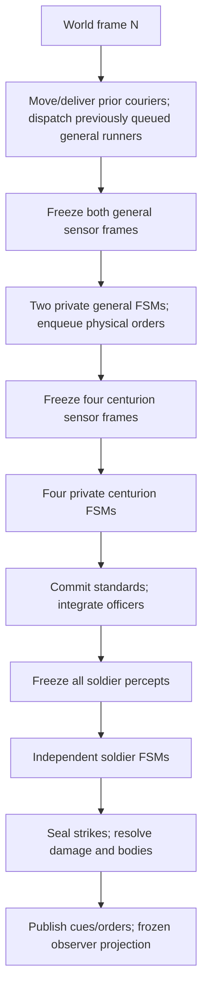

# soldier_ABM_v30 — private-command battlefield laboratory

`soldier_ABM_v30` is a deterministic, headless-first agent-based battlefield simulation with two centuries per team, bounded individual capabilities, private general and centurion cognition, and physical command traffic. It is a tactical systems prototype, not a conventional unit-controller RTS: a general forms intent from a private situation estimate, centurions interpret physically delivered orders through doctrine and private beliefs, and soldiers act through local finite-state machines.

The cardinal rule is:

> No telepathy. Shared doctrine is allowed. Shared live knowledge or intention is not.

Every causal decision must therefore originate in one of two places:

- **Doctrine:** immutable knowledge assigned before contact—formation geometry, century mark, relay duty, team axis, role conventions, and fallback behavior.
- **Perception or communication:** something the individual physically sees, hears, remembers, infers, or receives through a modeled channel.

External or shared world truth still exists inside the material simulation, but only four classes of boundary may inspect it directly: sensor projection, communication propagation, material collision/combat resolution, and observer/debug projection. A mind may inspect its own embodied/private state, but a general, centurion, or soldier mind never receives the live world collections or another mind's mutable record.

## What v30 adds

v30 retains the complete v29 individual-capability battle and adds a playable general-level information boundary:

- Permanent **Gameplay** and **Debug** interface modes, with Gameplay as the default.
- A Gameplay command/intelligence surface whose tactical knowledge comes from `generalSituation('blue')`, not omniscient century snapshots or diagnostics. If that projection is unavailable, the UI fails closed instead of unlocking observer data.
- Friendly field-report cards with source, pose age/confidence, independently aged strength evidence, status bands, and physical order status; weak strength evidence projects as `UNKNOWN`. Enemy intelligence cards use anonymous or recognized contact marks and bounded confidence, age, strength, range, bearing, and threat bands.
- Gameplay renderer truth firewall: exact Red soldiers, centurions, couriers, corpses, hit flashes, hold zones, command-post annotation, and FSM/role/count labels are suppressed. Coarse contact glyphs are drawn only from Blue's `generalSituation('blue').contacts`; Blue floating labels contain only public standard marks. Debug restores world truth and exact annotations.
- Two independently owned general brains with private traits, FSM state, friendly/enemy/signature tracks, latest-order and family receipt watermarks, per-serial receipt history, command-post-local runner leases, and decision history.
- General sensors at the two fixed command posts. They use finite sight, deterministic range error, public friendly standards, formation-center conversion, full-footprint-only strength evidence, and geometry-clustered enemy detections without hidden enemy century membership.
- A six-state general FSM—`observe`, `probe`, `deceive`, `press`, `guard`, and `recover`—that reasons only from its own tracks, aggregates all credible enemy tracks for force comparison, separates uncertain friendly location from strength evidence, clears obsolete zones physically, and issues ordinary posture/zone commands through the same path available to the player.
- Outbound general runners that carry independently addressed orders and return with immutable field reports composed by the receiving centurion. Delivery can change a century; only a physical return or a command-post-predicted missed-return deadline changes staff accounting. Successful returns update serial-specific receipts, confirmed intent, and transit-aged report knowledge.
- `generalSituation(team)`, `setGeneralAI(team, enabled)`, `debug.generalKnowledge(team)`, and general percept support through `debug.percept('general-blue' | 'general-red')`.
- Focused general tests plus expanded architecture and UI audits covering non-cheating decisions, team-scoped projections, serial/lease causality, transit-aged friendly evidence, physical AI orders, renderer annotation gating, and the Gameplay/Debug boundary.
- Tactical and grand-strategy research briefs plus `docs/DESIGN_SYNTHESIS_AND_ROADMAP.md`, which integrates them into one post-v30 product thesis and gated slice order.

The inherited v29 capability model includes:

- A unique, deeply frozen deployment profile and capability tree for every soldier, centurion, and physical runner.
- Correlated natural variance in stature, strength, agility, endurance, perception, cognition, and nerve, bounded to `0.90–1.10`.
- Independent training scalars for weapons, defense, formation, discipline, conditioning, awareness, command, tactics, leadership, and communication.
- Equipment classes whose names are metadata while reach, damage, penetration, armor, shield, and load are the actual scalar mechanics.
- Stable additive/multiplicative modifier stacks with source IDs, deterministic ordering, finite-value validation, time windows, and final clamps.
- Derived, bounded effects on health, perception, movement, formation control, order comprehension, relay cadence, attack, defense, reach, damage, fatigue, morale shock, route/rally thresholds, centurion judgment, command clarity, and report cadence.
- Local mutable conditions—HP, morale, fatigue, and an effects array—owned separately by each physical actor.
- `unitProfiles` deployment layering, `inspectActor()`, `rosterSummary()`, observer quality summaries, and focused capability tests.
- Mirrored default slot distributions across opposing teams: individuals vary, but the laboratory does not randomly grant one default side a better roster.

The inherited v28/v29 battle includes:

- A shared battlefield with **Blue B1/B2 versus Red R1/R2**.
- Four distinct centurion brains, four inboxes, four plan records, and four private enemy-track maps.
- Default **fix-and-flank doctrine** for an aggressive pair.
- Coordinated **hold-wing sectors** for a stationary pair.
- Perception-triggered **bait-and-cover doctrine** for defensive feints.
- Physically delayed general orders from fixed Blue and Red command posts.
- Centurion proposal/ACK/commit plan epochs.
- Voice, raised-standard, physical runner, officer-order, and local soldier-relay channels.
- Anonymous geometry-based enemy detections and uncertain private tracks.
- Physical melee with simultaneous damage, shield/front/flank effects, casualties, local morale, routing, and rallying.
- A perspective battlefield renderer, team-level posture controls, hold-zone placement, cognition overlays, couriers, standards, and detailed observer diagnostics.
- A self-contained browser release plus a modular source project and headless Node tests.

The default scale is 36 soldiers per century: 144 soldiers, four centurions, and any runners currently in flight. This is a computational representation of century behavior, not a claim that a historical century always fielded 36 men. The UI supports 12–64 soldiers per century; the engine accepts up to 100.

## Run it

The easiest build is the self-contained file:

```text
soldier_ABM_v30.html
```

Open it in a modern browser. It contains all JavaScript and CSS and requires no server.

For source development:

```bash
npm install
npm test
npm run build
```

`npm run build` writes:

- `dist/soldier-abm-v30.bundle.js`
- `dist/soldier_ABM_v30.html`
- a release copy at `../soldier_ABM_v30.html`

The engine itself has no DOM dependency:

```js
import { createBattlefieldSimulation } from './src/engine.js';

const sim = createBattlefieldSimulation({
  seed: 30,
  perCentury: 24,
  generalAI: { red: true }
});
sim.issuePosture('blue', 'aggressive'); // dispatches physical general couriers
sim.runSeconds(30);
console.log(sim.generalSituation('blue')); // detached gameplay-safe knowledge
```

## Player controls

The player is the Blue battlefield general, not a puppeteer for 144 individual bodies.

1. In Gameplay, select B1 or B2. Red formations are intelligence contacts, not selectable or commandable units.
2. Leave **Issue posture to both team centuries** enabled for normal general-level play. Disable it to address only the selected Blue century.
3. Choose one of three intentions:
   - **Aggressive / advance**
   - **Stationary / hold**
   - **Defensive / feint**
4. Optionally place a hold-ground zone. With team scope enabled, each centurion derives a distinct left/right sector rather than collapsing both centuries onto the clicked center.

Commands do not change the selected centuries immediately. A runner leaves the physical team command post, searches for the addressed standard from its last perceived or doctrinal position, delivers the order, and returns. A team posture then requires centurion proposal/ACK/commit traffic before both officers adopt the new epoch.

Other controls:

- Drag to orbit.
- Shift-drag or right-drag to pan.
- Mouse wheel to zoom.
- Space pauses/resumes.
- `Q` and `W` select B1 and B2 in Gameplay. Debug additionally enables `O` and `P` for R1 and R2.
- `1`, `2`, and `3` issue the three postures to the current command scope.
- `Escape` cancels hold-zone placement.
- **Enemy general AI** enables or disables the Red general's private FSM. It is enabled by default in the browser UI. Disabling it stops new AI decisions but does not grant the player Red knowledge or rewrite orders already in flight.
- **Assault v Hold**, **Meeting Fight**, **Feint Trap**, and **Mutual Feint** are Debug-only posture presets. They dispatch ordinary general couriers; they do not reposition bodies or pre-share a plan.
- **Pause**, **Restart**, **New Seed**, and **Reset Camera** control presentation/match lifecycle. The UI tempo slider spans 0.25–8×. Strength and seed controls are Debug-only; strength spans 12–64 soldiers per century in steps of two. Strength and the typed seed take effect on restart; New Seed deterministically derives and immediately starts another seed.
- The UI hold-zone radius is 5–30 m; the headless API accepts 4–32 m.
- **Private enemy tracks** is Debug-only. It shows observer projections of each century’s beliefs: dashed areas for formation tracks, diamonds for courier contacts, and crosses for other isolated bodies. It does not enable those beliefs or feed data back into the engine.
- **Runners and signals** controls only their rendering.

## Gameplay and Debug boundary

The two modes are intentionally different products over the same deterministic simulation.

| Surface | Gameplay | Debug |
|---|---|---|
| Command scope | Blue B1/B2 only | Any century for controlled experiments |
| Friendly cards | Blue general's doctrine, direct sight, returned reports, and order receipts; strength becomes unknown when its independent evidence confidence is weak | Exact observer century summaries |
| Enemy cards | Up to two threat-prioritized general-owned contacts, shown as bounded categorical intelligence | Exact R1/R2 state, role, count, capability summary, and communications |
| Selected panel | Reported strength/status/contact/order age and source | Exact FSM cause, line error, plan epoch, standard, zone, and roster quality |
| General diagnostics | Hidden | Both general FSM states, intents, reasons, contact counts, order counts, and report counts |
| Battlefield | Exact Blue friendlies and public standard labels; coarse Blue-general contact glyphs; no exact Red bodies, couriers, corpses, hit flashes, labels, zones, or post | Exact bodies/events/labels, both sides' zones/posts, and optional private-track overlays |
| Global tallies | Hidden | Exact casualty, hit, runner, and message totals |

Gameplay's command and intelligence panels call `generalSituation('blue')`. They never read `snapshot.centuries`, capability summaries, tactical roles, communications internals, or Red's `generalSituation`. A missing gameplay projection reduces the display to unknown/pending values. Returning from Debug synchronously scrubs observer-only text and disables the cognition overlay so there is no one-frame carryover.

Enemy contacts are projections of Blue's general-owned tracks, not Red century records. The facade deliberately omits enemy `centuryId`, team, FSM state, posture, mode, reason, profile, capabilities, condition, HP, morale, and fatigue. The browser further converts numeric estimates into safe bands and uses `CONTACT A/B` unless a public standard has been recognized. `generalSituation()` still exposes frozen, quantized track coordinates and numeric confidence for other gameplay clients; those values are uncertain beliefs rather than world truth. Contacts are deterministically sorted by threat band, confidence, freshness, range band, and finally private track ID, so the limited Gameplay card space presents the most urgent belief first without consulting exact enemy state.

The renderer receives both the observer snapshot and the Blue general situation, but Gameplay draws enemy information only from the latter. Contact position, confidence/age, and strength band control a coarse uncertain glyph; exact Red world records are skipped. This is a complete enemy-world truth firewall for the current open field, though future terrain still needs LOS, concealment, dead ground, and richer uncertainty geometry.

Debug is explicitly omniscient. `observe()`, `diagnostics()`, `inspectActor()`, `rosterSummary()`, cognition overlays, and `simulation.debug` exist for rendering, tests, audits, and controlled scenarios. They are detached/frozen where returned and have no write-back route into production cognition except the deliberately named debug mutators.

## Causal architecture



The barriers matter:

- A message dispatched during tick N cannot be received during tick N. General intent chosen in tick N remains queued until a later courier-service phase; queued runners are created only after the prior in-flight courier set has moved or delivered.
- Both general percepts are deeply frozen before either general FSM runs. An early general cannot issue an order that changes what the other general senses in that frame.
- All four centurion percepts are deeply frozen before any centurion FSM runs; an early officer cannot change a public state or create a runner for a later officer to sense in the same commander frame.
- A standard raised by the first-updated centurion is staged; the second centurion cannot see it until the next commander frame.
- Every soldier percept for a tick is frozen before any soldier mind publishes its next cue.
- Strike intentions are complete before any damage is applied.
- Renderer, diagnostics, and match adjudication cannot write into cognition.

### Ownership and authority

| Owner | Mutable knowledge | May directly change |
|---|---|---|
| Material world | Bodies, collision map, couriers, damage | Physical positions, delivery success, wounds |
| One general | Own traits/FSM, friendly and enemy tracks, recognized signatures, intended/confirmed posture and zone state, latest/family receipts, per-serial receipt history, command-post runner leases, decision history | Own team and per-century intended posture/zone plus queued addressed packets; confirmed state only from a successful physical return; never a century mission directly |
| General command network | Per-team serials, fixed command post, queued packets, command-post-local leases, physical outbound/return runners | Starts finite runner missions and releases staff-accounted capacity only on the matching return or its locally predicted deadline |
| One centurion | Own frozen profile/capabilities, tracks, ally track, plan epoch, inboxes, FSM, perceived strength/cohesion | Own condition, movement, standard act, semantic century order |
| One soldier | Own frozen profile/capabilities/doctrine, guide/order belief, local target memory, morale, fatigue, combat FSM | Own condition, preferred motion, relay acts, and strike intention |
| Observer | Frozen snapshots, diagnostics, terminal result | Nothing in cognition |

There is no omniscient faction brain, global nearest enemy, shared target, shared morale, shared unit anchor, or live team plan object. Blue and Red each have a separate general brain, but neither reads its team's century brains or material collections directly.

### General cognition and sensors

Each general starts with doctrinal deployment tracks for its two friendly standards. At every material step, the sensor at the fixed post receives a finite physical view:

- friendly soldiers contribute strength only when the complete doctrinal formation footprint is inside the general's sight; a partial footprint updates no count;
- friendly centurions contribute a noisy guide position/heading, overt public state, and a standard code only after its public signal delay; the guide observation is converted back to a believed formation center before storage;
- enemy runners are ignored by this general-level sensor;
- enemy soldiers/centurions inside the general sight horizon are position-noised and clustered by perceived geometry using the same minimum formation evidence rule as officer sensing;
- an enemy standard signature is attached only when its centurion is physically observed inside a cluster.

`updateGeneralAwareness()` merges that frozen percept into one private brain. Enemy tracks predict and decay, associate by recognized signature or bounded proximity, and expire. Friendly tracks keep location confidence/observation time separate from `strengthConfidence`/`strengthObservedAt`; both evidence channels decay when not refreshed. A returned report projects its coarse friendly pose from reported velocity across courier transit and applies transit-decayed confidence to pose and strength without letting an equal-time or older report replace newer direct evidence. A report never copies a century brain: it carries a finite summary composed at physical command delivery.

The general FSM considers its own estimated force ratio, confidence-weighted friendly strength evidence, reported withdrawal, every credible enemy track for aggregate force comparison, the best focal contact's motion/range/confidence, and deterministic aggression/deception/patience/acumen traits. Low believed strength with weak strength evidence produces guarded uncertainty rather than a false heavy-loss conclusion. It may observe, probe, deceive, press, guard, or recover. Enabling AI changes who chooses intent, not the causal path: `updateGeneralBrain()` calls `issuePosture()`, `setHoldZone()`, or `clearHoldZone()`, which enqueue ordinary couriers.

## Capability and variance model

“Skill” is not one causal number. An observer-only overall rating exists for UI summaries, but no FSM reads it. Behavior consumes only the relevant component: weapon training affects weapon handling, formation training affects drill, discipline affects morale hysteresis, and command training affects an officer's orders and reports.

### Four separate layers

| Layer | Examples | Battle mutability | Causal owner |
|---|---|---:|---|
| Natural aptitudes | Stature, strength, agility, endurance, perception, cognition, nerve | Frozen | One actor |
| Development | Training and prior battle/command experience | Frozen at deployment | Copied into one actor profile |
| Equipment | Weapon/armor/shield classes plus resolved scalars | Frozen at deployment | One material body |
| Condition | HP, morale, fatigue, future local effects | Mutable | One material body/agent |

The campaign layer may improve a roster between battles. Once a battle is constructed, every caller-supplied profile layer is validated, copied, clamped, and frozen into independent actor records. Mutating the original campaign object cannot alter a battle already underway. There is intentionally no live `team.skill`, `century.trainingBonus`, champion aura, or in-battle mass-training switch.

Training grounds, camps, instructors, champions, equipment technology, and battle experience can therefore become producers of deployment-profile changes without becoming battlefield telepathy. A future campaign system should decide which units and named actors actually attended, persist those changes between battles, and emit the corresponding century or exact-actor `unitProfiles` layers at the next deployment. The battle engine consumes those changes; it does not yet own that attendance or persistence ledger.

### Profile schema

`unitProfiles` accepts layers named `default`, `blue`, `red`, by exact century ID, or by exact actor ID such as `centurion-blue-1` or `blue-1-s7`. Layers merge from broadest to most specific: default → team → century → actor. An omitted scalar inherits the broader layer, ultimately falling back to `1.0`. An actor layer overrides scalar development/equipment keys and appends uniquely identified modifiers for that deployment; modifiers never silently replace one another, and a duplicate ID across layers is rejected. Actor layers do not rewrite generated natural aptitudes.

```js
const sim = createBattlefieldSimulation({
  seed: 29,
  perCentury: 36,
  unitProfiles: {
    default: {
      equipment: {
        weaponClass: 'gladius-basic',
        armorClass: 'basic-armor',
        shieldClass: 'scutum-basic'
      }
    },
    blue: {
      training: { formation: 1.08, discipline: 1.06 }
    },
    'blue-1': {
      training: { weapons: 1.15, defense: 1.10, conditioning: 1.05 },
      experience: { battle: 1.08, command: 1.04 },
      equipment: { weaponDamage: 1.06, armor: 1.10, load: 1.04 },
      modifiers: [
        { id: 'campus-martius', stat: 'orderResponse', mode: 'multiply', value: 1.04 }
      ]
    },
    'centurion-blue-1': {
      training: { command: 1.18, tactics: 1.12, leadership: 1.10 },
      experience: { command: 1.08 }
    },
    'blue-1-s7': {
      training: { weapons: 1.09 }
    }
  }
});
```

Training keys are:

```text
weapons, defense, formation, discipline, conditioning,
awareness, command, tactics, leadership, communication
```

Experience keys are `battle` and `command`. Broad century layers intentionally apply to its rankers, centurion, and century-to-century runners. General-command runners instead inherit default → team → `general-blue`/`general-red` → exact-runner layers. Use the exact centurion or soldier ID when only that actor should receive a promotion, instructor, injury, or issued item.

Equipment contains three non-causal labels—`weaponClass`, `armorClass`, and `shieldClass`—and six causal numbers:

```text
weaponReach, weaponDamage, penetration, armor, shield, load
```

Changing only a class label has no mechanical effect. This supports Total War-style armor/weapon technology names without scattering class-specific branches through combat.

### Bounds and modifiers

| Input family | Clamp |
|---|---:|
| Natural aptitudes | `0.90–1.10` |
| Training | `0.70–1.35` |
| Experience | `0.75–1.35` |
| Equipment multipliers | `0.60–1.60` |
| Penetration | `0.00–0.60` |
| One additive modifier | `−0.50–+0.50` |
| One multiplicative modifier | `0.50–1.50` |

Each modifier is `{ id, stat, mode, value, startsAt?, expiresAt? }`. Duplicate IDs are rejected. Matching active modifiers are stable-sorted by ID and flattened once as:

```text
effective = clamp((base + sum(additive)) × product(multiplicative), statMin, statMax)
```

Internally, the positive multiplicative terms are accumulated in log space so even an extreme valid stack resolves to the appropriate final bound rather than overflowing. The result never writes back into the base profile, so recalculation cannot compound a bonus every tick. The deployment engine resolves the stack at battle time zero; the mutable `condition.effects` array is reserved for a future wound/buff system and does not yet recalculate capabilities during a battle.

The exact modifier targets and their final derived clamps are:

| Modifier `stat` | Final clamp |
|---|---:|
| `health` | `0.72–1.45` |
| `armor` | `0.55–1.80` |
| `shield` | `0.55–1.65` |
| `speed`, `acceleration` | `0.72–1.35` |
| `turn` | `0.75–1.30` |
| `stamina` | `0.70–1.45` |
| `perception` | `0.78–1.30` |
| `orderResponse`, `formation` | `0.70–1.40` |
| `reach` | `0.82–1.22` |
| `damage` | `0.62–1.55` |
| `attack`, `defense` | `0.65–1.50` |
| `morale` | `0.68–1.45` |
| `command`, `leadership` | `0.70–1.45` |
| `communication` | `0.72–1.38` |
| `routeThreshold` | `0.10–0.24` |
| `rallyThreshold` | `0.22–0.42`, followed by route/rally hysteresis enforcement |

Those 20 names are the complete allowed `stat` set. `penetration` and `load` are bounded deployment-equipment inputs, not modifier targets; their downstream effects are already represented through combat and movement capabilities.

### Natural variation

Natural values use stateless keyed hashes and correlated latent physical, coordination, and temperament factors. Individual stat spans are generally around ±6.5–9% and hard-clamped within ±10%. Reach receives only 36% of stature deviation, keeping ordinary weapon-envelope variation much narrower than damage, nerve, or endurance variation.

The default laboratory uses the same natural slot distribution for corresponding opposing formations. Thus B1 soldier 1 and R1 soldier 1 have equal numerical aptitudes but different, independently owned frozen objects. B1 soldier 1 and B1 soldier 2 still differ. Intentional roster inequality comes from campaign profiles rather than an unnoticed aggregate seed advantage.

### Derived effects

| Domain | Important inputs | Battlefield effect |
|---|---|---|
| Health | Endurance, strength, conditioning | Maximum HP |
| Armor/shield | Equipment and modifiers | Damage reduction and frontal hit penalty |
| Movement | Agility, endurance, conditioning, load | Speed, acceleration, turning, fatigue cost/recovery |
| Perception | Perception, cognition, awareness, experience | Bounded sight/FOV, position error, target/track memory |
| Formation | Cognition, nerve, formation drill, discipline | Order delay, post correction, arrival tolerance, guide memory, relay cadence |
| Attack | Agility, perception, weapon training, experience | Guard/commit/strike timing and hit chance |
| Defense | Agility, perception, defense training, experience | Facing-dependent hit-chance reduction |
| Reach/damage | Weapon, stature/strength, weapon training, experience | Individual strike envelope and landed damage |
| Morale | Nerve, discipline, experience, heard command presence | Recovery, casualty/officer shock, route/rally thresholds |
| Command | Cognition, nerve, command/tactics/communication, experience | Track association/confidence, order clarity/cadence, report cadence |

Route and rally thresholds are derived together. Route clamps to `0.10–0.24`; rally clamps to `0.22–0.42` and must remain at least `0.12` above that actor's route threshold. A disciplined soldier therefore loses less morale from locally witnessed shocks, routes later, and can rally sooner, without gaining hidden knowledge.

Order handling is similarly causal. A centurion's `commandClarity` is carried inside the audible semantic order. Each hearing soldier combines that public quality with its own `orderResponse` to set a private comprehension time. The soldier cannot relay or act on the new wording before that time.

The derived health scalar multiplies a role base: soldier `1.0 HP`, centurion `2.2 HP`, and physical runner `0.8 HP`. Promotion supplies centurions with a bounded `1.06×` prior inside command and leadership derivation plus `1.03×` inside communication derivation; it is not a roster-wide aura.

### Combat interpretation

The attacker decides from its own reach, frozen percept, target memory, and combat FSM. The target's private armor or defense never appears in that decision or in any percept. Only the material resolver may inspect both bodies after all strike intentions for the tick are sealed.

Hit probability adds bounded attacker weapon ability and subtracts facing-weighted defender ability. Frontal shield protection remains a hit penalty; armor principally reduces landed damage, avoiding an accidental double armor bonus. Penetration suppresses only protection above the neutral `1.0` armor baseline; it never turns below-baseline armor into an additional vulnerability. Every final probability and damage amount is clamped and finite.

With `exposure = 0.22` from the rear/flank, `1.0` inside the frontal shield arc, and `0.62` otherwise, the exact hit equation is:

```text
hitChance = clamp(
  0.46 + flank×0.26
  + (attacker.attack − 1)×0.26
  − (target.defense − 1)×0.24×exposure
  − shieldFront×0.19×target.shield
  − attackerFatigue×0.18
  − centurionTarget×0.05,
  0.08, 0.88
)
```

Directional base damage is `0.76` from a flank/rear hit, `0.45` into the frontal shield arc, and `0.58` otherwise. Damage then resolves as:

```text
effectiveArmor = armor > 1
  ? 1 + (armor − 1)×(1 − penetration)
  : armor
damage = clamp(
  directionalBase × attacker.damage / max(0.45, effectiveArmor),
  0.15, 1.25
)
```

There is no omniscient “dodge after being selected.” Defense currently represents guard, footwork, and parry competence only when geometry gives the defender an opportunity. A future explicit dodge should be a defense intention sealed from the defender's own earlier percept before material strike resolution.

## Communication model

| Channel | Physical rule | Content and limitation |
|---|---|---|
| General runner | Starts at `(0,-54)` for Blue or `(0,54)` for Red; 2.6 m/s; visually reacquires within 18 m; targetable; returns to its team's post | One independently addressed posture/zone order per century outbound; one immutable field report plus delivery outcome on return. The command post holds one local runner lease per recipient, so later commands queue until the matching return or a belief-derived `expectedReturnAt`; a late old runner may still exist physically after that lease expires. |
| Centurion voice | Sender chooses voice only from a private estimate at perceived range ≤25 m; material delivery revalidates audibility at ≤25.8 m | Finite delay `0.22 s + perceivedRange / 65`; short utterance cooldown; no synchronous delivery knowledge. |
| Raised standard | Baseline recognition range 75 m, scaled only by the viewing officer's bounded perception, after a 0.45 s delay in the current unobstructed field model | `READY`, `GO`, `FIXED`, `DRAW`, or `ABORT`; staged to prevent same-tick reads. |
| Century runner | 2.6 m/s; one active outbound/return runner per century; 18 m reacquisition; 45 s packet life; targetable | Detailed reports or plan packets when the peer is not believed to be in voice range. The sender learns outcome only if the runner returns. Routine reports pause briefly after return rather than creating a permanent courier loop. |
| Officer order | Baseline 25 m projection with a small bounded sender-communication scale; repeated on state change or a command-scaled interval around 1.6 s | Semantic movement, heading, cadence, formation dimensions, clarity/presence, reason, sequence, and expiry—never per-soldier destinations or a live officer reference. |
| Soldier relay | 6.2 m; designated relay-duty soldiers; at most eight hops | Repeated order wording is projected acoustically regardless of receiver facing. A quantized deliberate guide call is consumed only from a speaker also present in the receiver's bounded visual percept. Public cues are staged and expire. |

The general targets a courier only from that general's private friendly track. The believed formation center—initially doctrine, later refreshed by sight or return report—is converted to the century guide estimate and quantized; command dispatch never samples the centurion's current true pose. The runner then searches and visually reacquires near that estimate. At dispatch, the post records a lease whose `expectedReturnAt` allows at least the configured retry floor and the believed round trip plus a return margin, capped by packet expiry. Dispatch capacity consults that local lease—not the remote courier collection. Only the matching serial/family's physical return or the predicted deadline releases it; killing or removing a runner away from the post changes neither lease nor receipt directly.

Every issued packet has a receipt-history entry keyed by recipient, command family, and serial; latest-order plus posture/zone maps are only convenient watermarks onto that history. When Gameplay chooses the latest posture-or-zone status for a friendly, equal `issuedAt` values are broken by the higher serial. Before dispatch, newer same-family intent explicitly supersedes an older queued packet, but never recalls or rewrites an outbound runner. A missed expected-return deadline changes that serial from `outbound` to locally inferred `overdue`, records `overdueAt`/reason, and releases only the post's lease; it does not claim that the remote runner died or delivered. A later physical return can still replace that serial's overdue status with `acknowledged` or `failed`.

On successful physical delivery, the recipient copies the command into its private command inbox and composes a return packet from information it owns: public standard mark, quantized formation center/heading/velocity, perceived own strength, status band, current standard code, report time, and at most one private enemy-track summary. The runner must then physically reach the originating post. `acceptGeneralReturn()` updates that packet's own history entry, releases only a matching lease, and records confirmation without regressing a newer confirmed serial. The carried friendly pose and enemy contact are projected by their reported velocity across transit; pose, strength, and enemy-contact confidence decay across that interval, while the original evidence times remain intact. Location and strength accept newer evidence independently through `observedAt` and `strengthObservedAt`.

Intended posture/zone changes when a command is queued; confirmed posture/zone and their confirmation serials change only on a successful return. If an older success comes back while a genuinely equivalent retry is still queued, it may mark that queued individual-posture or zone receipt privately as `satisfied` only when payload and `teamScope` match; `satisfiedAt` and `satisfiedBySerial` preserve the true provenance without inventing a return, while Gameplay projects the result as acknowledged. It cannot satisfy an already dispatched retry. Team-scoped posture is always excluded because its serial is a proposal/ACK/COMMIT epoch and cannot safely be canceled per recipient. Autonomous reconciliation compares intended, confirmed, and latest receipt state: failed or overdue commands retry physically, acknowledged/satisfied-but-mismatched confirmation is repaired, obsolete zones clear physically, and materially unchanged set-zone intent is not reissued while its matching receipt remains queued, outbound, or correctly confirmed.

## Plan epochs

A team-scoped posture is not a shared Boolean.

1. A separate general runner carries the same per-team command serial to each centurion.
2. The doctrinal coordinator—century 1—creates a private mission proposal for that epoch.
3. The partner copies the proposal into its own plan record and sends an ACK.
4. The coordinator successfully places the exact COMMIT into a finite voice/runner channel, then commits locally and raises `GO`.
5. The partner commits only after receiving that exact mission packet and only if it previously dispatched an ACK carrying the matching full mission fingerprint.

Each mission record carries an explicit `team` or `single` scope, an epoch-derived mission ID, and a 36 s coordination deadline. Team negotiation does not change active posture or tactical roles while it is pending. Packets can be delayed, lost with a runner, heard by one officer and not the other, or superseded by a later epoch. Repeated proposals and commits are idempotent. The ACK includes a canonical fingerprint of the complete proposed mission; a commit is rejected unless it comes from the doctrinal coordinator and exactly matches the recipient's pending, fingerprinted proposal. The coordinator itself commits only after the COMMIT act has actually entered a finite voice/runner channel.

If agreement cannot be completed before the deadline, that officer raises `ABORT`, retains its previously active posture/role, and clears the live pending mission. Only a non-coordinator follower whose matching ACK successfully entered a finite channel keeps a bounded 30 s fingerprinted reconciliation record; a coordinator or unacknowledged follower keeps none. A coordinator that already committed can react only if it physically sees or receives the matching `ABORT`; it re-sends the exact original COMMIT. The follower may accept that late packet only against its own previously ACKed reconciliation record. If the abort signal or reply cannot travel, the split remains—a deliberate causal failure rather than an invisible team-state repair.

Individual-century posture commands are supported for experiments. They still travel by general runner, but the addressed officer can adopt them locally because no team agreement was requested. A single-scoped mission is never offered or rebroadcast through the team protocol, so this can intentionally create divergent plans without silently changing the partner.

## Posture doctrine

All posture branches are subordinate to emergency priorities: perceived collapse/withdrawal, a credible exposed outer flank or seam penetration, and a finite ally support request can override the nominal mission.

The FSM uses asymmetric entry/exit thresholds and short commitment windows for contact, counterpressure, flank guard, and withdrawal. This prevents noisy range estimates from producing implausible order chatter while preserving prompt emergency entry.

### Aggressive / advance

The pair assigns complementary roles:

- **Century 1 — FIX:** advances on its best private track. Below 9.5 m it reduces forward pressure and enters `fix-enemy`; the exit threshold is 11 m. It raises `FIXED` only after repeated direct observations with sufficient confidence.
- **Century 2 — FLANK:** advances more slowly while a fresh private ally estimate regulates a scale-dependent staging gap—formation width plus the doctrinal century gap and 5 m of maneuver room. With no fresh ally estimate it adds no lateral drift. It enters `maneuver-flank` only after receiving or seeing `FIXED` for the current epoch and holding a fresh, directly observed enemy track. A report-only track cannot authorize the maneuver.

Once flank commitment has valid provenance, it remains part of that plan epoch even if the `FIXED` display later drops. The flanker still needs fresh direct contact to continue its attack and limits separation from its privately estimated ally position. The fixing century does not chase the flanker sideways; ordinary seam correction is intentionally asymmetric during the maneuver.

### Stationary / hold

Both centuries become `hold-wing` roles.

- Without an explicit zone, the centurion treats the location at mission commitment as its fallback anchor.
- With a team zone, each officer derives a separate sector by offsetting the clicked team center along the team lateral axis by its doctrinal wing sign.
- A century repositions toward its own anchor and may apply bounded counterpressure when a credible contact enters 13.5 m; it does not leave counterpressure until the contact reaches 16 m.
- A soft zone edge begins at 72% of the radius; inward pressure grows toward and beyond the hard radius.
- Private ally tracks drive seam and depth correction. If the ally estimate is stale, the centurion stops correcting rather than reading the partner’s true pose. A perceived hostile formation entering the inter-century seam or the doctrinal outer wing triggers a local guard response and a finite warning to the partner.

### Defensive / feint

The pair assigns:

- **Century 1 — BAIT:** `bait-wait` does nothing aggressive without a fresh direct enemy track. With a perceived enemy beyond 13 m and at or within 32 m it probes. At 13 m or less it commits to a retirement toward its anchor, capped at roughly 8 m, and raises `DRAW`. The retirement is latched and the bait then holds the new line; range noise cannot restart the probe/retire loop inside the same plan epoch.
- **Century 2 — COVER:** holds its anchor. It enters `ambush-strike` only when it has both recent `DRAW` provenance and its own fresh direct contact inside 24 m.

There is no timer-driven feint loop. With the enemy outside perception and hostile communications suppressed, the bait remains `bait-wait` and the cover remains `cover-feint` indefinitely.

## Perception and enemy awareness

### Centurion sensing

- Baseline sight: 82 m, scaled within the officer's bounded perception capability.
- Baseline enemy-search field of view: 150°, with a small bounded perception scale.
- Baseline close awareness: 16 m, with a small bounded perception scale.
- Friendly raised standards: 75 m baseline in the current open-field model, scaled by only the viewing officer's bounded perception.
- Perceived points include deterministic range-dependent error and quantization.
- Own cohesion is estimated from overt spacing and heading alignment. The sensor never reads a soldier’s private intended post.

Visible enemy soldiers and centurions are clustered with geometry-based connected components using a 2.8 m link distance. The sensor never groups bodies by engine `centuryId`. A standard signature is attached only if an enemy centurion/standard is physically in the observed component. A cluster needs at least three visible bodies before it becomes a formation observation. Smaller fragments and couriers enter a separate, short-lived individual-contact memory; they cannot create a formation track, authorize `FIXED`/flank or feint triggers, or masquerade as a century. Fragmented ranks may still create multiple tentative clusters, and intermingled formations may be confused.

### Private tracks

Each centurion owns its own `Map` of formation tracks plus a separate bounded list of individual contacts.

- A new visual track begins at `0.35 × command judgment`, clamped to `0.28–0.44` confidence.
- Repeated direct observations increase confidence by `0.22 × command judgment`.
- Confidence decays with a `5.8 s × target-memory` half-life.
- Tracks below 0.10 or older than `18 s × target-memory` are removed.
- Planning ignores weak or sufficiently stale tracks.
- Threat assessment examines every usable private formation track, not just the currently preferred frontal target; outer-flank and seam-penetration contacts are ranked separately.
- Every track remembers whether and when it was directly observed.
- Ally reports can create a lower-confidence `ally-report` track, but do not manufacture direct-observation provenance.
- Isolated bodies and runners decay on a shorter `2.5 s × target-memory` half-life, are retained for at most `8 s × target-memory`, and remain awareness-only rather than formation-tactic inputs.

Contact reports are deliberately coarse: positions to 3 m, velocity to 0.5 m/s, heading to 15°, strength as `few/body/many`, and age as `fresh/recent/stale`. On receipt, physical transit time is added to that reported age, position is dead-reckoned from the coarse velocity, and confidence decays from the total information age. An older courier cannot overwrite newer visual/voice evidence or refresh an expired tactical request.

Report cadence is event-sensitive: plan acts always take priority; new FSM states, standards, materially displaced contacts, strength bands, and flank classifications prompt a report. After a successful send, the base interval is 1.4 s for a flank threat; 4 s with contact in a tactically active state; 12 s with contact in `hold`, `bait-wait`, or `cover-feint`; 5.5 s without contact when cohesion is low or the officer is supporting its ally; and otherwise 11 s. The base is multiplied by that centurion's bounded command/report-cadence factor, then deterministic jitter in `[0, 1.2)` s is added. A runner send still has a 12 s physical floor, and routine non-emergency reports rest for roughly 3 s after its return.

### Soldier sensing

- Baseline sight: 9.5 m, scaled only within the actor's bounded perception capability.
- Baseline field of view: 190°, with a small bounded perception scale.
- Baseline close awareness: 2.4 m, with a small bounded perception scale.
- Perfect team-color recognition is an explicit current abstraction.
- Soldier percept DTOs contain no engine body ID or century membership key.
- Audible order calls are projected independently of visual facing.
- Officer death affects a soldier only through a locally witnessed fallen officer, missing/expired orders, and subsequent local behavior—not a raw global `centurion.alive` read.

## Formation and orders

Every soldier receives a unique, deeply frozen doctrine object containing rank, file, lateral/depth offset, spacing, century mark, wing, and relay duty, plus separate unique frozen profile/capability objects. Doctrine says what the post means; capability affects how quickly and accurately that soldier can execute it.

The centurion publishes semantic orders only:

- posture and movement word;
- heading and cadence;
- number of ranks/columns and spacing;
- issue, execution, and expiry times;
- audible command clarity and command presence;
- a human-readable tactical reason.

The order contains no enemy target, world destination, unit pointer, or per-soldier coordinate. A soldier combines the copied order with its own doctrine and private guide estimate to reconstruct its target post. On first hearing a sequence, the soldier derives a private comprehension time from its own formation/order-response capability and the order's publicly conveyed clarity.

Each soldier starts with a doctrine-time guide estimate for its deployment station. After contact begins, guide estimates come from direct sight of the officer or a limited, quantized, deliberate local guide call. Only designated relay-duty soldiers repeat calls, calls have cooldowns, no cue can travel more than eight local hops, and next-tick publication prevents instantaneous floods.

Friendly local collision avoidance receives copied public kinematics only. Enemies are deliberately excluded from cooperative ORCA: opposing soldiers do not politely negotiate future velocities. Material collision resolution handles enemy contact.

## Combat and morale

Each soldier combat FSM moves through:

```text
ready → approach → guard → commit → strike → recover
```

A soldier remembers a locally perceived position briefly, never an engine target handle. A strike intention contains the attacker’s own internal identity plus an aim heading and perceived range. At the material boundary, the resolver selects a physically present enemy in that arc, verifies weapon reach and friendly obstruction, then computes front/shield/flank effects.

Important baseline values before individual/profile capability factors:

- Weapon reach: 1.42 m.
- Base hit chance: 0.46 before attacker ability, facing-weighted defender ability, geometry, shield, target type, and attacker-fatigue effects.
- Flank bonus: 0.26.
- Commit: 0.18 s.
- Strike: 0.09 s.
- Recovery: 0.62 s, lengthened by fatigue.

All sealed strikes for a tick are evaluated before accumulated damage is committed, allowing reciprocal same-tick hits. Fallen bodies become local morale evidence and physical observer artifacts.

Morale is individual and local. It responds to nearby numerical balance, newly witnessed friendly/enemy losses, stale orders, heard command presence, and a witnessed fallen centurion. Each local casualty event is consumed once by that soldier. A witnessed courier loss has only 15% of the immediate morale weight of a soldier loss. Baseline route/rally values are 0.16/0.34, but each soldier receives a clamped, valid pair derived from nerve, discipline, experience, and order response. While routing it neither strikes nor deliberately relays orders, and it may rally only above its own rally threshold with no locally perceived enemy within 8 m.

## Determinism

The simulation uses no consuming global gameplay RNG.

- Natural aptitudes are keyed by seed, mirrored formation slot, and named purpose salts. Profile changes do not consume or reorder a random stream.
- Each actor's transient timing/noise variation remains keyed by its stable numeric identity and purpose.
- Sensor noise is keyed by observer/source/time epoch.
- Strike rolls are keyed by attacker, physical target, strike serial, and quantized commit time.
- Each centurion owns its own enemy-track serial counter.
- Each team owns its own general-command serial counter.
- Runner search variation is keyed to that runner mission, never the length/order of a global message collection.

Two worlds with the same seed and inputs produce identical snapshots even if one is observed, diagnosed, or privately audited much more often.

## Public API

`createBattlefieldSimulation(options)` returns a frozen facade. Construction accepts `seed`, `perCentury`, `unitProfiles`, and `generalAI`; `generalAI` may be `true` for both teams or an object such as `{ blue: false, red: true }`. Both AIs default off in the headless engine; the browser's checked enemy-AI control enables Red during UI setup.

| Member | Behavior |
|---|---|
| `version` | `30` |
| `step(dt)` | Advances one material tick; requires `0 < dt <= 0.25`. This low-level method ignores UI pause/time scale. |
| `runSeconds(seconds, dt?)` | Deterministic headless stepping; requires a finite non-negative duration and `0 < dt <= 0.25`, then returns a frozen snapshot. |
| `reset({ seed, perCentury, unitProfiles, generalAI })` | Rebuilds all general/centurion/soldier brains, private memory, profiles/capabilities, couriers, logs, and adjudication state. A finite seed is converted to unsigned 32-bit; `perCentury` is rounded and clamped to 12–100. Supplying `unitProfiles` validates and replaces the deployment map; omitting it retains the current map. Supplying `generalAI` replaces both team enable flags; omitting it retains them. Passing a finite number alone is shorthand for `{ seed }`. |
| `observe()` | Returns a deeply frozen omniscient observer projection. It includes detached `generalSituations.blue` and `.red` for inspection, but Gameplay reads only Blue through the dedicated method. |
| `diagnostics()` | Returns frozen current gauges plus cumulative communication, combat, and casualty totals. The exact schema is below. |
| `generalSituation(team)` | Returns a newly detached/deeply frozen projection of that general's private situation, including separately aged pose and strength evidence. Valid teams are `blue` and `red`; an unknown team throws. The schema is below. |
| `setGeneralAI(team, enabled)` | Enables/disables one general FSM and returns frozen `{ team, enabled }`. Enabling advances its next decision opportunity to at most 0.5 s away; awareness continues to update while decision-making is disabled. |
| `issuePosture(scope, posture)` | Queues finite general couriers. `scope` is a century ID, `blue`, `red`, or `all`. |
| `setHoldZone(scope, zone)` | Queues `{x,z,radius?}` as a physical general order. An omitted radius defaults to 14 m; a supplied radius must be finite and then clamps to 4–32 m. x/z clamp to battlefield bounds ±68/±72 m. Team scope derives distinct sectors on receipt. |
| `clearHoldZone(scope)` | Queues a physical clear-zone order. |
| `setPaused(bool)` | UI-facing pause flag. |
| `setTimeScale(scale)` | Clamps UI tempo to 0.1–8×. |
| `setPresentation(options)` | Observer-only `showCognition` and `showMessages` flags. |
| `observerEventsSince(index)` | Returns frozen `{ nextIndex, dropped, events }`. Every returned event has a monotonic `index`; `dropped` counts requested indices older than the oldest event still retained after buffer trimming or reset. The cursor remains monotonic across reset. |
| `inspectActor(actorId)` | Returns a detached, deeply frozen observer record containing that body's profile, derived capabilities, ratings, and copied current condition; returns `null` when no such retained actor exists. |
| `rosterSummary()` | Returns detached, frozen per-century broad deployment baselines, actual min/mean/max capability ratings after actor overrides, and centurion ratings. Use `inspectActor()` for an exact actor's development/equipment. |
| `simTime`, `tick`, `paused`, `timeScale`, `result` | Read-only getters. |

### `generalSituation(team)` schema

| Field | Gameplay meaning |
|---|---|
| `team`, `aiEnabled` | Requested viewpoint and whether its autonomous decision FSM is enabled. |
| `general` | `state`, current `intent`, evidence-based `reason`, `lastDecisionAt`, `ordersIssued`, and physically returned `reportsReceived`. |
| `friendly[]` | Own `centuryId`/public mark; pose `confidence`/`age`; independent `strengthConfidence`/`strengthAge`; strength/status bands; per-century `intendedPosture`; order status/source; and quantized believed x/z. `strengthBand` becomes `unknown` below 0.18 strength confidence. Order status is `doctrine`, `queued`, `outbound`, `overdue`, `acknowledged`, or `failed`; a private equivalent-command `satisfied` receipt projects as `acknowledged`. |
| `contacts[]` | Private general track ID, optional `recognizedMark`, numeric confidence and band, age/band, strength/range/bearing/threat bands, source, and quantized believed x/z. It contains no enemy engine century ID or private state and is threat-sorted with deterministic tie-breaks. |
| `alerts[]` | Derived strings for overdue couriers, uncertain friendly positions, reported withdrawal/retirement, and a credible threat near the command post. |

Every call creates a detached object; mutating or retaining it cannot mutate cognition. The projection is team-scoped, not player-scoped by itself: trusted tools may request Red, while the Gameplay UI is deliberately hard-wired to Blue.

### Diagnostics schema

The cumulative communication, combat, and casualty totals below are monotonic within one match and reset with it; trimming bounded detail logs cannot reduce them. Health, queue, plan, courier, collision, and team/century fields are current gauges and may rise or fall.

| Scope | Fields and semantics |
|---|---|
| Top-level health | `version`, `simTime`, `tick`, `activeBodies`, `fallenBodies`, `couriers`, `physicalRunners`, `generalCommandsQueued`, `overlaps`, `nonFinite`, `minGap`, `matchResult`. `activeBodies` counts living soldiers, centurions, and physical runners—not voice packets. `fallenBodies` retains fallen physical bodies of all three kinds. `couriers` includes finite voice signals; `physicalRunners` counts only physical runner bodies. `generalCommandsQueued` excludes already dispatched general runners. `minGap` is the minimum center-to-center distance between living bodies, not edge clearance. |
| Communication | `messagesDispatched`, `messagesDelivered`, `runnerDeliveries`, `voiceDeliveries`. These count centurion-to-centurion traffic; general-order events retain their separate event names. |
| Combat | `strikes` counts resolved hit-or-miss attempts, `hits` counts hits, and `casualties` aliases `soldierCasualties`. `soldierCasualties`, `centurionCasualties`, and `runnerLosses` are separate. |
| `team.blue` / `team.red` | `initial`, `alive`, `fallen`, `routing`, `centurionsAlive`. |
| `century[centuryId]` | `posture`, `state`, `alive`, `initial`, `centurionAlive`, `perceivedOwn`, `tracks`, `contactConfidence`, `messagesSent`, `messagesReceived`, `tacticalRole`, `planStatus`, `planEpoch`, `standardCode`, `ordersIssued`, `lineDepthError`, `lineGapError`, `holdZone`. |
| `general.blue` / `general.red` | `aiEnabled`, FSM `state`, current `intent`, private contact-map count, `ordersIssued`, and `reportsReceived`. This is observer diagnostics, not Gameplay knowledge. |

### Debug facade

`simulation.debug` is frozen and exists for tests/scenarios. It is deliberately quarantined from production cognition.

| Member | Purpose |
|---|---|
| `setCommunicationEnabled(centuryId, enabled)` | Disabling immediately clears that officer's peer and general-command inboxes, then blocks new centurion sends and packet/general receipt. It does not erase an already public standard, retract an outbound courier, or silence soldier-order acoustics. |
| `setCondition(actorId, { hp?, morale?, fatigue? })` | Test-only clamped mutation of one actor's local condition. Setting HP to zero invokes the ordinary material death path, including runner-loss accounting, so courier-death counterfactuals are real rather than zero-HP living bodies. It never changes a profile/capability and has no production call path. |
| `teleportCentury(centuryId, x, z, options?)` | Moves one physical formation, its soldiers’ private guide estimates, and normally its fallback anchor for counterfactual tests. It does not update any other century’s belief. |
| `knowledge(centuryId)` | Returns a detached/frozen copy of one private brain’s tracks, plan, inboxes, signal memory, and support/threat beliefs. |
| `generalKnowledge(team)` | Returns a detached/frozen copy of one general's private traits, FSM/intent/reason, decision timing/history, deception/zone state, friendly/enemy tracks (including intended/confirmed state and evidence clocks), latest/family receipts, complete per-serial `receiptHistory`, and command-post `runnerLeases`. |
| `percept(agentId)` | Projects one current sensor DTO without returning live state. In addition to soldier and centurion body IDs, accepts `general-blue` and `general-red`. |
| `dispatch(centuryId, kind, payload)` | Debug-only attempt by a century such as `blue-1` through normal perceived-range, voice cooldown, and runner-capacity rules. This expects a century ID, not a centurion body ID. |
| `architectureAudit()` | Computes identity/freeze/percept-boundary metrics from the live instance, including unique per-general receipt-history and runner-lease maps. |

No live `soldiers`, `centuries`, body map, private brain, or mutable configuration object is exported.

## Observer snapshot

The main snapshot contains:

- public configuration, time, tick, and match result;
- detached situation projections for both private generals, intended for observer/debug clients;
- four century summaries, including public posture/state, broad century-baseline training/equipment, actual min/mean/max capability ratings after actor overrides, observer copies of plan/role metrics, and cognition-gated formation/individual belief projections;
- soldier and centurion render DTOs with current/max HP and compact observer-only ratings;
- optional courier render DTOs and raised-standard rendering, controlled by the observer-only runners/signals flag;
- fallen-body records;
- bounded recent communication/combat events;
- private enemy-track copies only when the observer cognition overlay is enabled.

Snapshot body IDs are observer/render identifiers. Agent percepts do not contain them.

The renderer receives this observer snapshot in both modes, but Gameplay also receives only `generalSituation('blue')` as its enemy input. Gameplay filters every exact Red body/event/annotation and draws coarse enemy glyphs from Blue contacts; Debug restores observer truth. Terrain LOS, concealment, and uncertainty-area geometry remain future work.

The `Q` values displayed on century cards are static deployment summaries over that centurion plus all initially deployed soldiers; they exclude runners and mutable condition and do not update when casualties occur. `BASE DRL/WPN` are the broad century deployment layer and may differ from exact-actor overrides. Neither is century cognition. A centurion continues to infer readiness from visible geometry, motion, reports, and doctrine; it never reads the observer aggregate shown to the player.

## Match adjudication

Adjudication is observer-only. It cannot influence morale or tactical decisions.

- A team loses if its surviving soldiers fall to a small remnant, or if both centurions are gone and most survivors are routing.
- At 360 s, remaining soldier strength breaks a tie; exact equality is a draw.
- The first result is frozen and emitted once. Further headless stepping cannot change it.

## Source map

| File | Responsibility |
|---|---|
| `src/constants.js` | Public enum values, ranges, speeds, combat timings, battlefield limits, and deployment doctrine. |
| `src/math.js` | Vector/scalar helpers, coordinate transforms, quantization, and recursive freezing. |
| `src/rng.js` | Stateless keyed hashes plus optional isolated seeded RNG helper. |
| `src/capabilities.js` | Pure profile validation/layering, correlated aptitude generation, scalar modifier resolution, derived capabilities, summaries, order delay, hit chance, and damage formulas. It does not import the world kernel. |
| `src/orca.js` | Capability-limited friendly-only local avoidance. It cannot import the world kernel. |
| `src/engine.js` | World ownership, general/centurion/soldier sensors and private cognition, communications, tactics, combat, physics, gameplay/observer API, and projections. |
| `src/renderer.js` | Perspective canvas renderer, Gameplay Red-world filter and Blue-contact glyph projection, Debug observer view, and screen/ground projection. |
| `src/ui.js` | Gameplay-safe Blue general command/intelligence panels, Debug observer panels, enemy-AI control, and mode scrubbing through injected facades. |
| `src/main.js` | Fixed-step browser loop; pause/tempo handling; composition root. |
| `tools/build-standalone.mjs` | Bundles modules and inlines CSS/JS into one HTML release. |
| `tools/audit-architecture.mjs` | Static and runtime no-telepathy boundary checks. |
| `tools/audit-ui.mjs` | Control/DOM and standalone self-containment checks. |
| `test/engine.test.mjs` | Determinism, protocol, noninterference, tactics, combat, terminal, and stability tests. |
| `test/capabilities.test.mjs` | Modifier, bounds, variance, locality, independence, monotonic mechanics, ownership, privacy, and capability-determinism tests. |
| `test/general.test.mjs` | Team-scoped general projection, private general percept, physical AI-order/return causality, serial history/lease, stale friendly-evidence, and reconciliation regressions. |
| `docs/TACTICAL_EMERGENCE_RESEARCH.md` | Sourced tactical-emergence design, information contract, Ridge Road slice, and prioritized mechanics/verification roadmap. |
| `docs/GRAND_STRATEGY_RESEARCH.md` | Sourced continuous-time campaign, private knowledge, logistics, institutions, diplomacy, AI, and five-node vertical-slice proposal. |
| `docs/DESIGN_SYNTHESIS_AND_ROADMAP.md` | Evidence/inference-safe integration of both briefs into shared primitives, campaign–battle contracts, product gates, and post-v30 P0–P7 slices. |
| `V29_CAPABILITY_AUDIT.md` | Preserved v29 evidence for the inherited capability/variance model. |
| `V30_PLAYABILITY_AUDIT.md` | v30 interface, general-AI, physical-report, playability, verification, and next-slice audit. |
| `RELEASE_NOTES.md` | v30 scope, release gate, known limits, and next direction. |

## Capability function catalog

All 22 declarations in `src/capabilities.js` are pure: none reads live positions, minds, messages, or observer state.

| Functions | Responsibility |
|---|---|
| `finiteOr`, `bounded`, `safeClass`, `normalizedCategory` | Convert external scalar/class inputs into finite bounded values without mutating the caller. |
| `normalizeModifier`, `normalizeModifierList` | Validate effect ID/stat/mode/value/time data, stable-sort effects, and reject duplicate IDs. |
| `normalizeUnitProfileLayer`, `prepareUnitProfileMap` | Sanitize sparse default/team/century/actor layers and detach the complete caller map. |
| `mergeUnitProfileLayers`, `resolveUnitProfile` | Apply default → team → century → actor precedence and concatenate uniquely identified modifier sources. |
| `centeredTriangular`, `aptitude` | Generate centered, correlated, bounded natural variance from stateless keyed hashes. |
| `copyDevelopment`, `createActorProfile` | Give one soldier, centurion, or runner a unique frozen deployment profile. |
| `weighted`, `resolveModifierStack`, `deriveCapabilities` | Combine relevant aptitudes/development/equipment, flatten active modifier sources, clamp every causal domain, and preserve route/rally hysteresis. |
| `capabilityRatings`, `summarizeCapabilities` | Produce observer-only compact ratings and per-roster min/mean/max summaries. No FSM consumes `overall`. |
| `orderReactionDelay` | Combine a hearing soldier's private response with physically conveyed command clarity. |
| `combatHitChance`, `combatDamage` | Resolve bounded material combat formulas after strike intentions are sealed. |

## Engine function catalog

This section maps all 138 function declarations plus the eight named arrow helpers in `src/engine.js` to functional groups so future changes can be reviewed at the causal boundary rather than treated as a monolith.

### Construction, world indexing, and sensors

| Functions | Responsibility |
|---|---|
| `createBattlefieldSimulation` | Owns every mutable world collection and returns the frozen facade. |
| `attachCondition` | Give one body a unique mutable HP/morale/fatigue/effects record while retaining compatible scalar accessors. |
| `detachedFrozen`, local `clone` | Recursively copy observer/debug profile records without losing non-finite time sentinels such as `Infinity`. |
| `emitObserver`, `logCommunication`, `logCombat` | Append bounded observer-only event histories while maintaining separate monotonic aggregate counters/cursors. |
| `otherTeam`, `stableNumericKey`, `centuryById`, `partnerOf`, `aliveSoldiers`, `currentCenturyCenter` | Team inversion, stable actor-key generation, and kernel-only material lookups; never exported to minds. |
| `formationPlan`, `formationHalfWidth`, `guideFromCenter`, `centerFromGuide`, `slotPosition` | Derive immutable rank/file geometry and translate between formation center, guide, and individual doctrine posts. |
| `postureIsValid` | Validate the three public general-intent values at the facade boundary. |
| `generalAIEnabled`, `strengthBandForEstimate`, `contactStrengthBand`, `generalStatusBand` | Resolve one team's AI flag and convert private estimates/FSM state into bounded general-facing bands. |
| `createGeneralBrain` | Allocate one team's independently owned traits, FSM, doctrine-seeded friendly tracks with separate pose/strength and intended/confirmed evidence, enemy/signature maps, latest/family receipt maps, per-serial history, runner leases, and decision history. |
| `roleForPosture` | Converts shared role doctrine plus century index into fix/flank, hold-wing, or bait/cover. |
| `createCentury`, `initializeBattlefield` | Resolve deployment layers and allocate two general brains, four centurion brains, unique actor profiles/capabilities/conditions, soldier doctrines, bodies, anchors, and initial orders. |
| `spatialKey`, `rebuildSpatial`, `queryPhysicalBodies` | Material spatial hash and bounded physical queries. |
| `withinSensorArc`, `noisyPoint` | Sensor geometry and deterministic range error. |
| `clusterGeneralDetections`, `senseGeneral` | Build one frozen post-based general percept from public friendly standards and anonymous geometry-clustered enemy formations within finite sight. |
| `senseCenturion` | Produces anonymous clustered detections, overt own-formation estimates, and public ally-standard observations. |
| `senseSoldier` | Produces identifier-free nearby-body, audible-order, and local-loss DTOs. |

### Memory, plans, and communication

| Functions | Responsibility |
|---|---|
| `copyPacket` | Deep-copy and freeze a finite packet at a causal boundary. |
| `decayTrackConfidence`, `associateEnemyTrack`, `updateEnemyTracks` | Private formation-track prediction, association, confirmation, decay, and deletion. |
| `updateIndividualContacts` | Maintains bounded short-lived memories for couriers and sub-formation fragments without promoting them into tactical formation tracks. |
| `updateAllyTrackFromObservation`, `incorporateReportedContact` | Maintain one private ally estimate and transit-aged, lower-trust reported enemy contacts without letting old evidence overtake new. |
| `raiseStandard`, `expireStandard`, `commitCenturionSignals` | Stage deliberate public standard codes without same-tick cross-brain reads. |
| `missionFingerprint`, `validTeamMission`, `missionFor`, `activateMission`, `sectorZoneForCentury` | Canonically bind proposal contents, validate copied team missions, commit one officer’s epoch, and derive distinct left/right team sectors. |
| `generalCommandFamily`, `generalFamilyReceipt`, `generalReceiptKey`, `generalPacketReceipt` | Separate posture/zone watermarks while resolving the exact recipient/family/serial history record for a packet. |
| `zonesEquivalent`, `zoneIntentsMateriallyEqual`, `receiptMatchesPacket`, `receiptIsOverdue`, `expectedGeneralReturnAt` | Compare exact or material zone intent, constrain equivalent-command satisfaction, derive local overdue state, and predict a belief-based return deadline. |
| `processGeneralCommandInbox` | Apply only physically delivered, non-obsolete general packets. |
| `processCenturionInbox` | Deduplicate delivered peer packets, preserve information age/epoch provenance, expire old tactical semantics, and update only the recipient brain. |
| `servicePlanCoordination` | Retry proposal/ACK/commit acts, apply epoch/fingerprint guards, and perform bounded physically prompted reconciliation. |
| `deliverCenturionPacket`, `deliverGeneralCommand` | Material delivery boundary; a general delivery copies the order and composes a return report, but no success is written synchronously to the general. |
| `composeGeneralFieldReport`, `satisfyQueuedEquivalentCommands`, `acceptGeneralReturn` | Copy one centurion-owned field summary at delivery; on return update its exact receipt and serial-guarded confirmation, optionally satisfy only a truly equivalent queued non-team-posture packet with truthful provenance, and merge transit-aged evidence. |
| `composeSenderPose`, `composeContactPayload` | Quantize semantic reports. |
| `createPhysicalRunner`, `dispatchCenturionMessage`, `expireGeneralRunnerLeases`, `serviceGeneralCommandQueue`, `removeCourier`, `updateCouriers` | Give a physical runner its own profile/condition, move/reacquire/deliver/return/search/expire, and keep command-post capacity epistemic through matching returns or predicted lease deadlines rather than remote-courier inspection. Runner mission speed/range remain protocol constants in v30. |

### General cognition, gameplay projection, and AI

| Functions | Responsibility |
|---|---|
| `associateGeneralEnemyTrack`, `mergeGeneralEnemyObservation`, `updateGeneralAwareness` | Associate, predict, merge, decay, and expire one general's direct/report-based private tracks without copying world or century records. |
| `usableGeneralEnemyTracks`, `chooseGeneralIntent` | Filter private evidence and select an evidence-based posture/zone decision using only friendly tracks, enemy tracks, and own deterministic traits. |
| `generalPostureNeedsReconciliation`, `generalZoneSetNeedsReconciliation`, `generalZoneClearNeedsReconciliation` | Compare intended versus serial-guarded confirmed posture/zone, dedupe unchanged in-flight or confirmed set-zone intent, and retry failed/overdue or acknowledged-but-mismatched state without reading material missions. |
| `updateGeneralBrain` | Update awareness even while AI is disabled; when enabled and due, advance the private FSM, retry unresolved intent, clear obsolete zones, and enqueue ordinary physical orders. |
| `generalBearingBand`, `generalSituation` | Convert one brain into a detached, frozen, team-scoped gameplay projection with separately aged pose/strength evidence, truthful public order status, deterministic threat ordering, and alerts. |
| `setGeneralAI` | Toggle one private general FSM without changing its beliefs or bypassing physical command delivery. |

### Centurion tactics

| Functions | Responsibility |
|---|---|
| `usableEnemyTracks`, `bestEnemyTrack`, `assessFlankThreat` | Filter all usable private formation beliefs, select a tactical focus, and independently rank perceived outer-flank or seam-penetration threats. |
| `sendPeriodicCenturionReport` | Coalesce line/contact/flank/withdraw/feint information into finite acts with a bounded officer-specific report cadence. |
| `setCenturionState` | Change one FSM and preserve its current reason. |
| `publishCenturyOrder`, `movementForState`, `commitCenturyOrders` | Create semantic staged soldier orders carrying public command clarity/presence and publish only after the decision barrier. |
| `constrainToZone`, `applyLineCoordination`, `boundaryCorrection` | Apply private zone, ally-estimate seam/support, and battlefield-edge corrections. |
| `updateCenturionBrain` | Execute emergency priorities plus posture doctrine from a pre-frozen percept, private memory, and only that officer's judgment/nerve/command capabilities. |
| `integrateCenturions` | Materially integrate only the already chosen officer motion using that body’s bounded movement capability. |

### Soldier cognition, combat, and material resolution

| Functions | Responsibility |
|---|---|
| `updateSoldierOrderAndGuide` | Consume frozen acoustic DTOs, derive private comprehension time from own response plus heard clarity, copy orders, and capability-gate deliberate local relays. |
| `updateSoldierMorale`, local `casualtyWeight` | Apply own morale capability to local numerical, once-consumed casualty, order/leadership, and witnessed-officer evidence; weight a runner loss at 15%. |
| `formationTargetForSoldier` | Reconstruct one post from private doctrine plus a private guide/order belief. |
| `chooseVisibleEnemy` | Select only from the frozen local percept. |
| `advanceCombatState` | Advance the private melee FSM with own reach/timing/fatigue capabilities and seal aim-only strike intentions. |
| `planSoldierVelocity` | Blend route, combat, or post-seeking motion, own movement/drill limits, and friendly-only ORCA. |
| `updateSoldierMind`, `publishSoldierCues`, `integrateSoldiers` | Think from frozen frames, stage public local calls/states, and integrate planned motion. |
| `segmentClearOfFriendlies` | Materially validate the strike corridor. |
| `killBody`, `resolveStrikes` | At the material boundary only, combine attacker/target capabilities, accumulate simultaneous damage, create casualties, and stop fallen bodies. |
| `bodyMobility`, `clampBodyToBattlefield`, `resolveBodyCollisions` | Resolve non-negotiated hard overlap with state-weighted displacement while projecting battlefield-edge constraints inside the iterative solve. |

### Loop, observers, controls, and tests

| Functions | Responsibility |
|---|---|
| `projectMatchResult` | Observer-only terminal adjudication. |
| `step` | Enforce the full tick barrier order. |
| `centuryObserverSnapshot`, `observe`, `diagnostics`, `inspectActor`, `rosterSummary` | Build deeply frozen, non-causal render, general-situation, diagnostic, profile, and roster projections. |
| `resolveCommandScope`, `enqueueGeneralCommand`, `issuePosture`, `setHoldZone`, `clearHoldZone` | Turn UI intent into per-team serialized, independently addressed physical packets. |
| `setPaused`, `setTimeScale`, `setPresentation`, `reset`, `runSeconds`, `observerEventsSince` | Frozen facade utilities. |
| `debugSetCommunicationEnabled`, `debugSetCondition`, `debugTeleportCentury`, `debugKnowledge`, `debugGeneralKnowledge`, `debugPercept`, `debugDispatch`, `architectureAudit`, local `fullyFrozen`, local `forbiddenPerceptKey`, local `privatePerceptKey` | Quarantined verification controls (including material death when test HP reaches zero), detached centurion/general histories and leases, percept projection, recursive freeze checks, and separate identity/private-field/map-ownership scans. |

## Verification

`npm test` runs the architecture audit, 40 deterministic headless tests, the standalone build, and the UI/self-containment audit. The v30 release gate requires all 40 Node tests, all 18 reported architecture checks, and all eight reported UI/release checks. It covers:

- two distinct general brains with unique friendly/enemy, latest-receipt, posture-receipt, zone-receipt, per-serial receipt-history, and runner-lease maps;
- frozen, identifier-free general percepts with no actor profile/capability/condition fields;
- general decisions statically barred from live centuries, soldiers, bodies, conditions, and capabilities;
- detached, team-scoped `generalSituation()` projections that reveal no initial enemy beyond the post's sight horizon;
- AI decisions that enqueue physical orders without changing century posture in the decision or dispatch tick;
- private-friendly-track-only runner targeting, full-footprint-only visible strength, guide-to-center conversion, multi-track enemy aggregation, velocity-projected/transit-decayed friendly and enemy reports, and physical stale-zone clearing;
- per-century intended versus serial-guarded confirmed posture/zone, unchanged set-zone dedupe, and physical reconciliation of failed, overdue, satisfied/acknowledged-but-mismatched intent;
- per-serial receipt history, command-post-local runner leases, no remote-death capacity release, and belief-derived missed-return deadlines;
- truthful equivalent-queue satisfaction (`satisfiedAt`/`satisfiedBySerial`), exact payload/team-scope matching, and exclusion of team posture epochs;
- independent `strengthConfidence`/`strengthObservedAt`, public `strengthAge`, and `unknown` strength under weak evidence;
- threat-sorted public contacts with deterministic confidence, freshness, range, and private-ID tie-breaks;
- order receipts that remain outbound after centurion acceptance, become locally `overdue` only at the post's expected-return deadline, and then change to acknowledged/failed only on a later physical return; a still-local queued packet may separately fail on queue expiry (and private `satisfied` projects as acknowledged for an equivalent queued command);
- four distinct century brains, inboxes, plans, and track maps;
- one frozen doctrine object per soldier;
- one unique frozen deployment profile and capability tree plus one unique mutable condition/effects record per soldier, centurion, and active physical runner;
- bounded correlated natural aptitudes, varied individual reach/damage, and mirrored default opposing slots;
- deterministic modifier ordering, input clamping, duplicate rejection, expiry, and non-compounding resolution;
- default/team/century/actor profile precedence, caller-input detachment, and exact century- or actor-local development changes;
- independence among weapon, defense, formation, discipline, conditioning, equipment, and command domains;
- monotonic order-reaction, attack, defense, damage, armor, and officer-command formulas;
- valid individual route/rally hysteresis across generated profiles;
- frozen/detached snapshots and percepts;
- no body/century engine IDs or private profile/capability/condition fields in agent percept DTOs;
- same-seed determinism under asymmetric observer, diagnostics, actor-inspection, and roster-summary polling;
- delayed general runner delivery, including no same-tick delivery even inside the command-post envelope;
- proposal/ACK/commit activation, full-fingerprint/epoch rejection, no-ACK late-commit rejection, and physical ABORT reconciliation;
- FIFO posture/zone delivery with independent family watermarks, same-family queued supersession, and same-time latest-receipt serial tie-breaking;
- a monotonic observer cursor across buffer trimming and reset;
- strict team/single mission scope isolation;
- distinct team hold sectors;
- voice delay, packet send/receipt partitions, far-runner capacity, delivery, and return;
- hidden-enemy counterfactual noninterference;
- visible enemy-courier classification without formation-track contamination;
- no-contact defensive-feint inactivity;
- stable distinct R1/R2 standard-signature tracks at small scale;
- `FIXED` plus fresh direct-track gating for an aggressive flank in both 12- and 36-soldier default replays;
- rejection of old-epoch `FIXED`/`DRAW`, transit-aged stale runners, overtaken poses, and expired tactical requests;
- routed-soldier strike/relay suppression through a locally valid rally;
- reciprocal combat actions and losses, no non-finite values, no persistent overlap, one stable terminal result;
- a 36-soldier-per-century edge-collision replay sampled through 160.1 s, including the former t=160 clamp failure;
- Gameplay as the default, Blue-only command selection, Blue `generalSituation()` consumption, and Debug-only omniscient panels;
- Gameplay suppression of every exact Red body/courier/corpse/hit/zone/post/label plus Blue-general contact-glyph rendering and public-mark-only Blue floating labels;
- enemy-general AI control addressed to Red; and
- self-contained v30 standalone HTML and valid control bindings.

The eight general tests now embed the new long-round-trip, same-time serial, team-epoch non-dedupe, stale-friendly-evidence, remote-runner-death/lease, and reversed-return counterfactuals. In the last case a newer serial returns first and remains both confirmed and material posture after the older overdue runner returns later. These additions do not increase the total beyond 40.

The architecture audit also scans for the specific shortcuts this version is designed to prevent: true-century grouping in general/officer sensing, courier-to-formation promotion, private intended-post reads, raw centurion-life reads in morale, private profile/capability fields in percepts, general decisions reading material collections, command-post capacity reading the remote courier population, a causal team/century `skill`, opponent capability access outside material strike resolution, engine target handles, true receiver pose/life in channel selection, direct posture mutation by player or AI, same-tick general/centurion percept mutation, and team-plan traffic without explicit team scope and ACK provenance. Runtime identity checks include both generals' distinct receipt-history and runner-lease maps.

The detailed v30 judgment and evidence matrix are in `V30_PLAYABILITY_AUDIT.md`. The inherited capability calibration remains recorded in `V29_CAPABILITY_AUDIT.md`.

## Research direction and recommended next slice

`docs/TACTICAL_EMERGENCE_RESEARCH.md` and `docs/GRAND_STRATEGY_RESEARCH.md` deliberately distinguish sourced findings, historical inspiration, and project inference. `docs/DESIGN_SYNTHESIS_AND_ROADMAP.md` adds no new research; it integrates those briefs into one product thesis, shared campaign/battle primitives, handoff contracts, interface rules, acceptance metrics, and a P0–P7 slice order.

v30 completes most of the tactical brief's original Priority 0: private general beliefs, direct/report sources, Gameplay/Debug separation, a non-cheating enemy general, and automated boundary tests. It also implements part of that brief's Priority 2 through command-post sensing, general contact tracks, and an enemy general using the same API.

The integrated post-v30 roadmap recommends two immediately consecutive gates:

1. **P0 — Traceable command hardening:** generalize immutable report/message packets with source chains and observed/created/sent/received times; record decision traces and contradictions; make every AI command reconstructible from then-available evidence; expand the truth-access and gameplay-projection audits.
2. **P1 — Ridge Road:** the first new playable scenario, focused on objective/time pressure, mission purpose and constraints, a true reserve, withdrawal/pursuit boundaries, crisis cues, and terrain that changes viable plans.

Ridge Road should:

- keep two centuries per side;
- add a road over a shallow ridge, a wet gully, and a ford;
- give one side a timed hold-and-withdraw objective and the other a route-clearance objective;
- let each general choose a main effort, reserve, hold/delay area, rally point, pursuit boundary, command-post position, and one conditional release trigger;
- add one limited reconnaissance task and incomplete terrain confidence per side;
- add terrain-aware LOS/concealment to the existing belief-only enemy contact glyphs.

That playable slice tests ridge dead ground, road/gully mobility, congestion, delayed reports, reserve commitment, pursuit discipline, intact withdrawal, and objective pressure while reusing v30's sensors, tracks, runners, FSM boundary, and audits. The synthesis then places the five-node logistics/trade **Road to battle** slice at P2, after Ridge Road proves the tactical loop; its routes, stores, reports, campaign–battle handoff, and aftermath should reuse the same truth/private-knowledge discipline.

## Current abstractions and next work

The v30 no-telepathy architecture, private general layer, and individual capability model are stronger than v29, but this is not yet a complete historical battle engine.

- The battlefield is open and flat. There is no terrain height, LOS occlusion, weather, acoustic masking, or chokepoint geometry yet.
- Gameplay enemy rendering is belief-only, but current contact glyphs are circular point estimates rather than covariance areas, silhouettes, or terrain-aware visibility.
- Standards use range and life state but not occlusion, facing duration, or mistaken-code recognition.
- Team color recognition is perfect at soldier range.
- Coordinates in semantic reports stand for landmark-relative battlefield estimates; a full system should replace them with landmarks, bearings, and route descriptions.
- General command posts are fixed sensor/runner origins, not movable/vulnerable general bodies.
- General AI chooses only among the three existing postures and optional hold zones. It has no objective/time model, reserve, terrain hypotheses, mission-purpose schema, decision trace, or opponent course-of-action hypotheses.
- Command receipts now preserve per-serial lifecycle/provenance, but general track/report evidence still uses source and timestamps rather than immutable evidence IDs and full chains of custody.
- A runner is targetable; its matching return clears the post's lease, while a missed belief-derived deadline can free locally accounted capacity even if the old physical runner later overlaps a replacement. Staff recruitment, capture/interrogation, report corruption, and variable packet fidelity are not yet modeled.
- Century formations do not close ranks around casualties or reassign doctrine slots.
- The battle accepts deployment profiles but does not yet own a persistent campaign roster, training calendar, facility, instructor, aptitude cap, or post-battle XP ledger.
- Deployment modifier stacks resolve once at battle construction. Runtime wounds/effects are scaffolded as actor-owned condition records but do not yet recalculate frozen capabilities.
- Defense is a facing-weighted competence modifier, not yet an explicit pre-sealed parry/dodge intention.
- Equipment classes are metadata over normalized scalars; there is not yet a historical catalog of armor coverage, mass, material, penetration, or durability.
- There are no missiles, cavalry, terrain fatigue, reserves, supply, medical evacuation, surrender, prisoners, or formation-level weapons.
- The combat model is tuned for causal behavior and stability, not yet calibrated against experimental casualty rates.
- Track uncertainty is scalar confidence, not a full covariance filter.
- Match adjudication is observer-side and deliberately simple; it recognizes defeat or a time-limit strength comparison, not route clearance, delay, intact withdrawal, rally, or political objectives.

Good next extensions preserve the same rule: add a physical sensor, public act, message, or doctrinal inference first; only then add the tactical branch that consumes it.

## Refactor rule for future versions

Before adding a convenient field to an agent decision, ask:

1. Who owns this fact?
2. How did this individual obtain it?
3. How old, noisy, or ambiguous is it?
4. Can the source be absent, delayed, killed, blocked, or wrong?
5. Is it a copied immutable message/percept, or a live reference?
6. Would changing an unseen enemy or polling the observer change this decision?

If those questions do not have concrete answers, the field is probably telepathy.
