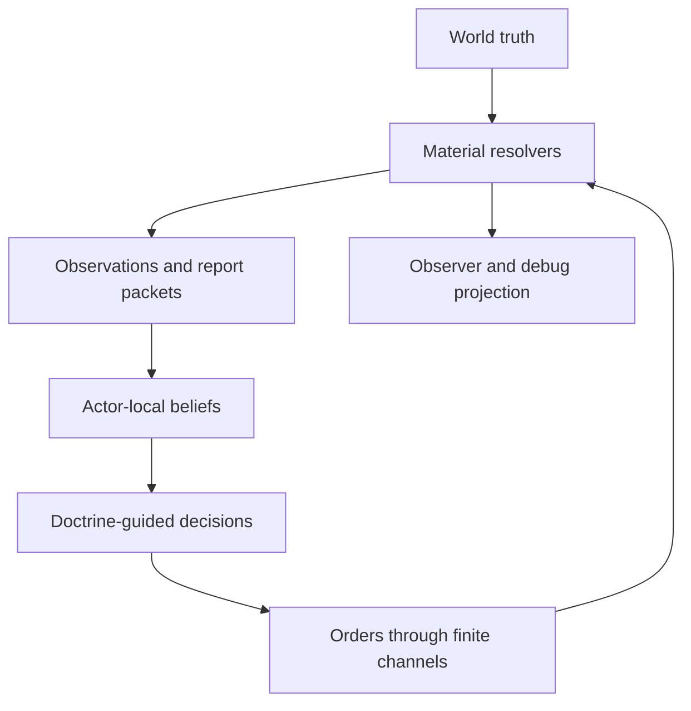

# Design synthesis and product roadmap

Status: integrated direction after v30  
Scope: tactical battle, campaign, and the contract between them

## Evidence and inference boundary

This synthesis combines the existing [tactical-emergence research](./TACTICAL_EMERGENCE_RESEARCH.md) and [grand-strategy research](./GRAND_STRATEGY_RESEARCH.md). Those briefs contain the historical, doctrinal, simulation, game-design, and human-factors evidence, including their source cautions. This document adds no new research.

Terms are used strictly:

- **Implemented** means the behavior is present in the v30 source or tests.
- **Research-supported relationship** means one or both briefs supply evidence for the relationship, not for a particular balance value or interface.
- **Design inference** means a product hypothesis to prototype and playtest. All roadmap ordering, scope, and numerical gates below are design inferences unless explicitly marked implemented.

Historical inspiration is not a telemetry set, and modern doctrine is not evidence that an ancient army used a modern staff process. Both are useful for causal relationships and design vocabulary; neither should silently become a claim of reconstruction.

## Integrated product thesis

**Build one command game at two scales: the player governs a polity and commands a field army by forming beliefs, setting intent, allocating scarce means, and making delayed commitments through fallible people and physical networks.**

The campaign and battle should use the same causal grammar:

```text
observe or receive a report
→ update a private belief
→ interpret doctrine and authority
→ choose a commitment
→ send an order through a finite channel
→ resolve material consequences
→ learn from later evidence
```

The product is therefore neither a high-APM unit RTS, a passive autobattler, nor a conventional grand-strategy spreadsheet with extra uncertainty. Its distinctive pleasure is **legible command under uncertainty**: preparing options, recognizing which assumption failed, intervening at the right echelon, and accepting that subordinates and opponents act from knowledge the player does not fully share.

Strategy should shape battles through material and informational conditions, not pre-battle percentage bonuses. Battles should change strategy through persistent bodies, stores, routes, obligations, relationships, and reports, not a winner screen detached from the campaign.

## The v30 launch point

The current README describes much of the inherited v29 battlefield and capability substrate; the v30 source and tests add the general echelon and player-facing information boundary summarized here.

| Area | Implemented in v30 | Frontier after v30 |
|---|---|---|
| Causal architecture | Deterministic, headless-first fixed-step simulation; frozen percept and observer projections; material/sensor/communication boundaries; architecture audits | General-purpose report provenance and decision traces across both scales |
| Embodied actors | Unique soldier, centurion, and runner profiles; bounded capabilities; actor-local HP, morale, fatigue, and condition scaffolding | Persistent campaign identities, attendance/experience ledger, live wound/effect recalculation |
| Local command | Private centurion tracks and inboxes; doctrine-driven FSMs; physical voice, standards, relays, and runners; proposal/ACK/commit plan epochs | Mission orders with purpose, boundaries, authority, branches, reserve, pursuit, and withdrawal policy |
| General command | One private general brain per side; friendly estimates, anonymous enemy tracks, direct sight, returned field reports, and order-receipt memory | Rich dossiers, explicit information requirements, movable/vulnerable command, contradiction handling, full decision provenance |
| Opposition | Enemy general selects among probe, press, guard, recover, and feint from its own believed situation and issues ordinary physical orders | Multi-hypothesis planning, objective-aware doctrine candidates, reconnaissance, bargaining, and longer-horizon adaptation |
| Player control | Three high-level postures, hold zones, physical courier latency, pause and speed | Objectives, planning, a real reserve, crisis decisions, report requests, disengagement, and pursuit authority |
| Presentation | Gameplay mode consumes the Blue general's bounded situation projection; debug mode exposes observer diagnostics separately | Unified command map, decision inbox, dossiers, planning view, archive, and provenance explanations |
| Battlefield/world | Two centuries per side, flat open field, melee, morale, collision, casualties, simple rout/time adjudication | Terrain, objective/time victory, safe withdrawal, reconnaissance, cavalry, missiles, supply, works, weather, and campaign handoff |

The key conclusion is that v30 has already implemented the architectural seed of the product. The next version should make that seed produce a meaningful command problem, not replace it with an omniscient strategy layer.

## Design pillars

1. **One causal grammar at every echelon.** A ruler, governor, general, centurion, and soldier differ in scope and cadence, not in permission to read truth. Each acts from private state, doctrine, perception, and received messages.
2. **Truth belongs to material simulation; knowledge belongs to actors.** Friendly information can also be late, biased, incomplete, or wrong. Uncertainty must have provenance and a causal remedy, never arbitrary noise.
3. **Intent is the player's scalable control surface.** The player defines purpose, priorities, boundaries, authority, acceptable risk, triggers, and abort conditions. Subordinates decide local execution and explain deviations when able.
4. **Power travels through shared physical networks.** The same road, port, bridge, messenger chain, market, and patronage link should carry supply, trade, taxes, orders, reports, officials, rumors, and spies. Recombination should create depth.
5. **Every advantage spends optionality.** A reserve committed here cannot answer there; a fortified route is useful and predictable; centralization improves synthesis and creates delay or a vulnerable hub. Strong tactics remain strong only when their prerequisites are maintained.
6. **Emergence must be legible and contestable.** Every major effect needs a signature, an opportunity cost, multiple responses, a failure gradient, and a reportable explanation. Randomness supplies variance; causal interaction supplies emergence.
7. **The interface is a map of commitments, not a database front page.** Default views show what changed, why it matters, confidence, responsibility, the delegated response, and the decision deadline. Exact truth and deep ledgers remain progressive disclosure or debug material.
8. **Success changes the player's job and can produce closure.** Growth should shift control from direct supervision toward appointments, institutions, doctrine, and exceptions. A durable political settlement should end the campaign before repetitive cleanup.

## Shared tactical and campaign primitives

These primitives should be implemented once conceptually, with scale-appropriate schemas and cadences.

| Primitive | Tactical use | Campaign use | Invariant |
|---|---|---|---|
| Actor-private belief/dossier | Friendly estimates, enemy tracks, terrain knowledge, mission comprehension | Provincial accounts, rival hypotheses, route risk, relationships, political intelligence | No live reference to world truth or another actor's mutable mind |
| Observation/report packet | Sight, sound, standards, contact and line reports | Scouts, merchants, officials, accounts, petitions, envoys, informants | Immutable claim with observed, created, sent, and received times plus provenance |
| Doctrine/plan/authority | Mission, boundaries, rally, pursuit, reserve trigger, initiative limits | Office contract, theater plan, collection priorities, alert policy, treaty execution | Conditions evaluate the actor's beliefs; doctrine never grants hidden truth |
| Person/office/roster | Soldier, centurion, general, scout, engineer | Ruler, governor, commander, collector, merchant, inspector | Identity, competence, relationships, obligations, and condition persist at the appropriate scale |
| Terrain/route graph | Elevation, cover, roads, gullies, fords, lanes, works | Roads, rivers, ports, passes, jurisdictions, patrols, congestion | Movement, sight, messages, supply, and commerce use the same geometry |
| Inventory/condition/flow | Exertion, water, missiles, tools, horse state, local resupply | Food, fodder, coin/credit, stores, equipment, transport, harvest | No teleportation; state changes through production, carriage, consumption, loss, or transfer |
| Executable commitment | Hold until time, release reserve, pursuit limit, surrender terms | Appointment, contract, debt, treaty clause, guarantee | Named parties, trigger, authority, performance window, verification, exceptions, and consequences |
| Event/history log | Orders, detections, strikes, casualties, deviations | Deliveries, trades, audits, appointments, obligations, political acts | Deterministic ordering; observer polling cannot mutate outcomes |
| Decision trace | General or centurion choice and evidence | Governor, polity, diplomatic, logistical, or intelligence choice | Records beliefs, reports, doctrine, authority, alternatives, selected action, and emitted orders |

The shared information/action architecture is:



### Campaign–battle handoff contract

Do not pass one omniscient campaign object into battle. Split material initialization from actor knowledge, and split physical aftermath from reported aftermath.

| Direction | Material boundary | Knowledge boundary |
|---|---|---|
| Campaign → battle | Named roster and equipment, actual condition, stores, animals, terrain/weather/work state, approach routes, reinforcement timing, command-post bodies | Mission orders, landmarks, map familiarity, delivered reconnaissance, known safe lanes, political purpose, casualty tolerance, and communication plan |
| Battle → campaign | Surviving identities and conditions, deaths/captures, consumed or lost stores, damaged works/routes, occupied ground, elapsed time | Commander and scout reports, claims of success/failure, casualty estimates, captured messages, and later reconciliations that travel through campaign channels |

The campaign world may settle material consequences exactly at its resolver boundary. The ruler and other actors learn those consequences only through their own reports. This prevents both lost persistence and instant omniscient after-action knowledge.

## Information architecture

Use one command shell with progressive disclosure at campaign and battle zoom levels.

| Surface | Must answer | Primary verbs | Must not expose |
|---|---|---|---|
| Command map | What changed? Where are commitments, constraints, and believed threats? | Select theater/formation, set priority, allocate means | Hidden enemy units, exact intent, exact internal state |
| Briefing and decision inbox | Why now? Source, age, confidence, contradiction, latest useful action time, delegated default | Act, ask, delegate, defer, change alert threshold | Omniscient urgency or guaranteed future outcomes |
| Dossier/route/obligation view | What evidence and dependencies support the current estimate? | Compare hypotheses, inspect chain, request collection/audit, renegotiate | A single unexplained accuracy score or relation scalar |
| Plan and doctrine view | What purpose, authority, thresholds, branches, and abort rules govern action? | Set intent, assign responsibility, bound risk, approve exception | Coordinate scripts that query future truth |
| Tactical command view | What do I currently believe about the objective, force, terrain, reserve, and reports? | Release/redirect reserve, reprioritize, request report, authorize pursuit, disengage | Soldier micromanagement and enemy debug cards |
| Archive and after-action view | What happened, what was believed then, and why did actors decide as they did? | Review, compare, revise doctrine | Retroactive knowledge during live play |
| Debug/audit view | Is the simulation causal, deterministic, calibrated, and healthy? | Inspect truth, private states, errors, traces | Any path back into gameplay cognition |

Numbers are not forbidden. Misplaced precision is. Show an exact count when an authorized actor physically counted it and date that count; otherwise show a range, band, scenario, source, and age. The default view should say “road stores likely support twelve to eighteen days” rather than display an unearned decimal.

## Integrated play loop

| Phase | Player experience | Simulation response |
|---|---|---|
| 1. Brief | Review changed commitments, exceptions, stale assumptions, and current projects | Routine actors continue under standing doctrine; reports are batched by policy |
| 2. Frame | Decide what must be protected, learned, achieved, or conceded | Dossiers expose evidence, contradictions, routes, authority, and likely deadlines |
| 3. Commit | Set intent, appoint responsibility, allocate force/stores/time, or make an enforceable bargain | Orders and resources enter finite routes; other options become unavailable or costlier |
| 4. Advance | Resume time and let delegated actors execute | Movement, production, trade, collection, communication, and opposition proceed concurrently |
| 5. Handle exception | Interpret a crisis, request, contradiction, missed report, or opportunity | The player may intervene, gather evidence, delegate, or deliberately wait; lateness remains causal |
| 6. Command battle | Plan from incomplete campaign knowledge, then make a few high-leverage decisions during pulses, lulls, and crises | Centurions and soldiers execute locally; reserves, reports, fatigue, terrain, and objectives create timing decisions |
| 7. Reconcile | Preserve the army, exploit, negotiate, or accept a limited result | Material consequences persist immediately; knowledge returns piecemeal through reports |
| 8. Institutionalize or settle | Revise doctrine, appointments, routes, contracts, and the campaign project | Solved recurring problems become delegated; durable equilibria can be recognized as victory |

The early tactical pacing hypothesis remains **20–35 minutes of player time for roughly 1–3 simulated hours**, with **4–12 major command decisions** in a typical prolonged battle. Short collapses and longer exceptions are valid. Campaign pacing should be measured by meaningful commitments per hour and interruption burden, not clicks per day.

## Anti-boredom and anti-spreadsheet rules

1. **Manage by exception.** Routine activity uses budgets, doctrine, reporting schedules, and alert thresholds. Do not ask the player to renew every patrol, trader, spy, or formation correction.
2. **Make uncertainty playable.** Every important unknown needs provenance, a reason it is uncertain, a possible collection/audit action, and consequences for acting now versus waiting.
3. **Keep automation inspectable.** Show what an agent is preserving, what it may spend, evidence used, authority held, when it will ask, what it did, and why it deviated.
4. **Earn reduced workload through institutions.** Competent appointments, aligned incentives, reliable reports, doctrine, and audits should automate a class of routine problems. A global “auto-manage” switch should not.
5. **Change granularity with scale.** Early play may inspect a store or know a courier; late play chooses theater policy, administrative structure, guarantees, and constitutional risk. Mandatory recurring actions must not grow linearly with object count.
6. **Prefer recombination to content inflation.** New systems should modify shared actors, routes, reports, conditions, commitments, or beliefs. Avoid isolated minigames and dozens of flavor resources.
7. **Preserve contextual strength.** Heavy infantry, cavalry, fortification, centralization, commerce, and conquest may be powerful, but their material, informational, political, and geographic prerequisites must create counters and alternatives.
8. **Create lulls and safe speed.** Continuous time should support pause, speed, scheduled briefings, and low-attention periods. It must not reward constant vigilance or APM.
9. **Summarize repetition, surface novelty.** Batch routine confirmations while highlighting violated assumptions, conflicting commitments, and unprecedented interactions.
10. **End when the strategic question is answered.** After a durable equilibrium survives one appropriate stress test, offer closure rather than map cleanup or a permanent crisis treadmill.

Before implementing a subsystem, answer:

1. What consequential decision does it create?
2. What evidence supports that decision?
3. What does commitment expose or foreclose?
4. How can another actor counter or exploit it?
5. How will the player understand the result?

If the answers reduce to upkeep clicks, an isolated modifier, or hidden randomness, fold the subsystem into a shared primitive or do not build it.

## Prioritized vertical slices after v30

Each slice must produce a playable question and pass its gate before map, faction, or content expansion.

| Priority | Slice and player promise | Minimum build | Exit gate |
|---:|---|---|---|
| P0 | **Traceable command:** trust that every general decision and warning came from available evidence | General-purpose immutable report/message packets; source chain and observed/sent/received times; decision traces; contradiction history; expanded truth-access and gameplay-projection audits | Zero truth-access violations; every AI command reconstructible from its then-available reports, percepts, doctrine, and private condition; same seed/commands remain invariant under observer and UI polling |
| P1 | **Ridge Road:** win by timing, terrain, reserve, and withdrawal rather than extermination | Static ridge/road/gully/ford fields; attacker and defender objectives with deadline; safe withdrawal; mission purpose, boundary, rally point, pursuit limit, one reserve and one belief-based release branch; limited pre-contact reconnaissance; crisis cues and safe time controls | Holding, clearing, delaying, and withdrawing intact can decide the scenario; the reserve cannot act on unseen truth; a sound plan lowers intervention demand without determining the result |
| P2 | **Road to battle:** see campaign preparation become physical battlefield conditions and consequences return | Five nodes, two land corridors and one river/port route; continuous event queue; food, fodder/animal condition, coin/credit, and one trade good; local stores, army movement, depots, patrol/raid, delayed reports; explicit campaign–battle handoff and aftermath | Route, timing, stores, approach fatigue, and reconnaissance materially alter Ridge Road; one battle result is applied exactly once; the ruler learns it only as reports arrive; route disruption has at least three viable responses |
| P3 | **Govern by exception:** run a growing corridor through people rather than province clicks | Governor, commander, merchant, collector, and inspector offices; authority contracts; standing doctrine; physical versus book versus ruler estimates; audit, petition, relief, appointment, and briefing policy | Delegates solve routine cases and explain deviations; oversight has visible cost; increasing managed objects fourfold causes no more than a provisional twofold increase in mandatory recurring player actions |
| P4 | **Bargain or fight:** secure the corridor with credible commitments, not only conquest | Clause-based transit, grain, defense, and monitoring obligations; performance windows, exceptions, guarantor/collateral, breach evidence and repair; multidimensional reputation; bargaining AI using private beliefs | Different enforceable contracts can solve the same dispute; willing-but-unable differs from betrayal; AI sometimes accepts a credible bargain and sometimes rejects an unverifiable one without reading truth |
| P5 | **Prepared combined arms:** make readiness and preparation create options, not universal bonuses | Acute versus operational fatigue; relief and recovery; finite missiles and local resupply; horse condition separate from rider; wounded/straggler flow; then dynamic soil/weather and segment-based works only after the first systems are legible | Fresh relief changes a crisis; repeated charges decline without arbitrary cooldowns; an objective can be won without capacity to exploit; mud and works arise from physical state, labor, signature, and counterplay |
| P6 | **Contest beliefs:** deceive, corroborate, and adapt at both scales | Informant/scout access graph; collection requirements; competing hypotheses; interception and counterintelligence; demonstration, concealed effort, and feigned retreat through physical observables; doctrine candidates and coherent AI plans | Deception can be unseen, disbelieved, late, exposed, or effective; no success flag reaches the deceiver; player and AI use the same evidence pipeline; AI can decline battle or abandon a failed plan |
| P7 | **Durable settlement:** finish a campaign because a political problem is solved | Constituency legitimacy, traceable expansion burdens, succession/constitutional stress, threat-based balancing, concurrent theater/institutional plans, and at least three political projects with recognition and one stress test | At least three materially different projects can win, at least two without conquest; expansion costs arise from entities and channels rather than size penalties; formal closure follows practical victory without long mop-up |

Interface work is not a final polish phase. Extend the command map, briefing, dossier, planning, archive, and debug layers alongside each slice, exposing only the concepts that have become causally real.

## Acceptance and telemetry

The following are product gates, not historical claims. Values marked **provisional** should be revised from playtest distributions rather than defended as doctrine.

| Dimension | Acceptance measure |
|---|---|
| Information integrity | Zero cognitive reads of world truth or enemy-private state; zero forbidden private fields in gameplay DTOs; 100% of AI commitments have a complete decision trace |
| Determinism | Same seed and issued commands produce the same material result regardless of rendering, selection, overlays, archive access, snapshot frequency, or time-control presentation |
| Cross-scale integrity | Every battle input has a campaign material or delivered-knowledge source; every aftermath mutation is idempotent; report arrival can lag material settlement without contradiction |
| Tactical agency | **Provisional:** 4–12 major decisions in a typical 20–35 minute prolonged battle; at least one lull/reorganization opportunity; quick collapse and non-annihilation endings remain possible |
| Anti-micro | Repeated fine corrections do not outperform coherent intent across the scenario corpus after accounting for order delay and attention; strong preparation reduces live orders but does not guarantee victory |
| Tactical diversity | Investigate any force-normalized doctrine above roughly 65% wins across a broad adversarial scenario corpus; retain high performance inside its intended niche |
| Counterplay | Every major advantage has a visible or reportable signature, an opportunity cost, a failure gradient, and at least two credible responses; a route disruption has at least three |
| Information UX | **Provisional:** at least 80% of observed playtesters can state what was known versus suspected, why a warning appeared, and why a key subordinate deviated |
| Workload scaling | Mandatory repetitive actions grow sublinearly with controlled entities; **provisional first gate:** 4× managed objects produces no more than 2× recurring mandatory actions |
| Automation trust | Players can predict the do-nothing delegated response and inspect the evidence, authority, and expenditure behind it; automation surprise is recorded and explainable |
| AI fairness | Player and AI share material resolvers, sensors, communication, logistics, politics, and treaty rules; difficulty changes doctrine and reasoning, not hidden resources, vision, morale, or damage |
| Deception quality | Test corpus produces belief, disbelief, suspended judgment, and correct conclusion for the wrong reason; neither side receives hidden truth about success |
| Campaign closure | Three different strategic projects are viable, two are non-conquest, and practical victory requires at most one relevant stress test before a settlement offer |

Qualitative debriefs remain necessary. Ask whether logistics created plans or chores, whether uncertainty felt fair, whether delegated actions were understandable, whether surprise had a recoverable cause, and whether formal victory arrived when the strategic question felt resolved.

## What not to build yet

Defer these until the vertical slices prove their underlying decisions:

- a continent-scale map, hundreds of settlements, or a historical faction/content roster;
- household-level population simulation or a resource bar for every commodity;
- a settlement build tree, large technology catalog, or equipment taxonomy whose entries only add modifiers;
- full dynamic weather, elaborate fortifications, naval warfare, sieges, and many unit classes before static Ridge Road is fun and legible;
- a large campaign event generator or scripted historical plot before causal actors can produce coherent situations;
- unrestricted online-learning AI, opaque optimizers, or one giant polity FSM before doctrine candidates and decision audits work;
- collectible super-spies or manually moved intelligence tokens before network doctrine and collection requirements are validated;
- multiplayer before deterministic single-player command, pause/speed policy, and workload are stable;
- photoreal presentation or content-scale production that makes core schema changes expensive;
- live campaign auras or team-wide skill values that bypass the deployment and actor-identity contract.

Permanently reject, rather than merely defer:

- omniscient player or AI cognition disguised by cosmetic fog;
- direct unit puppeteering as the optimal command style;
- deception buttons that write enemy beliefs or reveal success;
- logistics as a supply-radius attrition aura;
- corruption, rebellion, or coalition formation as ownerless random penalties;
- hidden AI income, combat, morale, movement, or vision bonuses;
- uncertainty presented as noisy exact spreadsheets with no provenance or remedy;
- victory that requires extermination or repetitive map cleanup after the strategic question is settled.

The immediate product decision is narrow: **harden v30's general-level evidence chain, then build Ridge Road.** If that slice does not make delayed intent, reserve timing, terrain, objectives, and incomplete reports enjoyable at the current two-century scale, a larger campaign will only hide the problem under more objects.
