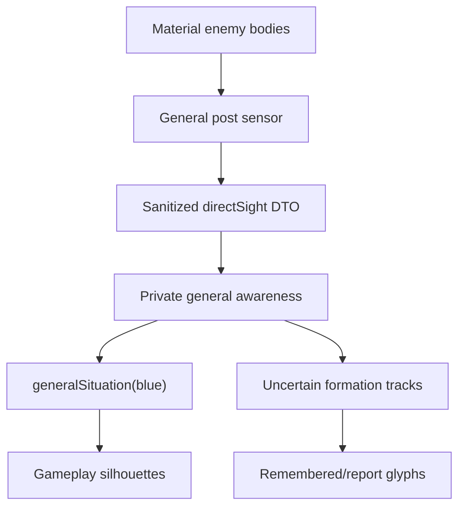

# v31 doctrine and visibility audit

Audit date: 2026-07-15

Scope: `soldier_ABM_v31` Gameplay enemy visibility, centurion doctrine/coordination, hold-zone interpretation, and no-telepathy boundaries

Status: **release-ready for the current open-field two-century laboratory, with bounded limits listed below**

## Executive judgment

v31 satisfies the two motivating requirements:

1. **An enemy physically visible to the Blue general is visible in Gameplay.** The implementation does not reopen the omniscient observer channel. It creates a separate, sanitized direct-sight projection from Blue's finite general sensor and renders that geometry while continuing to suppress exact Red observer records and private state.
2. **A hold zone no longer outranks battlefield doctrine.** The centurion chooses local action through an explicit priority hierarchy. Withdrawal, fresh threat response, formation survival, and physically requested mutual support all precede zone transit. The zone remains a stored area destination and can resume only after local recovery/hysteresis.

The implementation remains consistent with the cardinal restriction:

> A mind may use shared doctrine or privately obtained perception/communication. It may not read globally shared live truth or intention.

The evidence is stronger than a visual smoke test: the release has projection-field tests, priority counterfactuals, lease-loss counterfactuals, static source audits, UI source audits, and multi-seed battle exercise. The judgment is intentionally limited to the flat, unobstructed battlefield and two-peer century topology. It is not a claim of historical calibration or a complete line-of-sight model.

## Audit method

The review used four kinds of evidence:

- **Source-boundary inspection:** sensor DTO construction, general awareness storage, public projection, renderer filtering, centurion decision order, movement correction, communication lease lifecycle, and observer/debug exposure.
- **Deterministic Node regressions:** 53 tests across engine, capabilities, general cognition, and doctrine.
- **Static/runtime audits:** 21 named architecture checks and nine UI/release checks.
- **Battle exercise:** six seeds for 120 s each, sampled for combat, doctrine-state exercise, overlap, and non-finite failures.

“Pass” below means the requirement is implemented and covered proportionately for this version. “Bounded pass” means the implementation is correct within an explicitly narrower abstraction than the eventual game.

## Requirement 1 — visible enemies in Gameplay

### Information path



The material world is read only at the sensor boundary. `senseGeneral()` makes two deliberately different enemy projections:

- a current visual geometry list for `directSight`; and
- noisy, clustered detections for private formation-track cognition.

The Gameplay renderer receives enemy information from `generalSituation('blue')`, not from exact Red observer arrays. Debug still renders observer truth.

### Direct-sight data contract

| Field | Present | Purpose |
|---|---:|---|
| `observedAt` | Yes | Timestamp of the complete current sensor frame. |
| `visualClass` | Yes | `ranker`, `standard`, or `runner`; enough to select a silhouette. |
| `x`, `z` | Yes | Current visible geometry, quantized to 0.05 m. |
| `heading` | Yes | Facing geometry, quantized to `π/72` (2.5°). |
| `recognizedMark` | Conditional | Public mark only for a living centurion/standard physically observed with it. |
| body/engine ID | No | Would reveal stable material identity beyond the visual requirement. |
| enemy `centuryId` or team | No | Would leak hidden grouping/faction internals. |
| profile/capabilities/condition | No | Private actor attributes. |
| HP/max HP/morale/fatigue | No | Exact hidden condition. |
| FSM/posture/combat state/reason | No | Private intention/internal inference. |
| sender/receiver/target IDs | No | Private communications/combat linkage. |

Living bodies and fallen remains are separate deterministically sorted arrays. A fallen record cannot expose a recognized standard mark. Enemy runners are visible as runner geometry but exit before formation clustering; therefore seeing a courier cannot create a false enemy century track or authorize a formation tactic.

### Renderer behavior

| Case | Gameplay result | Audit status |
|---|---|---:|
| Visible enemy soldier | Ranker circle/facing tick from `directSight` | Pass |
| Visible enemy centurion | Standard/banner; recognized public mark only when present | Pass |
| Visible enemy runner | Runner diamond | Pass |
| Visible enemy remains | Sanitized red cross | Pass |
| Formation currently visible and tracked | Direct bodies draw; coarse contact is suppressed via `directlyVisible` | Pass |
| Remembered/reported formation outside current sight | Coarse uncertain contact glyph remains | Pass |
| Exact Red observer soldier/centurion/courier/fallen record | Skipped | Pass |
| Red hit flash, zone, command post, private label | Skipped | Pass |
| Debug mode | Exact observer truth restored by design | Pass |

`contacts[].directlyVisible` is a current-frame rendering-coverage signal, not a stable target handle. A matching visible public standard covers its track; otherwise current non-runner body geometry is tested against the coarse track footprint. This deliberately survives two cases where track association cannot: a depleted formation below the three-body clustering threshold and two recognized formations that visually merge into one component.

### Visibility verdict

**Pass, bounded to command-post sight.** v31 corrects the Gameplay disappearance without crossing the no-telepathy boundary. The player sees what the modeled Blue general post currently sees and what its private general brain remembers or receives.

The boundary is narrower than eventual embodied army vision. It does not union soldier/centurion sight, and it does not yet model terrain, a gaze cone, occlusion, concealment, light, weather, or mistaken identity. Finely quantized visible geometry is also more precise than the noisy belief tracks. Those are declared model limits, not hidden leaks.

## Requirement 2 — doctrine before zone transit

### Explicit priority hierarchy

`updateCenturionBrain()` updates only from the centurion's frozen percept, private tracks/inboxes, own body/capabilities, and doctrine. It then evaluates these branches in source order:

| Rank | `doctrinePriority` | Evidence and action | Zone effect |
|---:|---|---|---|
| 1 | `emergency-withdrawal` | Perceived heavy loss/morale collapse or physically received ally withdrawal; enter/continue `withdraw`. | Stored but cannot reverse retreat; resumption delayed. |
| 2 | `immediate-threat` | Fresh direct flank/seam/rear threat or close local contact; guard, form, or bounded HOLD counter. | Transit interrupted; minimum commitment plus recovery delay. |
| 3 | `formation-survival` | Broken perceived mutual line, low own cohesion, or latched incomplete recovery; enter `form-line`. | Transit interrupted; destination remains private mission state. |
| 4 | `mutual-support` | Finite support/flank request and no fresh close contact requiring own response; enter `support-ally`. | Mission temporarily subordinate to finite support evidence. |
| 5 | `zone-transit` / `mission` | Execute controlled HOLD transit or the active posture's normal role logic. | Approach only when higher levels are clear. |

This order directly answers the original failure: `march-to-zone` is a mission state, not a movement command applied after the FSM. There is no `constrainToZone()` post-processing force that can pull an officer through contact or reverse withdrawal.

### Threat response

The tactical focus is chosen by `mostUrgentEnemyTrack()`, which combines private confidence, direct freshness, range, closing speed, and estimated strength. Routine reporting deliberately continues to use the steadier `bestEnemyTrack()` so rapidly switching urgent threats do not saturate finite communication.

The centurion maintains line orientation independently from travel and local threat facing:

- `lineHeading` settles toward the shared team-doctrine frontage, preventing two private contact choices from rotating the same mutual-line measurement in opposite ways;
- the locally selected `desiredHeading` still faces a direct contact, refused flank, or reported threat as arbitration requires; and
- gaze normally follows contact but briefly scans the exposed side for 0.55 s every 3.2 s when close direct contact does not dominate.

`assessFlankThreat()` uses private fresh-direct formation tracks only. It predicts perceived motion over a bounded interval, derives the inner/outer wing from perceived ally geometry, and classifies:

- `outer-flank`;
- `seam-penetration`; or
- `rear-penetration`.

A guard can refuse about 81° from line heading and fully turn inside 18 m. Outer guards back/refuse instead of continuing toward a zone. Threat memory is short and private; a flank warning to the partner must use voice or a physical runner.

### Formation survival and recovery

`assessLineIntegrity()` dead-reckons a private ally track in the current line frame. It uses no partner body/world lookup.

| Band | Condition |
|---|---|
| `unknown` | No ally track, confidence below 0.15, or observation older than 6.5 s |
| `sound` | Depth error ≤4.2 m and gap error ≤3.5 m |
| `strained` | Beyond a tolerance but not a break threshold |
| `broken` | Depth error >8.4 m or gap error >7 m |

Formation-survival entry occurs for `broken` or perceived own cohesion below 0.58. Recovery is intentionally asymmetric: `form-line` remains latched for the 2.8 s minimum and while cohesion is below 0.78 or a known line remains non-sound. An unknown line does not keep a recovered formation trapped forever.

`coordinateLineAction()` corrects line depth/gap only from that usable ally estimate. It skips withdrawal/routing. A committed, fresh aggressive flanker in `maneuver-flank` and a cover century in `ambush-strike` are authorized detachments; they receive only a maximum-separation correction. FIX exempts its peer only when the perceived public state shows the peer actually maneuvering, not merely staging.

In movement states that publish `hold` (`hold`, `form-line`, `guard-flank`, bait/cover holds), the guide's speed is capped below soldier dress speed. This reduces the previous failure in which the centurion could reform while outrunning its own ranks.

### Mutual support

Support is neither global nor recursively shared:

- A local `helpRequest` exists only when the sender perceives cohesion below 0.45, has fresh direct contact, and is actually in `form-line`.
- The finite `SUPPORT_REQUEST` carries a quantized seam/support point separately from threat geometry.
- The receiver moves toward the support point and faces its own or reported threat.
- A receiver facing fresh close direct contact handles its own immediate threat instead of abandoning its line to support.
- `support-ally` does not itself satisfy the help-request creation predicate, preventing automatic echo.

### Zone semantics

`zoneRelation()` treats a zone as an area:

```text
arrivalRadius = max(1.5 m, zone.radius × 0.60)
arrived       = distance(centuryCenter, zoneCenter) <= arrivalRadius
```

For HOLD:

- outside and unopposed → `march-to-zone` at up to 0.56 m/s;
- fresh direct contact inside 25 m → stop/form/guard/counter according to local evidence;
- credible reported interception inside 19 m → stop and form, without inventing direct provenance;
- broken/low-cohesion formation → `form-line` before resumption;
- no explicit zone → return to fallback anchor when doctrine permits;
- arrived → hold the area, not the exact center.

Counterpressure uses a 13.5 m entry / 16 m continuation envelope and requires cohesion ≥0.58. If the century is already outside a zone-relative tactical leash, counterpressure is allowed only when its direction returns toward the zone; otherwise it halts/faces contact. This prevents unlimited pursuit from converting a zone defense into an accidental attack.

The observer `zonePhase` values—`none`, `approach`, `interrupted`, `fallback`, `holding-area`, `holding-anchor`, and `tactical-override`—are diagnosis of one officer's private interpretation. They are not shared team truth. Team-scoped zones still create distinct doctrinal wing sectors.

HOLD is the posture with an explicit zone-transit FSM. Aggressive and defensive-feint branches retain their earlier use of a zone or fallback anchor inside fix/flank and bait/cover mission logic; v31 does not claim one universal zone state machine.

### Doctrine verdict

**Pass for the two-century open-field scope.** Local survival and doctrine now supersede a zone destination. The FSM can halt, orient, refuse, reform, request/receive finite help, and resume. The new behavior is inspectable through `doctrinePriority`, `lineIntegrityBand`, `lineHeading`, and `zonePhase` without making those observer fields causal.

## No-telepathy review

| Risk | Implemented boundary | Evidence | Status |
|---|---|---|---:|
| Gameplay reads exact Red arrays to show bodies | Sanitized `directSight` built at sensor boundary; renderer uses Blue situation | `sanitizedDirectSight`, `enemyProjectionOnly`, projection test | Pass |
| Stable visual IDs reveal hidden grouping | Direct-sight entries omit body/century IDs and team | forbidden-field assertions/static audit | Pass |
| Enemy runner becomes formation knowledge | Runner rendered but excluded before clustering | general test and isolated classification audit | Pass |
| Centurion reads partner's true location | Line geometry uses private aged ally track | source audit and broken-line counterfactual | Pass |
| Centurion learns remote runner death | Sender-local lease persists until return/deadline | lost-runner doctrine test, `epistemicPeerRunnerLease` | Pass |
| Support intention becomes global | Support requires received packet; support point copied in payload | nonrecursive-support test | Pass |
| General order directly controls state | Commands still use physical runners and private inboxes | inherited physical-order/return tests | Pass |
| Observer fields feed cognition | Snapshot/debug records remain detached/frozen outputs | `frozenObserverSurface`, deterministic polling tests | Pass |

The architecture audit statically rejects the earlier global peer-capacity pattern (`couriers.some`) and requires `centurionRunnerLease`. It also requires the doctrine-priority labels in the intended source order.

## Verification record

### Node tests

| File | Count | v31-relevant coverage |
|---|---:|---|
| `test/engine.test.mjs` | 24 | Private brains/percepts, barriers, communication, plans, tactical causality, combat and stability |
| `test/capabilities.test.mjs` | 8 | Bounded/local capability and modifier mechanics inherited by officers/runners |
| `test/general.test.mjs` | 9 | Team projection, sanitized direct sight, physical general orders/reports, serial leases/evidence |
| `test/doctrine.test.mjs` | 12 | Priority, interception/resumption, refusal, line repair/hysteresis, support handoff, pursuit leash, evidence age, report priority, peer lease |
| **Total** | **53** | Deterministic release suite |

The 12 doctrine cases prove:

1. zone persistence never reverses withdrawal;
2. HOLD contact interception forms/faces and later resumes;
3. outer flank refusal exceeds the former shallow heading limit;
4. broken mutual line outranks independent movement;
5. pre-commit flank staging repairs a break and remains latched until recovered;
6. a support request cannot override the receiver's fresh frontal danger;
7. HOLD counterpressure respects a zone-relative pursuit leash;
8. noisy ally velocity is bounded and stale line geometry expires;
9. a delivered flank warning carries separate support and threat points;
10. withdrawal reporting outranks a simultaneous flank warning;
11. support is not recursively echoed; and
12. a lost peer runner holds its sender-local lease until overdue.

### Architecture checks

The audit reports 21 named passes:

`headlessBoundaries`, `anonymousGeometryPerception`, `isolatedContactClassification`, `noRawOfficerLifeRead`, `perceptBoundOfficerSpeech`, `aimGeometryStrikeBoundary`, `beliefSelectedCommunication`, `perceptionBoundGeneralAI`, `teamScopedGeneralProjection`, `sanitizedDirectSight`, `physicalReturnReports`, `physicalGeneralOrders`, `scopedPlanProtocol`, `doctrinePriorityHierarchy`, `epistemicPeerRunnerLease`, `exactTickBarriers`, `detachedPrivateBrains`, `frozenObserverSurface`, `privateActorCapabilities`, `materialOnlyOpponentStats`, and `boundedDeploymentProfiles`.

### UI/release checks

The audit reports nine named passes:

`controlsResolve`, `fourCenturySelectors`, `threePostures`, `standaloneIsSelfContained`, `gameplayDefault`, `enemyProjectionOnly`, `directSightSilhouettes`, `enemyGeneralAIToggle`, and `releaseVersion: 31`.

### Multi-seed exercise

Six deterministic 120 s matches used seeds `0x3101` through `0x3106` with 12 rankers per century.

| Metric | Observed range/result |
|---|---|
| Strikes | 183–247 per seed |
| Casualties | 18–19 per seed |
| Persistent overlaps | 0 every seed |
| Non-finite state | 0 every seed |
| Doctrine states | `form-line` and `guard-flank` in every seed; focused warning regression covers the brief `support-ally` state |
| Ordinary combat roles | FIX and committed FLANK in every seed |

This demonstrates that the new states are reachable during live reciprocal combat without destabilizing body resolution. It does not demonstrate optimal tactics, balance, or historical casualty rates.

## Residual risks and limits

### Visibility

- The sensor is a radial range test from a fixed post. It has no FOV, facing, terrain occlusion, dead ground, concealment, atmospheric visibility, night, or mistaken identity.
- It is not the union of Blue soldier/centurion observations. A player can fail to see an enemy that subordinates physically see until a report/track reaches general cognition.
- Direct-sight positions are fine-quantized current geometry rather than noisy estimates. This is safe against private-state leakage but still visually precise.
- Formation contacts remain scalar-confidence point tracks, not covariance areas or competing hypotheses.

### Doctrine and coordination

- The line topology has one peer. It does not yet coordinate three or more centuries, reserves, second lines, echelons, passage of lines, or a true formation graph.
- Ally-line correction extrapolates a private pose/velocity for at most 6.5 s. It does not model contradictory sources or uncertainty covariance.
- Own strength/morale uses `ownVisible`; a partial own scan can still resemble loss. A richer officer-owned muster/casualty belief is future work.
- Zone arrival and tactical leash are geometric and terrain-agnostic. There is no best-point selection inside an area, chokepoint frontage, fortification edge, patrol, or “hold at all costs” semantics.
- Aggressive and feint roles have posture-specific authorized detachments, but no general mission-purpose/constraint language, reserve release, pursuit boundary, or conditional order.
- Support packets are finite but currently carry quantized coordinates as stand-ins for landmarks/bearings.

### Communications

- The peer lease is epistemically correct but intentionally permits a late original runner to overlap a replacement after the local deadline.
- Packets can expire, but capture, interrogation, misinformation, deliberate acknowledgment, runner reassignment, and cancellation are not modeled.
- General and centurion runner speed/range remain protocol constants rather than actor-capability-derived mission performance.

### Validation

- The deterministic scenarios show causal behavior and physical stability, not military optimality.
- No historical calibration target currently bounds combat duration, casualty rate, frontage density, officer response, or withdrawal success.
- The open-field tests do not exercise the terrain and LOS interactions that should be the next major visibility/doctrine gate.

## Recommended next gate

The next slice should preserve these interfaces while adding terrain-aware embodied information:

1. height/dead-ground and occlusion-aware LOS for general, officer, soldier, and standard sensors;
2. a movable/vulnerable command post or general body with explicit staff sight;
3. mission purpose and constraints—hold/delay, withdrawal line, pursuit boundary, main effort, reserve, and conditional release;
4. a multi-century formation graph so line integrity scales beyond one peer;
5. officer-owned strength accounting that distinguishes unseen subordinates, reported casualties, and witnessed losses;
6. uncertainty-area Gameplay rendering for remembered/reported contacts.

Each new tactical branch should continue to name its evidence source and remain reproducible from the actor's then-available percept, doctrine, memory, and physically received packets.

## Final disposition

**Accepted for v31.** The visible-enemy fix exposes only current sanitized geometry that the modeled general sensor admits. The centurion overhaul places withdrawal, threat, formation survival, and finite mutual support above zone transit, with inspectable state and deterministic regressions. Remaining gaps are explicit modeling limits rather than hidden global knowledge paths.

`V30_PLAYABILITY_AUDIT.md` remains preserved as the historical v30 assessment.
